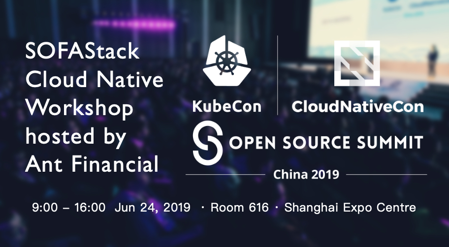

### SOFAStack Cloud Native Workshop hosted by Ant Financial (KubeCon China 2019 Co-Located Event)

- Date: Monday, 24 June, 2019
- Time: 9:00 – 16:00
- Location: Shanghai Expo Centre Room 616
- Registration Fees: Complimentary
- Register here: https://www.lfasiallc.com/events/kubecon-cloudnativecon-china-2019/co-located-events/#sofastack-cloud-native-workshop
- Note: This event is hands-on, please bring your personal computer. The language of communication in this workshop is Chinese.

SOFAStack (Scalable Open Financial Architecture Stack) is a financial-grade distributed architecture independently developed and open sourced by Ant Financial. It contains the components required to build a financial-grade cloud native architecture. It is a best practice tempered in financial scenarios. SOFAStack official website: https://www.sofastack.tech/

Attendees can get:

- Rapidly build microservices based on SOFAStack
- Best Practices for Distributed Transactions in Financial Scenarios
- Cloud native deployment experience based on Kubernetes
- Service Mesh basic usage scenario experience on the cloud
- Get started on Serverless apps
- Easily build applications on the cloud based on Serverless

How to Register: Pre-registration is required. To [register](https://www.lfasiallc.com/events/kubecon-cloudnativecon-china-2019/register/) for SOFAStack Cloud Native Workshop, add it on during your KubeCon + CloudNativeCon + Open Source Summit registration. You can get KubeCon half price tickets with `KCCN19COMATF` coupon code!

For questions regarding this event, please reach out to [jingchao.sjc@antfin.com](mailto:jingchao.sjc@antfin.com).

### Event details

**9:00 - 9:20 Opening speech SOFAStack Cloud Native**

**9:20 - 10:10 Quickly build microservices with SOFAStack by Jie Cao**

Building a microservices application based on the SOFAStack. Through this workshop, you can learn how to report application monitoring data, service link data, and publish and subscribe services in the SOFAStack.

**10:15 - 11:05 SOFABoot dynamic module practice by Guolei Song**

In this workshop, you can implement the combined deployment and dynamic module push capabilities provided by SOFAArk based on the ARK control capabilities of SOFADashboard.

**11:10 - 12:00 Using Seata to guarantee the consistency of payment by Long Chen**

Under the microservice architecture, the distributed transaction problem is an industry problem. Through this workshop, you can understand the background of distributed transaction problems under distributed architecture, as well as common distributed transaction solutions and experience on how to use the open source distributed transaction framework - Seata's AT mode, TCC mode to solve the ultimate  consistency of the business data.

**12:00 - 13:00 Lunch time**

**13:00 - 13:30 Cloud Native exlporation and practice in Ant Fnancial by Renjie Yu**

**13:30 - 14:40 Migrating to cloud based on Serverless by Yitao Dong**

As one of the pioneering technologies of cloud technology, Serverless architecture allows you to further improve resource utilization and focus on business development. Through our workshop, you can experience new product features such as quickly creating Serveless apps, auto-scaling based on business request seconds 0-1-N, quick troubleshooting via log viewer, time-based app launch.

**14:50 - 16:00 Easily practice Service Mesh with CloudMesh by Xiaojian Ao**

Service Mesh sinks the inter-service communication capabilities to the infrastructure, decoupling and lightweighting applications. But the complexity of Service Mesh itself still exists, and CloudMesh can easily implement Service Mesh technology by hosting Service Mesh on the cloud. With our workshop, you can quickly deploy applications to CloudMesh, access services, monitor traffic, and experience utility management, Sidecar management, and grayscale publishing of new versions of services.
