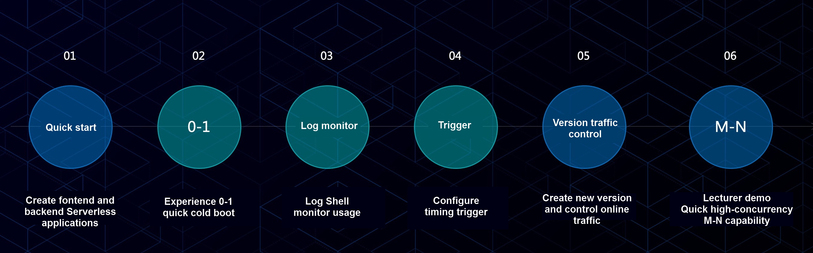

As one of the developing directions of cloud native technology, Serverless architecture enables you to further improve resource utilization and focus on service development. With our workshop, you can experience new features such as quick creation of Serveless applications, automatic second-level 0-1-N scaling based on service requests, and quick troubleshooting via log viewer.

## Workshop procedure

### Flow diagram

### Preview

### Preparation

- Access to Serverless application service address
- Login with account and password
- Git clone this project to local

### Step 1-1: Publish backend Java application

- Select **Create quickly**
- Select **Java Runtime**
- Upload the code package `balance-mng.jar`
- The entry method can be automatically recognized
- Port: 8080
- Copy and save the backend service address after creation
- View the number of computing instances of backend service: 0

### Step 1-2: Publish frontend NodeJS application

- Select **create an application**
- Select the buildpack **NodeJS**
- Upload the code package `stock-mng.zip`
- The entry method can be automatically recognized
- Select `nodejs-0.0.1.1-pre` at runtime
- Port: 3000
- Set the environment variable `BALANCEMNG_URL` as the backend service address

### Step 2: 0-1 cold boot capability

- Access frontend service
- View the changes in the number of the computing instances of backend service

### Step 3: Log and monitoring

- View application service logs via Log Shell
- View usage amount via monitoring

### Step 4: Configure time trigger

- Configure timing trigger to call application at fixed time
- View the triggering results via operation records

### Step 5: Create versions and control traffic

- Clone the frontend application and create a new version
- Upload the code package `stock-mng-v2.zip`
- Configure router to visit V1 and V2 at 1:1 ratio
- View the effect in the browser

### Step 6: Quick M-n capability for high-concurrency

- Simulate high concurrency situtation via scripts and access the frontend application service
- Check how the Serverless application perform quick M-N computing instance changes
