## Background

[kc-sofastack-demo](https://github.com/sofastack-guides/kc-sofastack-demo) has introduced how to quickly build an e-commerce microservice application and has implemented the service calling link tracking and application status monitoring.

In e-commerce system, the platforms often are not satisfied with the default product listing order, and always want to arrange some products in the conspicuous places. Also, there are some cases where the platforms would like to show different products to different users based on the collected user behaviors.

Based on the background of [kc-sofastack-demo](https://github.com/sofastack-guides/kc-sofastack-demo), this guide will implement sorting the products dynamically based on the total amount of products of each onsite attendee.

## Demo content

Implement the dynamic change of product sorting via the dynamic module capability provided by SOFABoot and the dynamic module control capability of SOFADashboard. 

Implement the change of application behavior without restarting the host and without changing the application configuration.

The project architecture is as follows:


## Tasks

### 1. Preparation
Clone the demo from GitHub to local

```
git clone https://github.com/sofastack-guides/kc-sofastack-dynamic-demo.git
```

Then, import the project into IDEA or Eclipse.

### 2. Package SOFABoot project as Ark JAR

As shown in the following screenshot, add the Ark package plugin in the POM file and configure it:

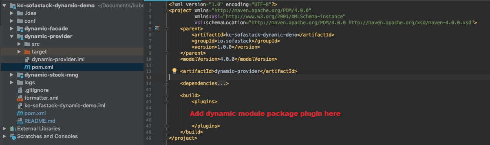

#### Step 1: Copy the Ark plugin and configuration to the specified positions in the above screenshot

```xml
<plugin>
  <groupId>com.alipay.sofa</groupId>
  <artifactId>sofa-ark-maven-plugin</artifactId>
  <version>0.6.0</version>
  <executions>
    <execution>
      <!--goal executed to generate executable-ark-jar -->
      <goals>
        <goal>repackage</goal>
      </goals>
      <!-- package configuration of ark-biz JAR  -->
      <configuration>
        <!-- Whether to package, install and publish ark biz. The default value is false. For details, see Ark Biz documentation.-->
        <attach>true</attach>
        <!-- The directory for ark package and ark biz package, defaulting to the build directory of project-->
        <outputDirectory>target</outputDirectory>
        <!--default none-->
        <arkClassifier>executable-ark</arkClassifier>
        <!-- The priority of starting ark-biz package. The smaller the value, the higher the priority.-->
        <priority>200</priority>
        <!--Set the root directory of application, used to read ${base.dir}/conf/ark/bootstrap.application configuration file and defaulting to ${project.basedir}-->
        <baseDir>../</baseDir>
      </configuration>
    </execution>
  </executions>
</plugin>
```

#### Step 2: Run mvn clean package to package the project. 

The successfully packaged JAR file is as shown in the following screenshot:

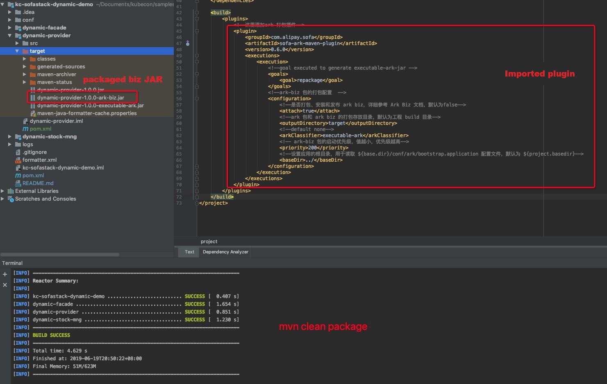

### 3. Build host application

In the downloaded project, dynamic-stock-mng is the host application model. In this task, we will build dynamic-stock-mng as the host application of dynamic module.

#### Step 1: Introduce Ark dynamic configuration dependencies and configure package plugin

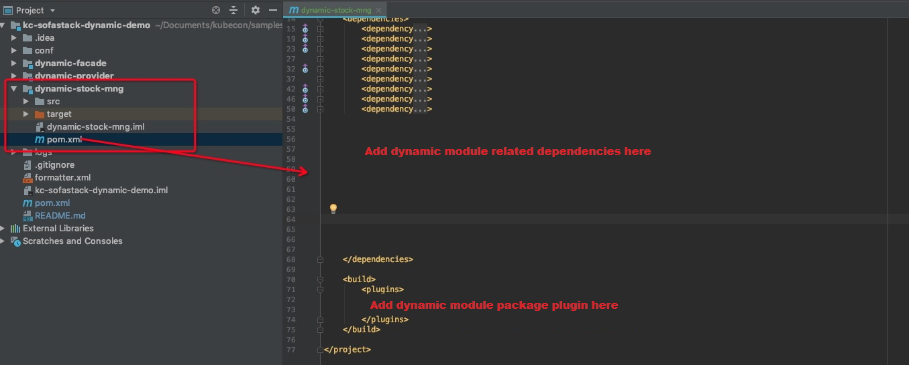

1、SOFAArk dependencies

```xml
<dependency>
  <groupId>com.alipay.sofa</groupId>
  <artifactId>sofa-ark-springboot-starter</artifactId>
</dependency>
<dependency>
  <groupId>com.alipay.sofa</groupId>
  <artifactId>web-ark-plugin</artifactId>
</dependency>
<dependency>
  <groupId>com.alipay.sofa</groupId>
  <artifactId>config-ark-plugin</artifactId>
</dependency>
<dependency>
  <groupId>io.sofastack</groupId>
  <artifactId>dynamic-provider</artifactId>
  <version>1.0.0</version>
  <classifier>ark-biz</classifier>
</dependency>
```

2、Host application package plugin

```xml
<plugin>
	<groupId>com.alipay.sofa</groupId>
  <artifactId>sofa-ark-maven-plugin</artifactId>
  <version>0.6.0</version>
  <executions>
    <execution>
      <id>default-cli</id>
      <goals>
        <goal>repackage</goal>
      </goals>
    </execution>
  </executions>
  <configuration>
    <priority>100</priority>
    <baseDir>../</baseDir>
    <bizName>stock-mng</bizName>
  </configuration>
</plugin>
```

#### Step 2: Host application configuration

**1. Configure dynamic module**

Add the following configuration in the /conf/ark/bootstrap.properties file:

```ini
# Root directory of logs
logging.path=./logs
# Configure server address
com.alipay.sofa.ark.config.address=zookeeper://zookeeper-1-dev.sofastack.tech:2181
# Host application name
com.alipay.sofa.ark.master.biz=stock-mng
```

**2. Configure Dashboard client**  

Add the following configuration in the resource/application.properties file of dynamic-stock-mng:

```ini
management.endpoints.web.exposure.include=*
com.alipay.sofa.dashboard.zookeeper.address=zookeeper-1-dev.sofastack.tech:2181
#skip jvm health check to startup host-app
com.alipay.sofa.boot.skip-jvm-reference-health-check=true
```

#### 4. Package & start host application

- step 1 ： Run mvn clean package to package
- step 2 ： Start host application

```bash
 java -jar dynamic-stock-mng/target/dynamic-stock-mng-1.0.0.jar
```

The log information after successful startup is as follows:

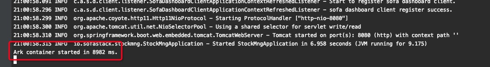

#### 5. Register plugin information in Dashboard

1. Click **Create**. 
2. In the popup dialog, enter plugin name and description.
3. Click **OK**.

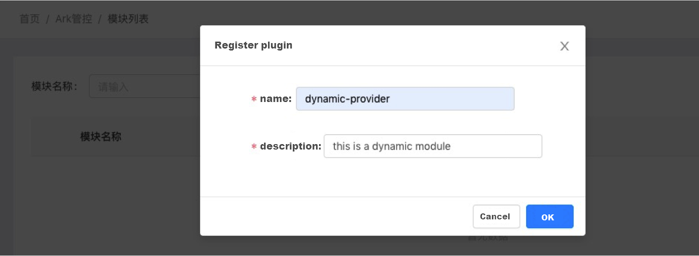

#### 6. Add a new version in Dashboard

Enter the absolute path or the resource URL in **File address**. Here we take file protocol as an example.

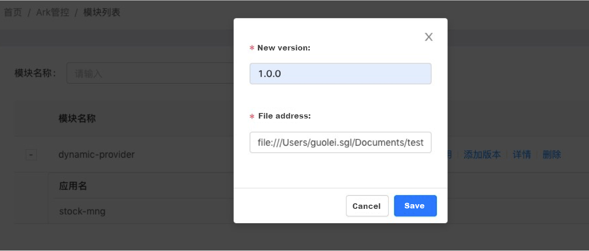

#### 7. Associate application

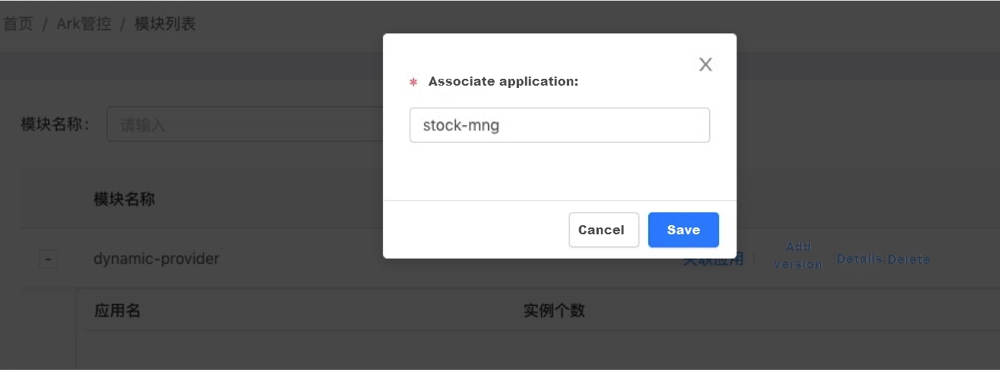

#### 8. View details and push install command

Click details in the interface as shown in the above screenshot to go to the plugin details page.

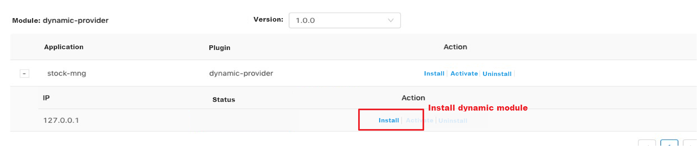

Before installing, you can first visit [http://localhost:8080](http://localhost:8080/). Since there is not any module providing JVM service currently, the product is listed in the default order, as shown in the following screenshot:

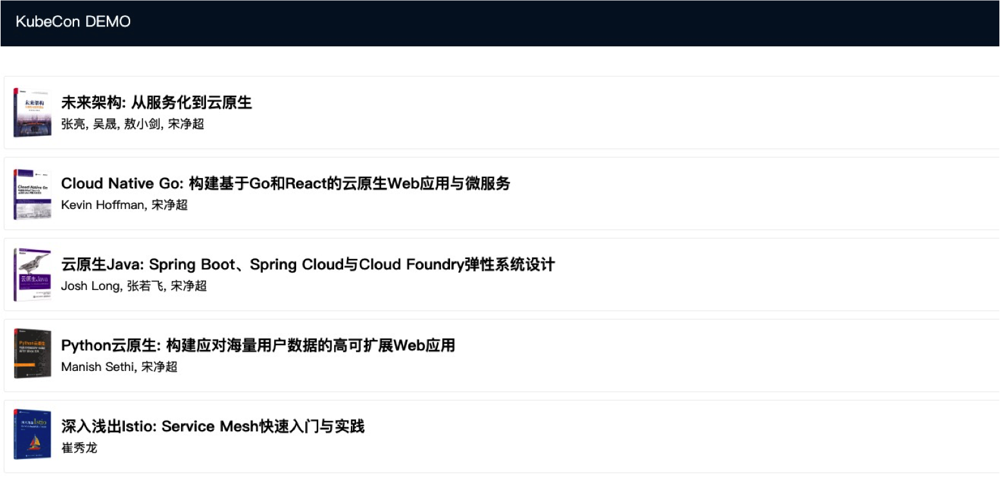

Then, click Install. After 1 ~ 2 seconds, the status is changed to ACTIVATED. 

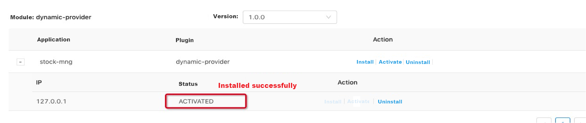

Then, visit [http://localhost:8080](http://localhost:8080/) again. The product order is as follows:

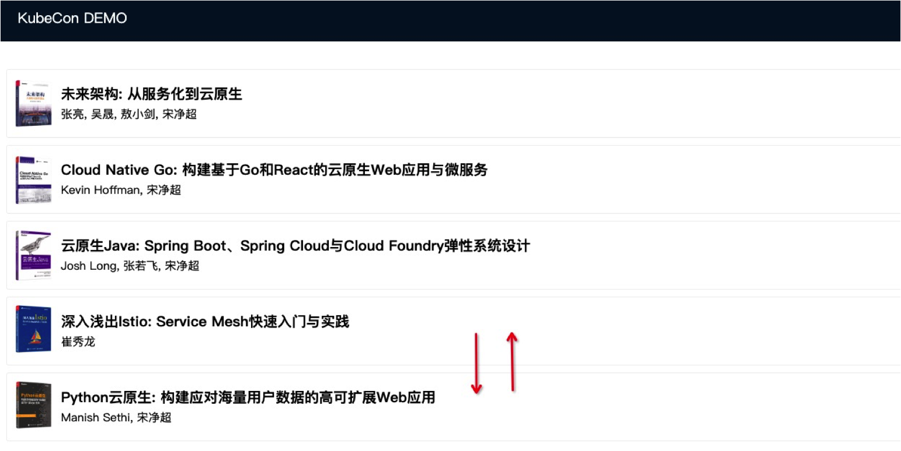
