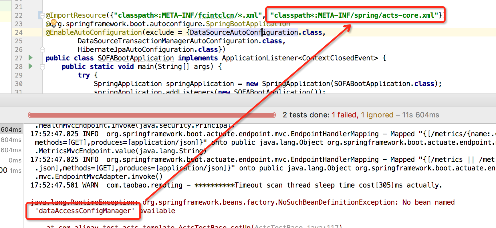
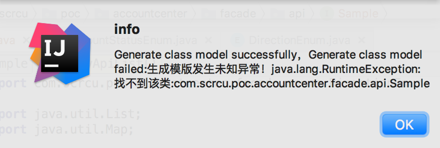
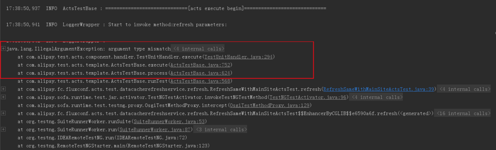
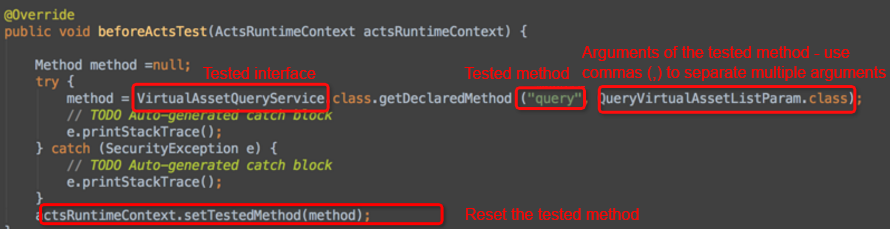

---

title: "FAQ"
aliases: "/sofa-acts/docs/FAQ"
---

## Q: What should I do if NoSuchMethodError is returned?

Generally, this error is returned in the case of dependency conflicts. Commonly known dependency conflicts are listed as follows. Exclude the corresponding dependencies when you encounter relevant conflicts.

### Log conflict

#### commons-logging conflict

```xml
<exclusion>
    <artifactId>commons-logging</artifactId>
    <groupId>commons-logging</groupId>
</exclusion>
```

#### logback-classic conflict

Rule out logback-classic by the location of the conflict. For example, application dependencies spring-boot-starter-logging and spring-test conflict with each other.

```xml
<dependency>
    <groupId>org.springframework.boot</groupId>
    <artifactId>spring-boot-starter-logging</artifactId>
    <version>1.4.2.RELEASE</version>
    <exclusions>
        <exclusion>
            <groupId>ch.qos.logback</groupId>
            <artifactId>logback-classic</artifactId>
        </exclusion>
    </exclusions>
</dependency>
<dependency>
    <groupId>org.springframework</groupId>
    <artifactId>spring-test</artifactId>
    <version>4.3.4.RELEASE</version>
    <exclusions>
        <exclusion>
            <groupId>ch.qos.logback</groupId>
            <artifactId>logback-classic</artifactId>
        </exclusion>
    </exclusions>
</dependency>
```

### snakeyaml conflict

```java
java.lang.NoSuchMethodError: org.yaml.snakeyaml.Yaml.<init>(Lorg/yaml/snakeyaml/constructor/BaseConstructor;)V
```

org.yaml referenced in spring-boot-starter-test conflicts with org.yaml referenced in org.testing. In the following sample code, a conflict of org.yaml in spring-boot-starter-test is ruled out (it can also be ruled out at other conflict locations such as org.testing):

```xml
<dependency>
    <groupId>org.springframework.boot</groupId>
    <artifactId>spring-boot-starter-test</artifactId>
    <scope>test</scope>
    <exclusions>
        <exclusion>
            <groupId>org.yaml</groupId>
            <artifactId>snakeyaml</artifactId>
        </exclusion>
    </exclusions>
</dependency>
```

## Q: What should I do if NoClassDefFoundError is returned?

Generally, this error is returned in the case of missing dependencies or dependency conflicts.

### Mockito returns a no class found error

While using Mockito with SOFABoot, you do not have to import Mockito if the spring-boot-starter-test dependency already exists.

## Q: What should I do if "No bean dataAccessConfigManager available" is returned?

This error is returned because the application starter class specified by the test script does not have the acts-core.xml file. You can add the acts-core.xml file according to the following figure.



## Q: What should I do if "No runnable methods" is returned?

Generally, this error is caused when you run your Junit test with the ACTS test script. You can use the TestNG framework to run the ACTS test script.

## Q: What should I do in the case of a model generation exception?

This exception may be caused in many circumstances. The most common cause of this exception is that a newly compiled class or a modified class has not been compiled by MAVEN. Execute the `mvn clean install -Dmaven.test.skip=true` command before generating the model.



## Q: What should I do if request parameters of the editor are incorrect?

When you operate on request parameters in ACTS IDE, you may not be able to select the request parameters, or the values of the request parameters are incorrect. This problem is generally caused by an improper test script generation operation, which directly generates the test script without a request parameter model. As a result, request parameters in the initially generated YAML file are incorrect.

- Solution 1: Delete the YAML file corresponding to the test script. Open ACTS IDE, right click Request Parameters and choose Select Model. Edit and save your configuration. The YAML file will be automatically generated again.
- Solution 2: Delete the test script and the YAML file. Generate the request parameter model, and then generate the test script. The new YAML file then has the request parameter settings by default.

## Q: What should I do in the case of an argument type mismatch?

Generally, this problem occurs when the tested interface has multiple overload methods with identical names. This causes argument mismatch during Java reflection.



### Solution

You can rewrite the findMethod method that is used by ACTS for testing base classes, to return the actual tested method object. You can also refer to the following code to solve the failure to obtain the tested method.

```java
@Override
public void beforeActsTest(ActsRuntimeContext actsRuntimeContext) {

    Method method =null;
    try {
        method = VirtualAssetQueryService.class.getDeclaredMethod ("query", QueryVirtualAssetListParam.class);
    } catch (NoSuchMethodException e) {
        e.printStackTrace();
    } catch (SecurityException e) {
        e.printStackTrace();
    }
    actsRuntimeContext.setTestedMethod(method);
}
```



## What should I do in the case of failure to save property values when I edit class properties in ACTS IDE?

Default classes in ACTS IDE use the standard JavaBean format. You can call the set method of the properties to set their values. If the set method does not exist, the values cannot be saved.

