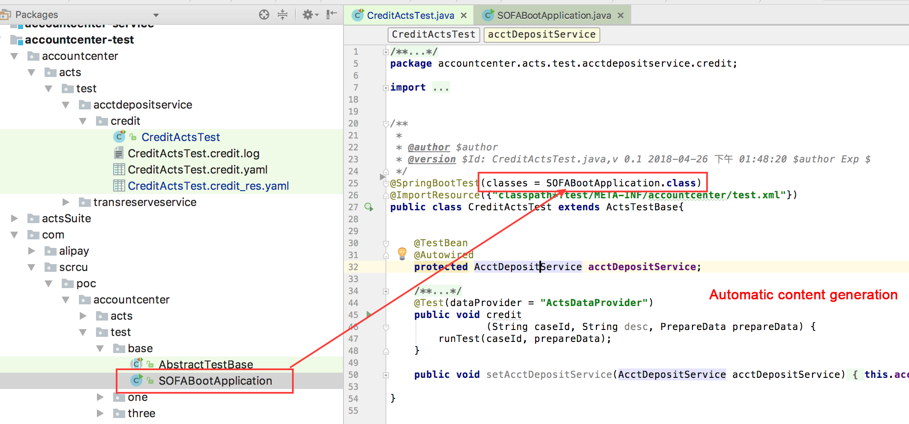

This topic comprises four parts:

- Part 1: Install the ACTS IDE visual editor on Intellij IDEA.
- Part 2: Import the ACTS dependency to a multi-module project.
- Part 3: Establish the ACTS framework in the test module to manage ACTS test cases.
- Part 4: Generate the ACTS test script.

## 1. Install ACTS IDE

__We recommend that you use Intellij IDEA 2017. For the sake of your data security, please download the ACTS IDE installation package from the following source only:__
[Click to download ACTS IDE](https://gw.alipayobjects.com/os/basement_prod/5436d6bc-0390-4db1-9ec7-54e287c731f6.zip).

Local installation: Choose Preferences > Plugins. Install the plugin from disk and restart Intellij IDEA.


## 2. Import the ACTS dependency

Before introducing the dependencies, make sure your application is a multi-module project (including the test module). After you import the dependency, ACTS places all test code under the test module for convenient ACTS test case management.

You can read the following information based on the actual situation of your application:

If your application is a complete multi-module project, you can refer to section 2.1 to import the ACTS dependency.
If your application is a multi-module project without a test module, you can refer to section 2.2 to quickly create a test module.
If your application is not a multi-module project, you can refer to section 2.3 to quickly create a multi-module project.
If you have not created a project yet, you can use SOFABoot to quickly create an application.

### 2.1 Multi-module application - with the test module

You only need to import acts-bom to the pom.xml file of the test module.

```xml
<dependency>
    <groupId>com.alipay.sofa.acts</groupId>
    <artifactId>acts-bom</artifactId>
    <version>${acts.version}</version>
    <type>pom</type>
</dependency>
```

### 2.2 Multi-module application - without the test module

Here, Intellij IDEA is used to create the submodule.

Right click the parent project, choose New > Module, and enter the name for the test module, which follows the pattern of appname-test. The step-by-step procedure is illustrated in the following figures.

#### Step 1: Create a test module


#### Step 2: Manage the test module

Manage the test module that you have created in the pom.xml file under the parent project.


#### Step 3: Import the ACTS dependency

Find the test module that you just created and import acts-bom to its pom.xml file.

```xml
<! -- Import the pom file that contains SOFABootApplication -->
<dependency>
    <groupId>com.example</groupId>
    <artifactId>example-service</artifactId>
</dependency>

<! -- Import the ACTS dependency -->
<dependency>
    <groupId>com.alipay.sofa.acts</groupId>
    <artifactId>acts-bom</artifactId>
    <version>${acts.version}</version>
    <type>pom</type>
</dependency>
```

### 2.3 Single-module application

If you already have a sound single-module SOFABoot application, you can quickly create a multi-module project based on the existing project in the following way:

#### Step 1: Create a parent project

Create a SOFABoot, delete irrelevant files, and keep only the pom.xml file.


#### Step 2: Create a submodule

Create a submodule by adding the existing application to the parent project as a module and pulling relevant dependency management to the parent project. For detailed steps of how to create a service module and a test module, see the following figures.


#### Step 3: Manage submodules


#### Step 4: Import the dependency

Import acts-bom to the pom.xml file of the test module.

```xml
<dependency>
    <groupId>com.alipay.sofa.acts</groupId>
    <artifactId>acts-bom</artifactId>
    <version>${acts.version}</version>
    <type>pom</type>
</dependency>
```

## 3. Initialize the ACTS test framework

You can complete the initialization with a few clicks as shown in the following figures. In figure 3.2, correctly enter the **application name** and select the **encoding format** that is suitable for your application.

For more information about the usage of files generated during initialization, see Framework preparation in the ACTS documentation.


## 4. Generate the test script

### 4.1 Starter class

Copy starter classes of the service module, such as SOFABootApplication, to the test module, and add the required configuration file: `classpath*:META-INF/spring/acts-core.xml`


### 4.2 Test script

Prerequisites: Be sure to use Maven to compile your project and generate the object model. Otherwise, ACTS IDE may encounter unexpected errors, such as edit failures and incorrect data.

Right click the tested method, and choose ACTS Function > Generate Test Case. Correct the import location of the SOFABoot starter class in the generated test script.




