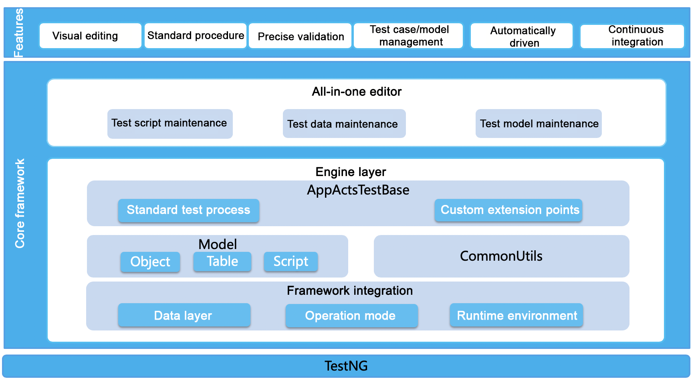
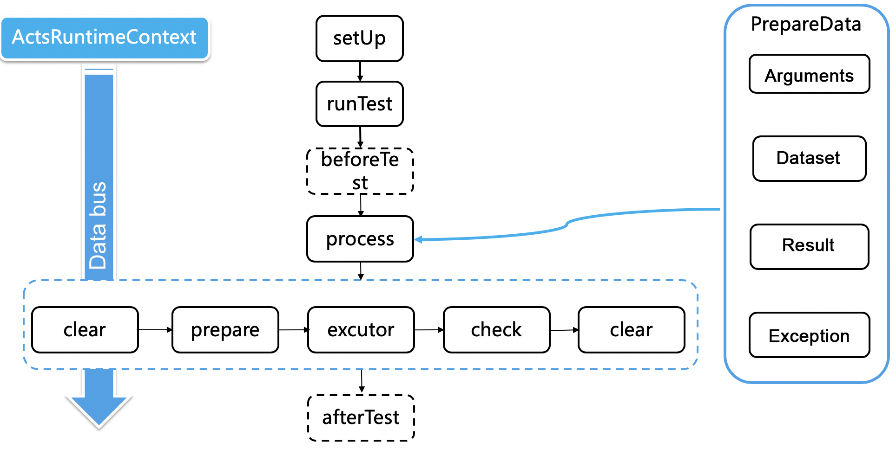

---

title: "SOFAActs overview"
aliases: "/sofa-acts/docs/Home"
---

AntCoreTest (ACTS) is a white-box test framework developed by Ant Financial based on years' testing knowledge and experience with the financial-level distributed architecture for the purpose of providing enterprises with a highly efficient, precise, and automated interface testing services.
In addition to general testing capabilities such as data-driven testing provided by conventional open source frameworks like TestNG, ACTS offers new features such as model-driven testing, visualized editing, and a standard process engine to assist engineers with efficient and high quality test case compilation as well as standard and precise test validation for interface testing.

ACTS is a next generation testing framework based on the data model-driven testing engine. ACTS is applicable to context environments that require the integration of TestNg and Spring. ACTS uses the YAML file as the data carrier and builds data model drivers upon it, providing features such as the all-in-one editor, precise validation, and efficient test case management to significantly improve testing efficiency.

## Operating principle

1. Upon the start of the test script, ActsDataProvider starts the tested method (the method annotated by @Test), loads the corresponding test case data file (YAML file), and converts the data into corresponding PrepareData objects.

2. When runTest starts running, it passes PrepareData and test case names to ACTS. ACTS then assembles such information into the ActsRuntimeContext class, transmits it in the entire process, and initializes the TestUnitHandler. The running period of the runTest process method consists of the following stages:

   | Action | Method |
   | :--- | :--- |
   | Clear | clear(actsRuntimeContext) |
   | Prepare | prepare(actsRuntimeContext) |
   | Execute | execute(actsRuntimeContext) |
   | Check | check(actsRuntimeContext) |

Description:

+ Clear: Clean up the preparation data and validation data to avoid the negative impact of dirty data on the test script.
+ Prepare: Prepare data such as DB data.
+ Execute: Call the tested method, and capture the corresponding information, such as responses and exception messages.
+ Check: Validate the corresponding information such as the responses, DB data, and exception messages based on the test data.

## Features

ACTS provides the following features:

### 2.1 All-in-one editor

The ACTS framework separates the test data from the test code, and provides the visual editor ACTS IDE. ACTS IDE can help you quickly enter, view, and manage the test case data, which significantly reduces repetitive coding.

### 2.2 Precise validation

To improve data fill-in efficiency and reduce omission of check points among the expectation data, such as response expectations and database expectations, the ACTS framework provides a run and backfill function. In addition, ACTS uses validation rule flags to implement precise validation of the expectation data.

### 2.3 Flexible scalability

ACTS provides a rich variety of APIs, which are encapsulated in the ActsRuntimeContext class. The APIs can help you quickly get and set custom parameters, test case request parameters, and response expectations, and allow you to customize test case data.

In addition, the ActsTestBase class exposes APIs of different execution stages, such as prepare, execute, check, and clear. For example, you can rewrite the process method to reorchestrate the entire test script.

### 2.4 Unified configuration capability

The configuration file provides extensive configuration options to help you customize the ACTS framework as needed.

## Scenarios

ACTS supports quick compilation and running of interface test cases for SOFABoot-based applications in the Intellij IDEA development environment. We recommend that you use Intellij IDEA 2017 for better compatibility with ACTS IDE.

