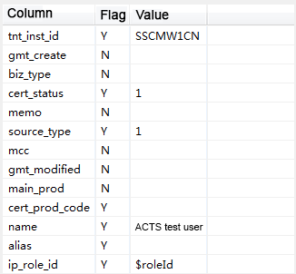
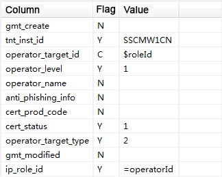
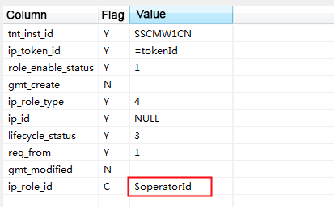
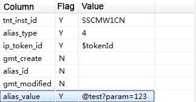

---

title: "Extensions"
aliases: "/sofa-acts/docs/Usage-API"
---

## Customize different engine stages

You can rewrite APIs provided by ActsTestBase in the test script or in the base class.

1. Rewrite the prepare, execute, check, and clear actions. For example, you can add some actions before or after super.prepare().
1. Rewrite the process method. You can add some actions before or after super.process() to reorchestrate the entire script. For example, you can add some personalized steps in the existing clear > prepare > execute > check process.
1. Rewrite beforeActsTest and afterActsTest to add some personalized actions before or after the running of each test case, such as preparing the context and refreshing the cache.

## Parameterization

In response expectation and database expectation data, you can use `$Variable name` to define a value as a variable. You can set values of the variable in the test script.
Supported scope: request parameters, responses, and database table fields. Supported types: Currently, only string parameterization is supported.

Usage:

(1) Add `$` before a value to define it as a variable in the interface.



(2) Assign values to the variables in the test script.

```java
@Override
public void beforeActsTest(ActsRuntimeContext actsRuntimeContext) {
    actsRuntimeContext.paramMap.put("roleId", "123");
    actsRuntimeContext.refreshDataParam();
}
```

When you write the database expectation, you can use the equal sign `=` to assign a value to the variable. This indicates that the value is a query result, and subsequent tables can use this variable as the value.





Assume that the interface will insert data into two tables.

| id_A | value_A |
| :--- | :--- |
| 123 | abc |

| id_B | value_B |
| :--- | :--- |
| abc | efg |

When you query these two tables, first query for value_A based on id_A in Table A that is returned by the interface. Then use value_A as a condition for the query in Table B. You can set the values as follows in the plug-in.

| Field | Flag | Value |
| :--- | :--- | :--- |
| id_A | C | $param1 |
| value_A | Y | =param2 |

| Field | Flag | Value |
| :--- | :--- | :--- |
| id_B | C | $param2 |
| value_B | Y | efg |

Operation description:

1. `=param2` and `$param2` indicate that the ACTS framework will first query for value_A in Table A, and then `select from B where id_B = value_A` to obtain the property value of id_B in Table B.
1. `$param1` indicates that you can assign a value to id_A in the code, for example:

```java
actsRuntimeContext.paramMap.put("param1","123");
```

This snippet assigns the value 123 to the variable param1. You can write this snippet to beforeActsTest in the test script to make the ACTS framework query table A before assigning the value 123 to id_A.

## Componentization

**Currently, only string componentization is supported.**

If a property is a dynamically generated string, for example, some IDs. You can use the at sign `@` to call a component to generate this property. The component must be placed in the component package at the same level as the test module, namely: `com.corpname.appname.acts.component` (appname is the name of the system, and corpname is the name of the company, for example, Alipay).

```java
public class MyComponent {
    @TestComponent(id = "test")
    public String test(String param) {
        return param+"123";
    }
}
```

Then use `acts-config.properties` to declare the parameter components to make them take effect. Use English commas `,` to separate multiple components. Avoid unnecessary trailing spaces.

```plain
param_components=IdGenerateComponent,NoGenerateComponent
```



As shown in the preceding figure, the value of alis_value is `@test? param=123`. When ACTS runs the test case, it automatically replaces the value of alis_value.

Component IDs must be unique. Otherwise, only the first component (among multiple components with identical Ids) is called. If a non-parameter component method is declared, you can simply annotate this method by using `@test`. In addition, component arguments can be passed in the form of variables. For example, in `@test? param=$id`, $id is replaced with the actual value when the test case is run.

Component parameters can also be called in the test script:

```java
ActsComponentUtil.run("@test?param=123");
```

If a custom component has multiple parameters, use ampersands `&` to separate the parameters, for example, `@test? param1=xxx&param2=yyy`

## Database utilities

### 1. Specify a datasource for DB table access

The ActsDBUtils class of ACTS supports database table access with specified data sources for personalized database operations. For example, assume that a database table has a data record that is neither preparation data nor validation data and must be deleted or updated after the test case is run. In this case, you need to use this utility to operate on the database data.

**Pre-use configuration**

To use a specified datasource, you need to first configure the datasource in the `acts-config.properties` file as shown in the following example.

```plain
datasource_bean_name_exampleDataSource=com.alipay.example.dal;exampleDataSource

#The overall configuration follows this format: datasource_bean_name_xxx(datasource name)=yyy(module name of the datasource);xxx(datasource name)
```

**Methods for specifying a datasource**

Description of the ActsDBUtils utility class method for specifying a datasource:

```java
public static int getUpdateResultMap(String sql,String tableName,String dbConfigKey);
```

You can use this method to specify a datasource for table addition, deletion, and edit. In this method, sql is a standard SQL statement, tableName is the logical table name, and dbConfigKey is the logical datasource configuration of the DB table.
The datasource is identical to the datasource name that you have configured in `acts-config.properties`.

```java
public static List<Map<String, Object>> getQueryResultMap(String sql, String tableName,String dbConfigKey);
```

You can use this method to specify a datasource for table query. These two methods are atomic database table operations. If you have other database operation requirements, you can encapsulate additional operations upon these two operations.

### 2. Access database tables without specifying a datasource

In this method, the ACTS framework searches the datasource by table name. The steps for using this utility method are as follows:

**Pre-use configuration**

```plain
datasource_bundle_name=com.alipay.example.common.dal
ds_exampleDataSource=table1,tabal2

#The overall configuration follows this format
#datasource_bundle_name=module name of the datasource
#ds_datasource name=logical table name of this datasource
```

**Methods without specifying a datasource**

```java
public static int getUpdateResultMap(String sql, String tableName);
```

You can use this method for table addition, deletion, and edit without specifying a datasource. In this method, sql is a standard SQL statement, and tableName is the logical table name.

```java
public static List<Map<String, Object>> getQueryResultMap(String sql, String tableName);
```

You can use this method for table query without specifying a datasource.

## Annotation extensions in different ACTS stages

You can annotate custom methods to perform personalized operations in different stages indicated by the annotation.

```java
@BeforeClean
public void beforeClean(ActsRuntimeContext actsRuntimeContext) {
    System.out.println("Execute before cleaning!") ;
}

@AfterClean
public void afterClean(ActsRuntimeContext actsRuntimeContext) {
    System.out.println("Execute after cleaning!") ;
}

@BeforePrepare
public void beforePrepare(ActsRuntimeContext actsRuntimeContext) {
    System.out.println("Execute before preparation!") ;
}

@AfterPrepare
public void afterPrepare(ActsRuntimeContext actsRuntimeContext) {
    System.out.println("Execute after preparation!") ;
}

@BeforeCheck
public void beforeCheck(ActsRuntimeContext actsRuntimeContext) {
    System.out.println("Execute before check!") ;
}

@AfterCheck
public void afterCheck(ActsRuntimeContext actsRuntimeContext) {
    System.out.println("Execute after check!") ;
}
```

You can simply annotate the method that you want to execute. Arguments of annotated methods must be consistent with those in the preceding example. ActsRuntimeContext is automatically passed to the annotated method for use by the ACTS framework.

