## Open ACTS IDE

In the Packages view, right click the function name annotated by @Test, and choose ACTS Function > Edit Test Case as shown in the following figure.

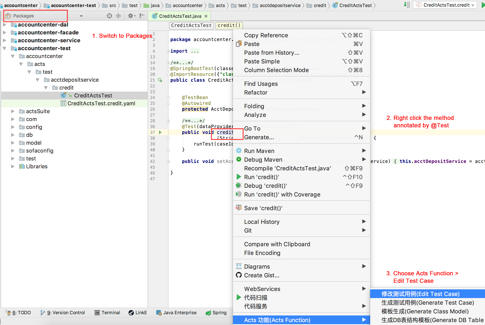

## Write test data

## Prepare request parameters

Prepare correct request parameter data for the request parameters (type, order, and quantity) of the tested method. The parameters are divided into simple and complex types. Simple parameters include parameter types String, Date, Integer, Float, Double, Long, Short, and Byte (including their corresponding basic types, such as int and float). Complex parameters include parameter types List, Map, Set, custom class, Java defined class, and their nested expressions.

### Simple request parameters

Right click Request Parameters, choose Select Model, and click Simple Type in the pop-up to select simple parameters.

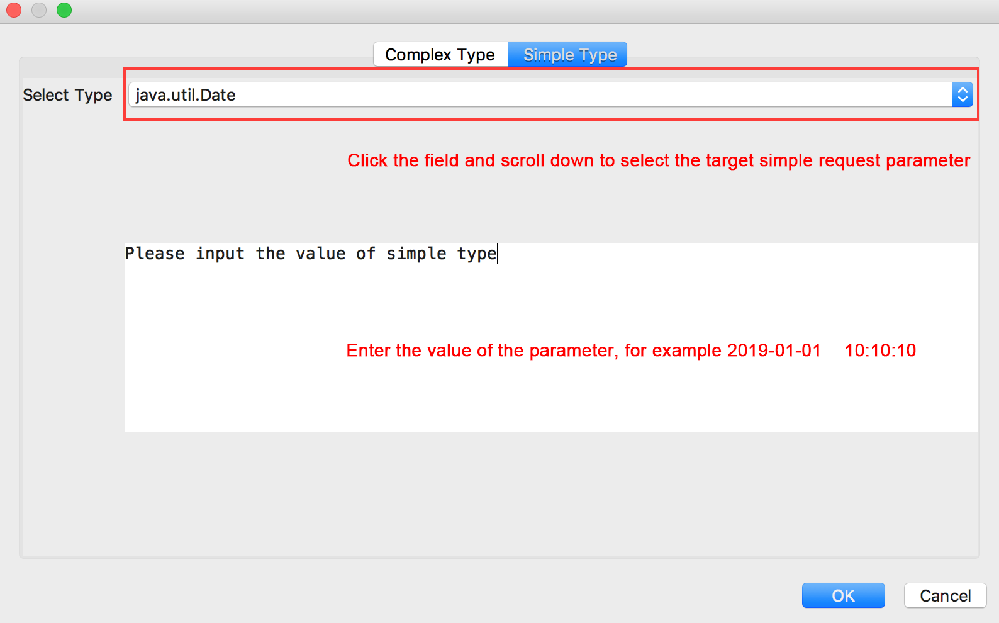

After importing simple request parameters, enter their values directly in the field as shown in the preceding figure.
Parameters listed top down are the first, second, and third parameters of the tested method. You can right click a parameter to adjust its order.

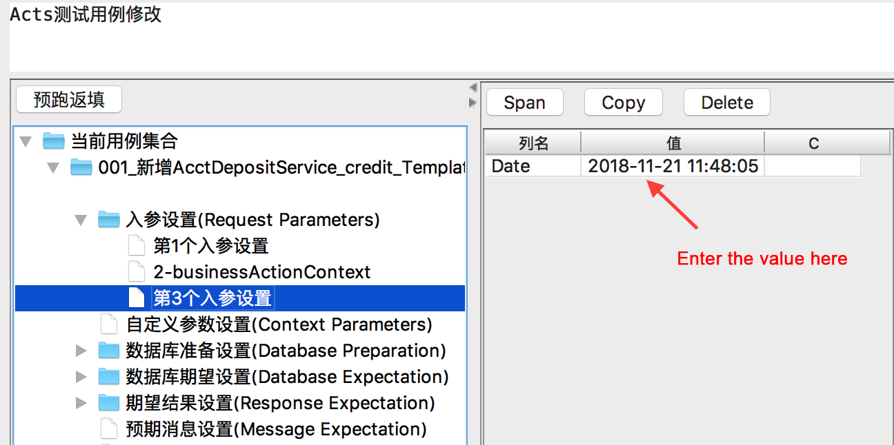

### Complex parameters

As shown in Figure 27, you need to generate request parameter models for the AccountTransRequest class and the BusinessActionContext class. Generally, class models of the tested method's request parameters and responses are automatically generated along with the test script. You can open ACTS IDE to edit class models of request parameters as shown in Figure 28.


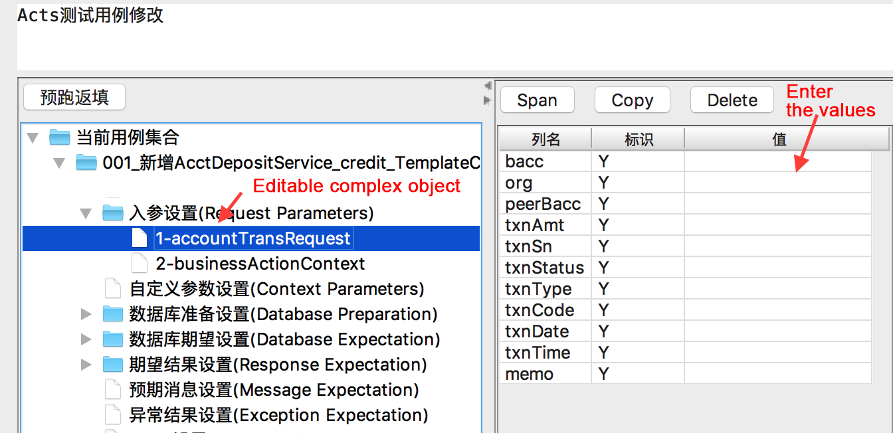

<p align="center">Figure 28</p>
If the models of the method's request parameters and responses are not identified when you generate the test script, first generate models of complex request parameters and responses (for detailed operation steps, see [Generate object model](../usage-model/#generate-object-model)). Then open ACTS IDE, right click Request Parameters, choose Select Model, and click Complex Type in the pop-up to add complex objects. After this, you can view and edit complex objects under Request Parameters.

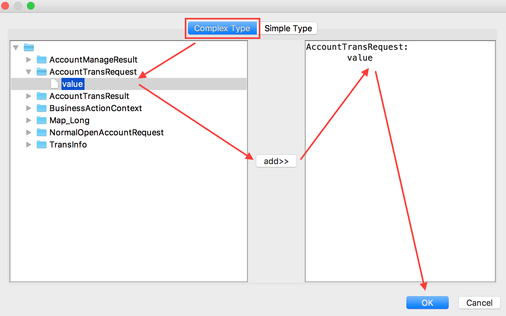

### List


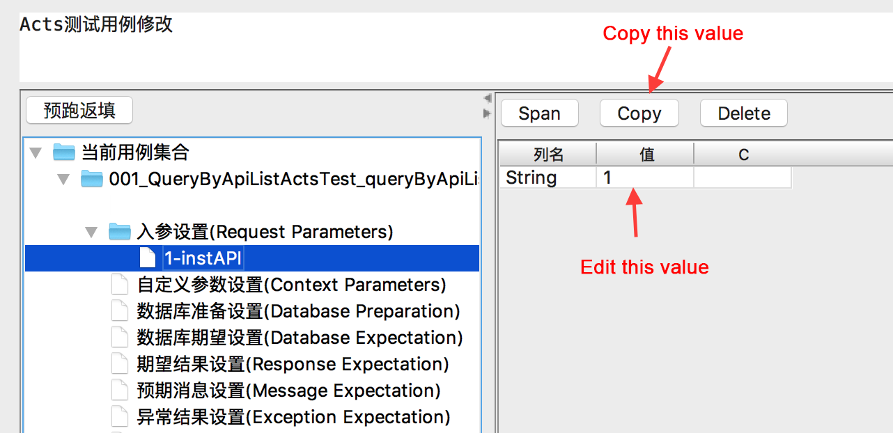

### Map

See example 2 (the Set type is similar).
In Figure 32, request parameters of the method shown in sample 2 is the `Map<String, Object>` type. Objects do not belong to a specific type. If you want to set an object as a complex one, edit the YAML file. For example, if you want to set an object as the AccountTransResult class, edit the YAML file as follows:

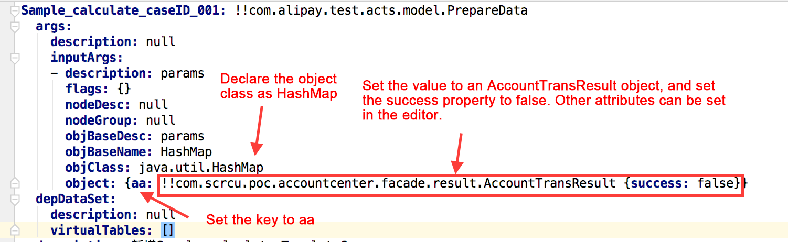

<p align="center">Figure 32</p>
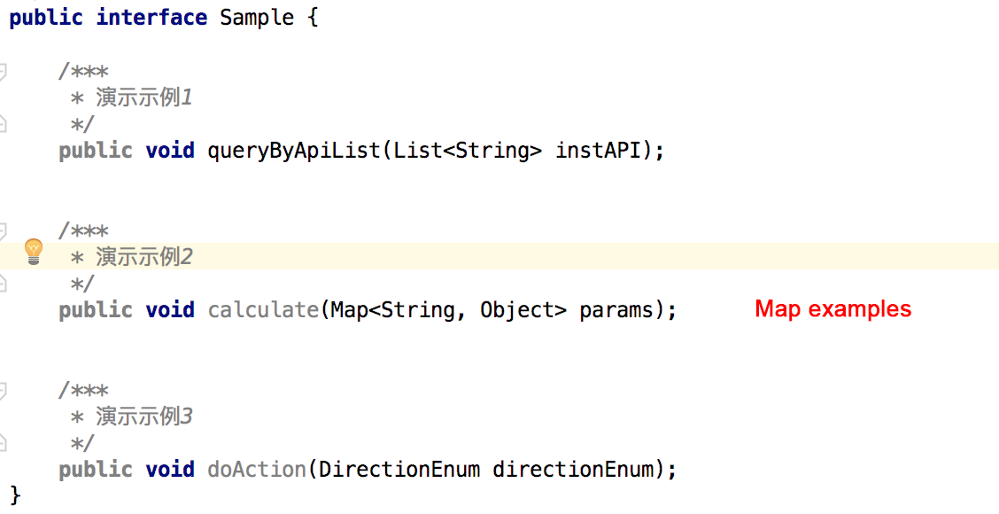

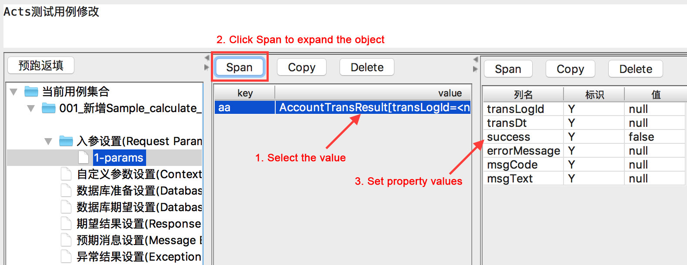

### enum

Example code:

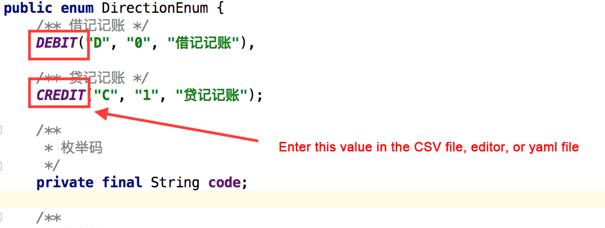

1. You can edit the values in ACTS IDE as follows:


2. If an enum type class is nested in another class, set the value of the enum type to DEBIT in the CSV model of the class.

3. Figure 37 shows the test case data in the YAML file.

```yaml
interestRecoverTypeEnum: !!com.alipay.fc.loancore.common.util.enums.InterestRecoverTypeEnum 'ALL'
```


<p align="center">Figure 37</p>
### Coding for request parameter preparation

You can override the prepare method, and use the ActsRuntimeContext method to quickly get and set test case request parameters. See Figure 38.

1. Get all request parameters: `List getInputParams()`
2. Get request parameters by position: `Object getInputParamByPos(int i)`
3. Add request parameters for the test case: `void addInputParam(Object obj)`

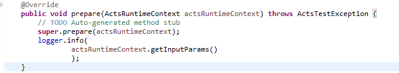

<p align="center">Figure 38</p>
## Prepare database data

### Prepare database data - single column database{#db-single}

As shown in Figure 39, right click Database Preparation, select the desired database model for insertion (ensure that this database model has been generated). The database preparation model is inserted when you click OK after performing steps 1 and 2. As shown in Figure 41, you can edit the data to be inserted into the database.

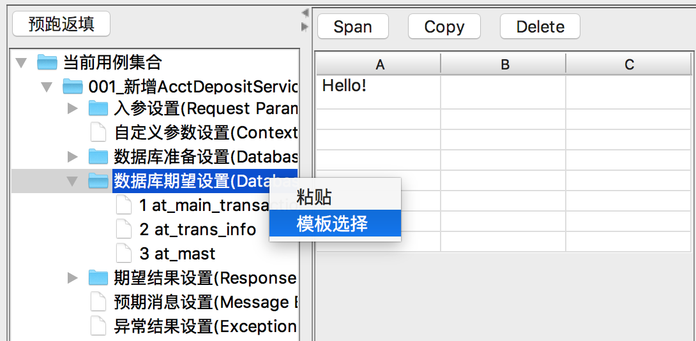

<p align="center">Figure 39</p>
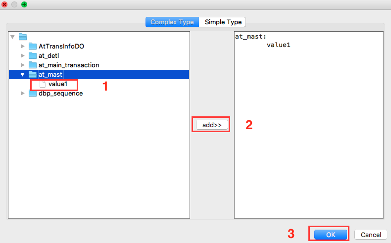

<p align="center">Figure 40</p>
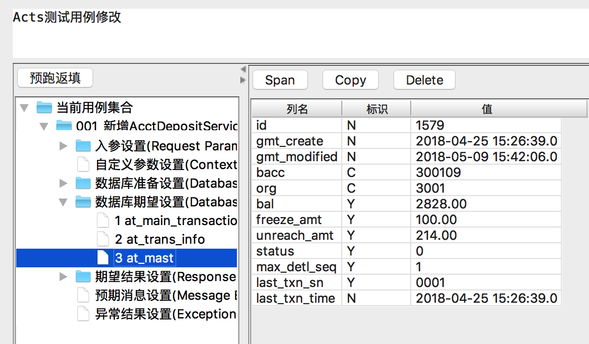

<p align="center">Figure 41</p>
### Prepare DB data - multi-column DB{#db-multi}

Select a column and click Copy. You can use this method to copy multiple columns and then edit the columns.

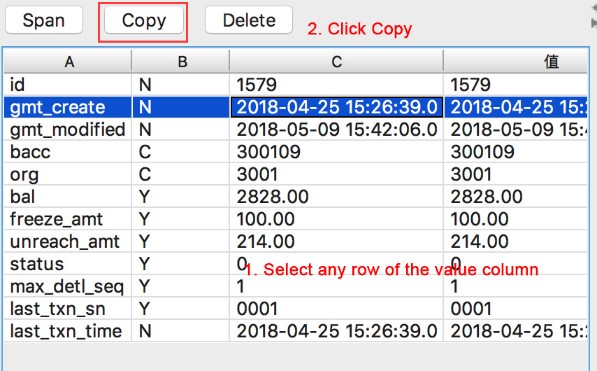

<p align="center">Figure 42</p>
### Prepare database data - flag description

Data dependency flags:

```plain
Y: indicates that the data is to be inserted.
N: indicates that the data is not to be inserted.
C: indicates that ACTS will clean the inserted data by taking this value as the where condition.
F: indicates that the value of this column is a database function.
L: indicates that a large field data record requires line wrap. The preparation method for this data record is: A=B;C=D.
```

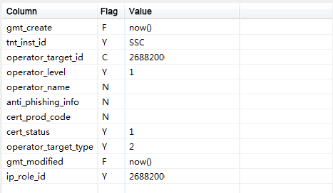

<p align="center">Figure 43</p>
## Prepare response expectation data

After generating the object model of response expectations, you can right click Response Expectation in ACTS IDE and choose Select Model as shown in the following figure.

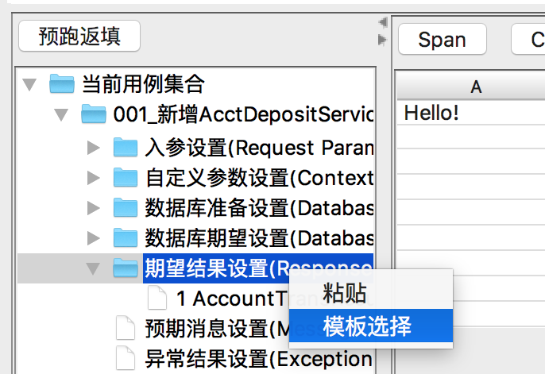

<p align="center">Figure 44</p>
### Flag description of response expectations

```plain
Y: indicates that the data needs to be validated.
N: indicates that the data does not need to be validated.
D: indicates the time difference between the expectation and the actual response, for example, D200.
ME: ACTS performs full-key validation on responses of Map type request parameters by default. ME indicates that the validation is performed based on the expectation keys. If you have more actual response keys than the expectation keys, the excessive part is not validated.
```

Validation description of Date type fields of the responses:

1. Y | null -> Indicates that the expectation is null.
2. Y | 2015-01-01 00:00:00 -> Indicates that the expectation is 2015-01-01 00:00:00
3. N | null -> Indicates that ACTS does not validate the responses.
4. D200 | 2015-01-01 00:00:00/null -> Indicates that there is a 200s difference between the actual response and the expectation 2015-01-01 00:00:00/new Date()

### Coding for response expectation preparation

You can override the prepare method, and use the ActsRuntimeContext method to quickly get and set response expectations.

1. Get response expectations: `Object getExpectResult()`
2. Set response expectations: `Boolean setExpectResult(Object objToSet)`

## Prepare database expectation data

### Prepare database expectation data - single column database

Perform the configuration in Database Expectation. For detailed operation steps, see [Prepare database data - single column database](#db-single)

### Prepare database expectation data - multi-column database

Perform the configuration in Database Expectation. For detailed operation steps, see [Prepare DB data - multi-column database](#db-multi)

### Flag description of database expectation data

Data validation flags:

```plain
Y: indicates that the data needs to be validated.
N: indicates that the data does not need to be validated.
C: indicates that ACTS uses a C-flagged value to select data from the database and compare the returned data records. If multiple records are returned, all the returned records are validated together with the Y-flagged data records.
CN: indicates that when ACTS uses C and CN as the condition to select data from the current database table, the result is empty.
D200: indicates that if the time difference between an actual data record and the expectation is smaller than 200s, the data record is considered to have passed the validation. The format of the date type is: today.
L: indicates the validation of line-wrapped large field database data. The preparation method for this data record is: A=B;C=D.
P: indicates the validation of large field database data. The key-value pair of the response expectation is used as the reference for validation of key-value pairs of large field database data records. Key-value pairs must be separated by line feeds in the database.
R: indicates regular expression match validation.
```

## Prepare exception expectation data

### Coding for preparing exception expectation data

Exception classes encapsulated by some systems do not have a default constructor. As a result, exception results added through the model may cause problems when you load the YAML file (the current class cannot be constructed without a default constructor). You need to write an exception script based on the custom parameters as follows:

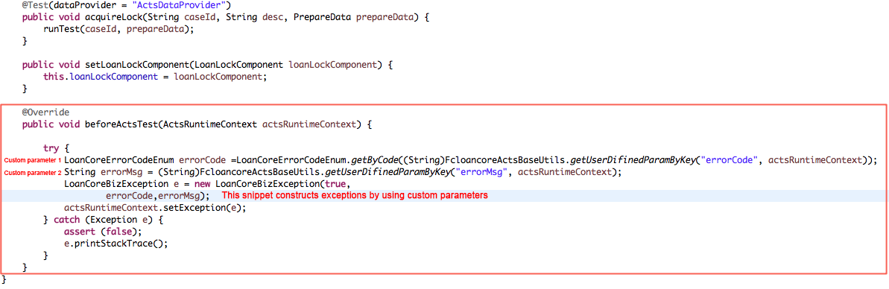

<p align="center">Figure 45</p>
## Prepare custom data

### Custom data - usage

A variety of data customized for use in the test process.

### Custom data - data type

For more information about the data type, see [Request parameters](#Request parameters).

### Coding for custom data preparation

Quickly get and set custom parameters:

1. Get all custom parameters: `getParamMap getParamMap()`
2. Get custom parameters by key: `Object getParamByName(String paraName)`
3. Add custom parameters: `void addOneParam(String paraName, Object paraObj)`
4. Replace custom parameters: `void setParamMap(Map<String, Object> paramMap)`
5. Get custom parameters by using a generic method: `T getParamByNameWithGeneric(String paraName)`

## Edit different types of data

### Edit simple type data

Take adding simple type data to Custom Parameters as an example. As shown in Figure 46, right click Context Parameters and choose Select Model. Enter the name of the request parameter in the pop-up dialog box.

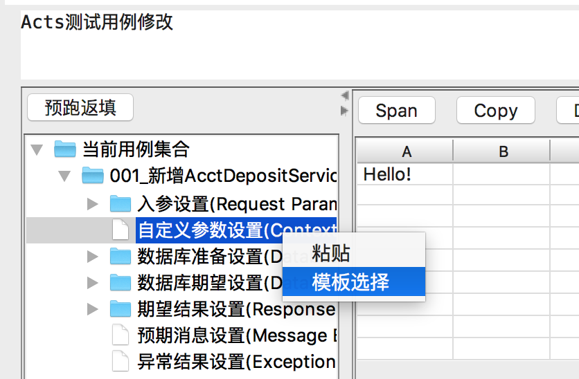

<p align="center">Figure 46</p>
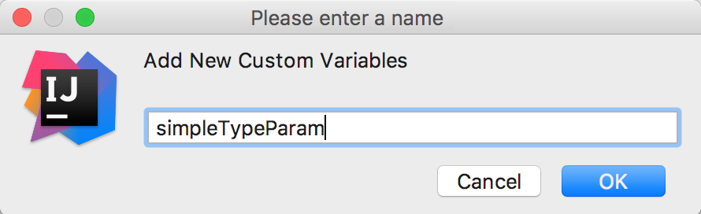

<p align="center">Figure 47</p>
Select java.lang.String and enter the value in the editing area. You can also edit the value later after the model is created.

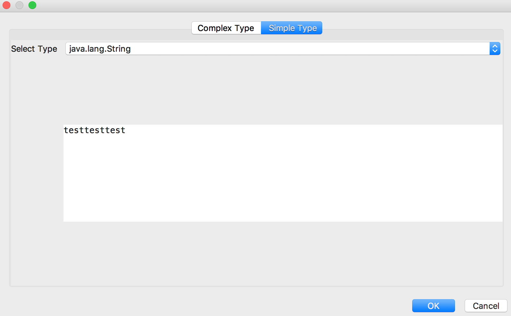

<p align="center">Figure 48</p>
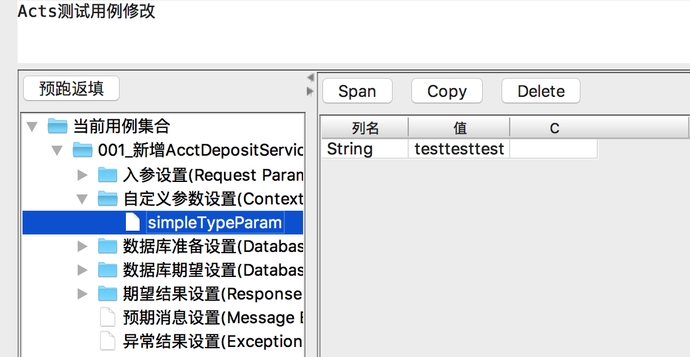

<p align="center">Figure 49</p>
### Edit complex type data

Take adding complex type data to Coustom Parameters as an example.

Refer to Edit simple type data and enter the name of the request parameter in the dialog box. Select a complex object from the model selection list (if no complex object meets your needs, create the corresponding data model first), click add, and then click OK.

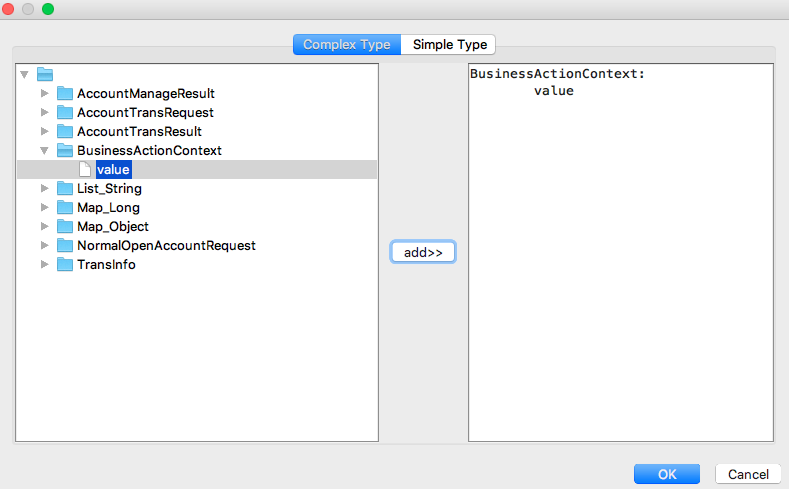

<p align="center">Figure 50</p>
If the complex object contains one or more context objects, select the row and click Span to expand the data in the editing area on the right side of the page. If nothing happens, move your pointer to the value column, and then click Span again. If more context objects exist, repeat this operation to expand the objects.

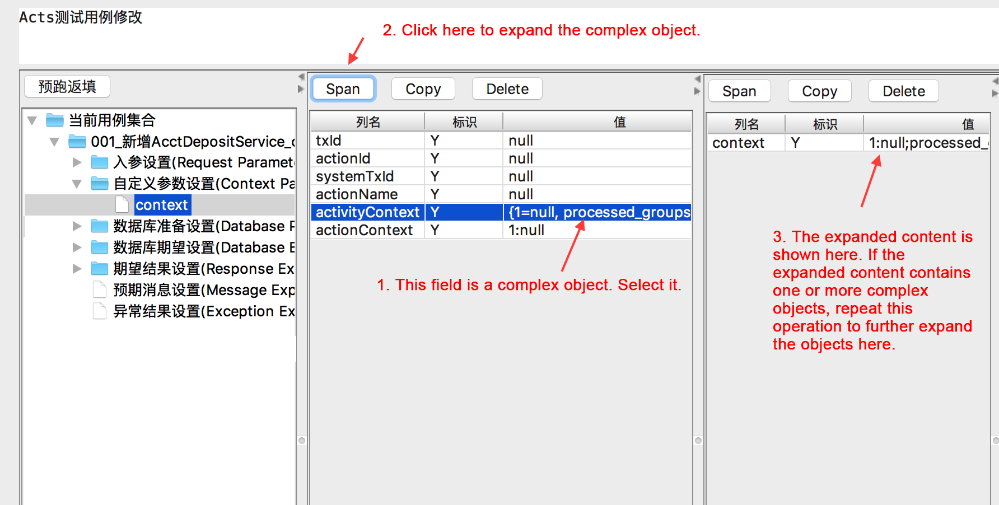

<p align="center">Figure 51</p>
### Edit the list model

Take adding `List<String>` to Custom Parameters as an example. Select the list model as shown in the following figure.


<p align="center">Figure 52</p>
Edit the list and select and copy the first column as shown in Figure 53.


<p align="center">Figure 53</p>
### Edit the map model

For details, see the Map section in Request parameters.

### Edit the enum model

For details, see the enum section in Request parameters.

## Right click functions

### Copy the current node

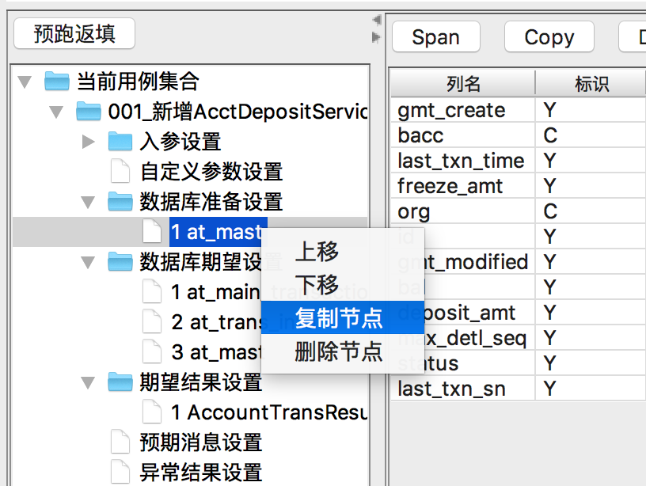

<p align="center">Figure 54</p>
### Delete the current node

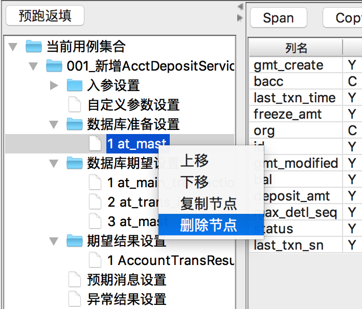

<p align="center">Figure 55</p>
## Modify the current use case name

Right click a test case, and select Modify the current use case name.


<p align="center">Figure 56</p>
## Copy the test case

Right click a test case, and select Copy Current Test Case.


<p align="center">Figure 57</p>
## Run and backfill

To improve the fill-in efficiency of the expectation data, such as the response expectation and the DB data expectation, the ACTS framework provides the Run and Backfill function. When you have prepared request parameters and database data for your test case, as well as the basic data to run the test case, you can run the test case without filling in the expectation data. The ACTS framework automatically captures the responses and database change data. After running the test case, you can open ACTS IDE and click __Run and Backfill__ to automatically fill in the expectation data of the specified test case. Specific use case:
Prerequisite: ACTS log function is configured.

1. `acts-config.properties` Set collect_case_result to true in the configuration file: `collect_case_result=true`.
2. Normally run the ACTS test case.
3. Use the plug-in to backfill the results. You need to select the row that you want to operate on.


<p align="center">Figure 58</p>
This feature is designed to provide users with convenience. After the backfill, strictly test each data record to ensure the accuracy and avoid omission.

### Backfill

As shown in Figure 59, select the test case for which you need to backfill the expectation data, and then click OK.

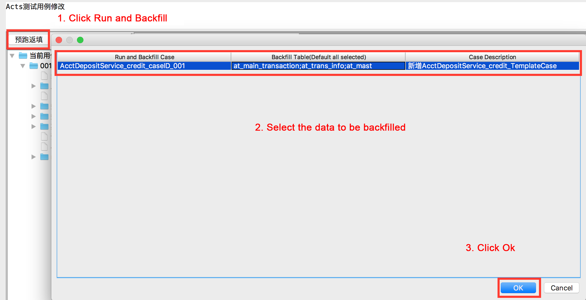

<p align="center">Figure 59</p>
