---

title: "Models"
aliases: "/sofa-acts/docs/Usage-Model"
---

## Quickly understand of ACTS models

When you write a test case, you need to prepare some database tables, request parameter data of methods, or data for validating database tables and responses. You can save such data in models, and import it to preparation data or validation data when you edit the test case. This allows you to conveniently reuse data. Currently, ACTS models can be divided into database models and class models.

In conventional test case compilation, data preparation of models, such as database models, request parameter models, and response models, is based on the test code. The complexity of models increases with the business complexity, especially in financial-level business applications, where a class or data table may have dozens of properties or fields, and where class nesting is common. In this case, constructing complex objects is extremely difficult and prone to omissions. Some of the most frequently occurring problems are listed as follows:

* Omissions may occur and troubleshooting takes a lot of time for a large number of tables.
* Field names of tables are difficult to remember, and spelling errors frequently occur.
* The large number and complex types of interface request parameters are frustrating.
*  There are so many class properties that important properties are prone to omission.
* Object construction with nested structures requires continuous effort in creating and setting values.
* Important properties are easily omitted when the inheritance and implementation relationships are complex.

ACTS models can effectively address the above problems by formatting classes and tables in CSV, which makes the structure of classes easier to understand. Class models and data table models can help you quickly create objects, and serialize them into the YAML file. ACTS models allow you to conveniently manage test case data.

### Storage location of models

You can view existing models under the resource/model directory of the test module.

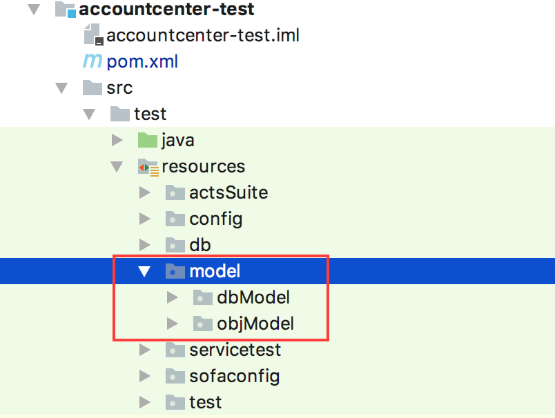

Figure 4

## Generate data table model

### Sample data table model

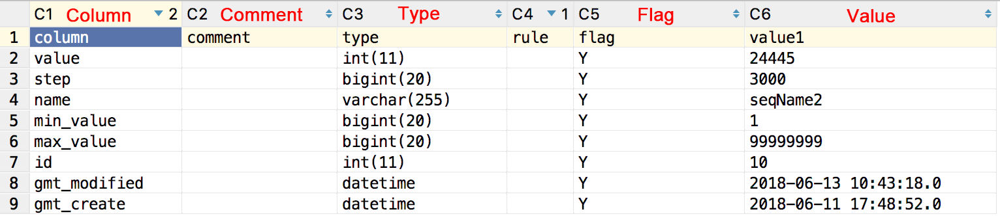

Figure 5

**1. Validation flag description**

    Y: indicates that the data is to be inserted.
    N: indicates that the data is not to be inserted.
    C: indicates that ACTS will clean the inserted data by taking this value as the where condition.
    F: indicates that the value of this column is a database function.
    L: indicates that a large field data record requires line wrap. The preparation method for this data record is: A=B;C=D.
    

**2. Quickly import data from models during test case editing**

When editing database table data (including preparing table data and expectation data) in ACTS IDE, you can right click to add a model of the specified table, to import all fields and values of the specified table directly from the CSV file of the table model for quick editing.
For more information about the use of DB models, see Prepare database data.

### Generate table model

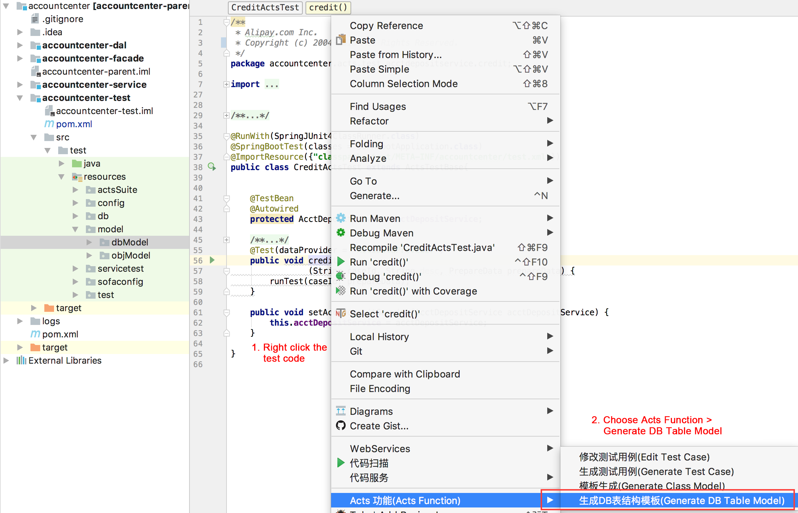

Figure 6

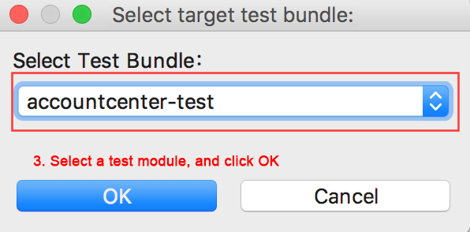

Figure 7

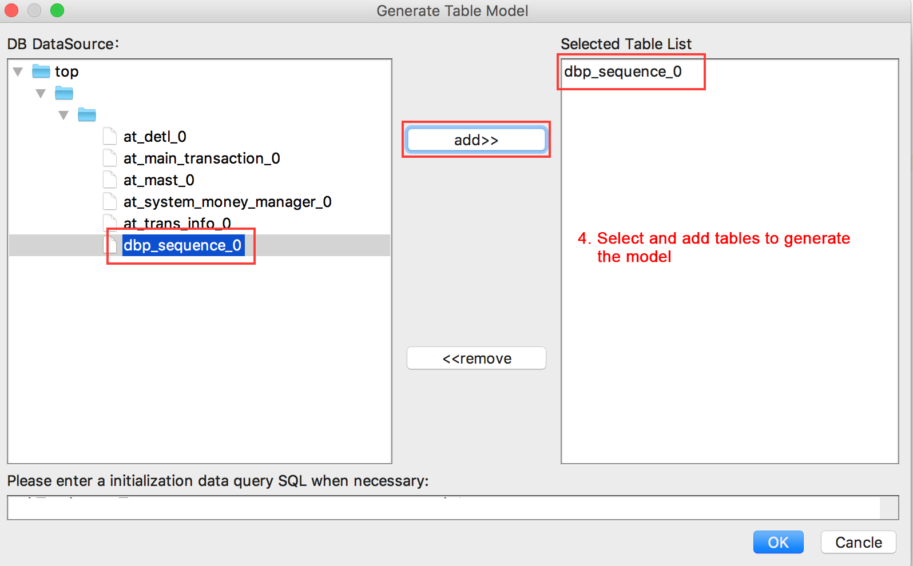

Figure 8

Click OK to generate the model as shown in Figure 9.

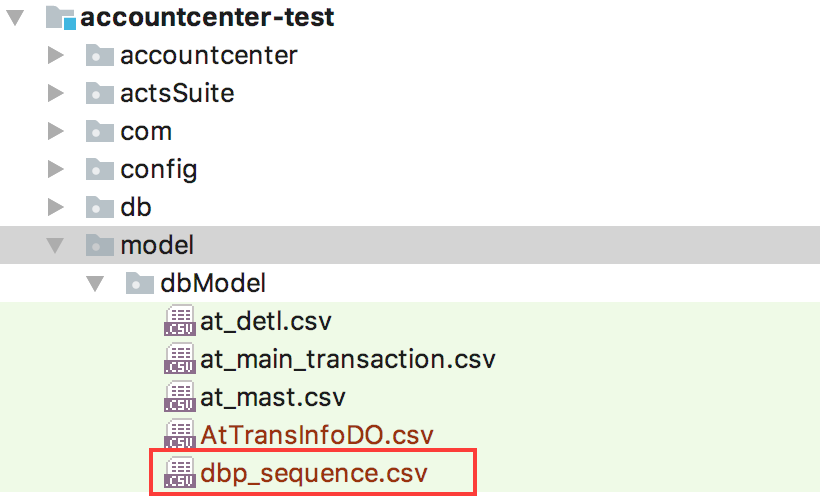

Figure 9

ACTS also supports table model generation without a direct JDBC connection. Specifically, you can right click the DO class, and generate a table model based on the DO class:
Right click the DO class, and choose ACTS Function > Generate DO Model.

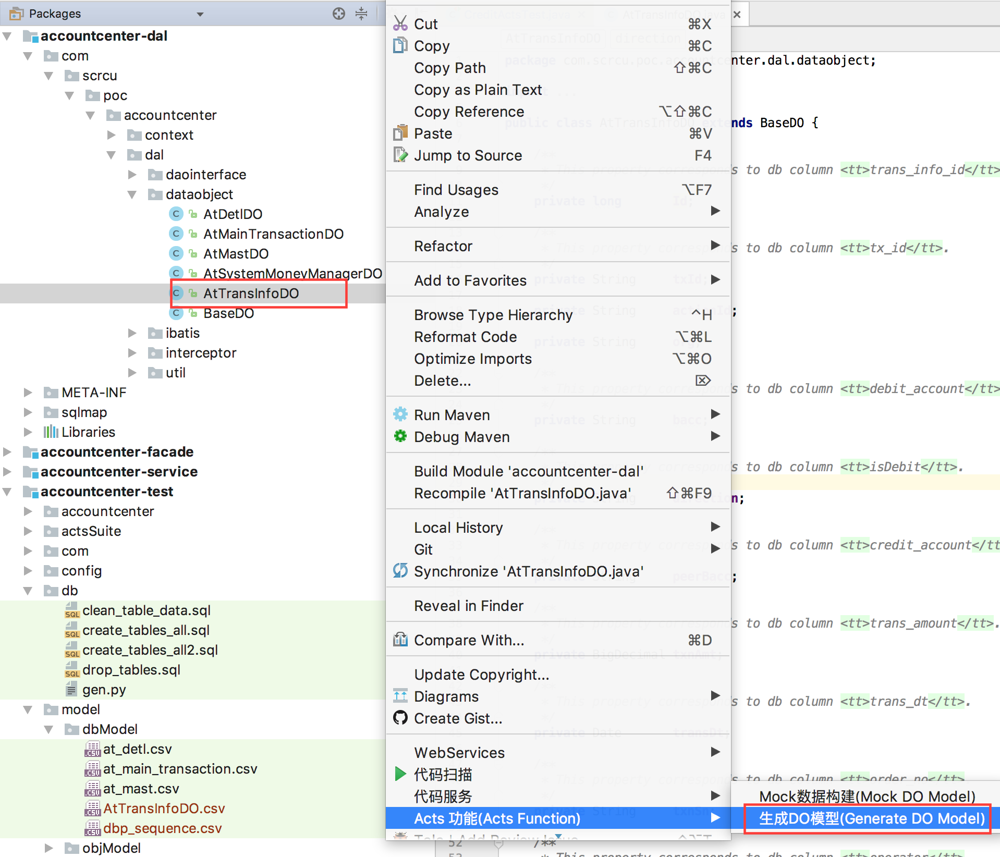

Figure 10

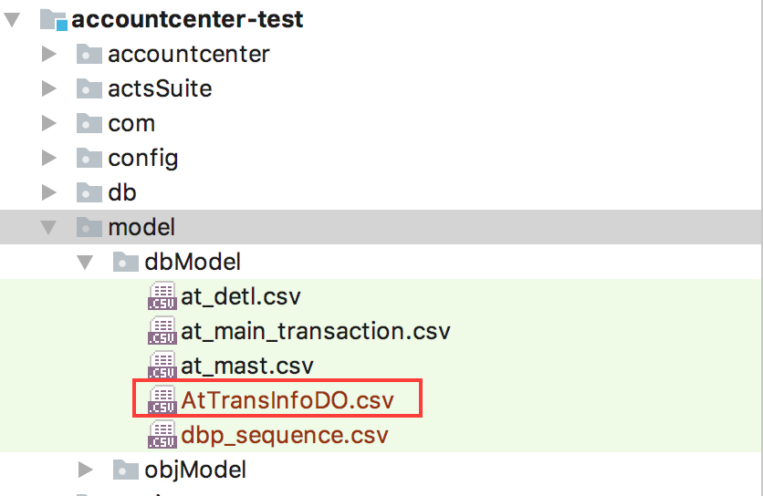

Figure 11

## Generate object model

### Sample object model

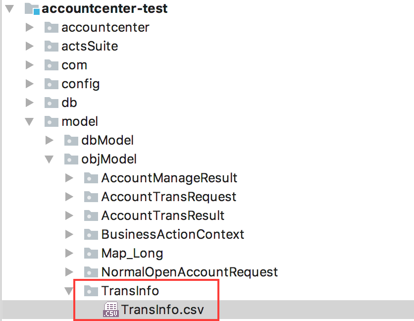

Figure 12

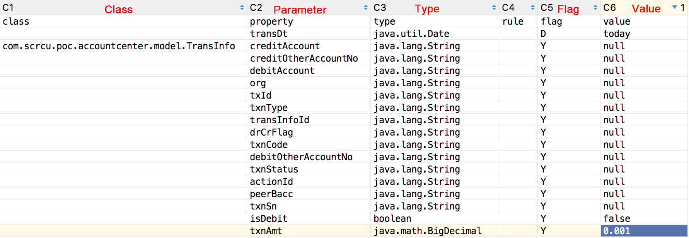

Figure 13

A complex object is a closed package that contains not only its own model but also the models of its nested objects.

ACTS uses models to quickly import data and edit complex objects (including request parameters, responses, and exceptions). You can right click a class model in ACTS IDE to construct objects of this class, and assign values to these objects for quick editing.

### Generate object model

You can generate an object model by using one of the following methods:
1. Right click any method defined in the class that you want to generate the object model for.
1. Right click any method defined in the interface as shown in the following figure.

If you use IDEA, ensure that your code has been compiled. IDEA does not automatically compile your code and you need to manually proceed with `mvn clean install`, or enable the automatic compilation function by choosing File > Settings > Build,Execution,Deployment > Compiler > Make project automatically.

#### Generate object model in ACTS IDE

(1) Right click any method defined in the class that you want to generate the object model for.

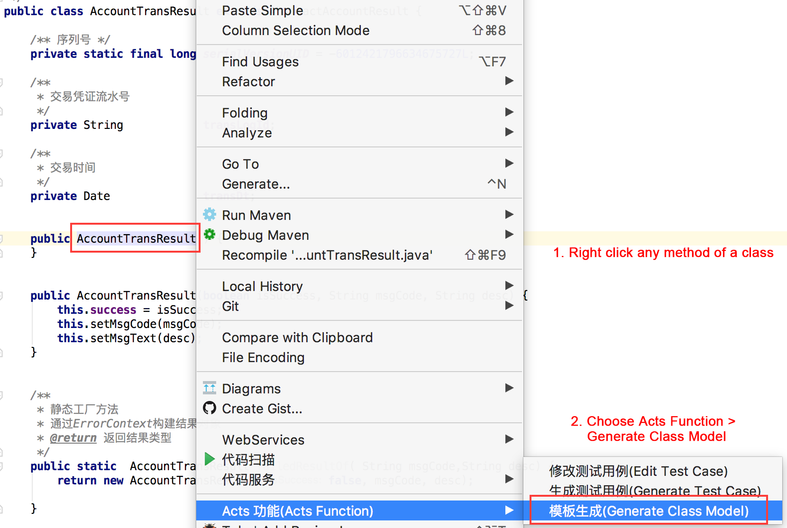

Figure 14

(2) Right click any method defined in the interface to generate models of complex request parameters and complex responses of all methods in the current interface.

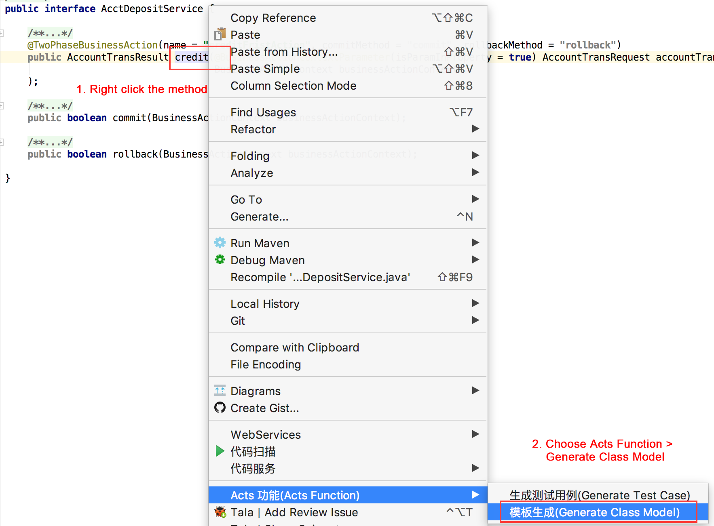

Figure 15

