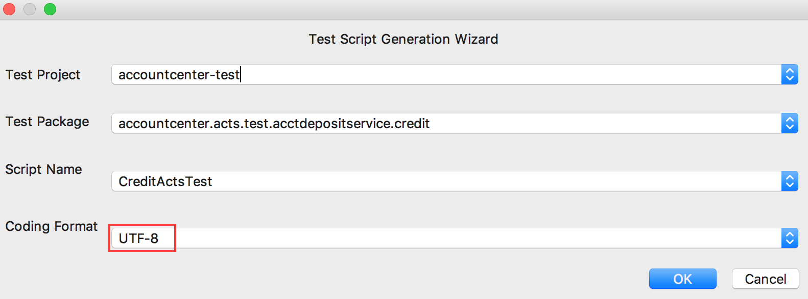
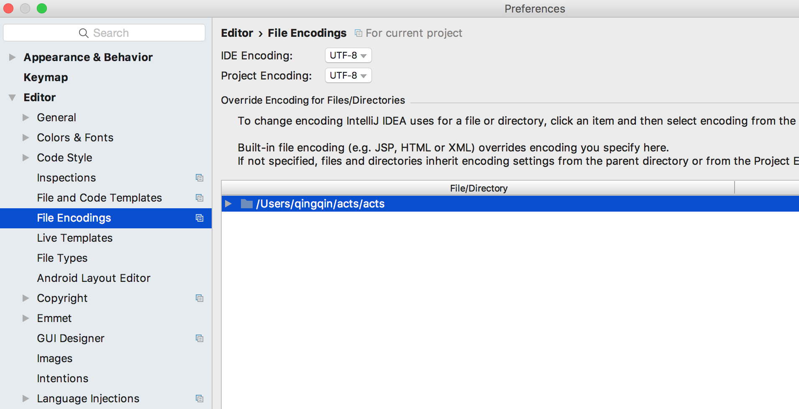
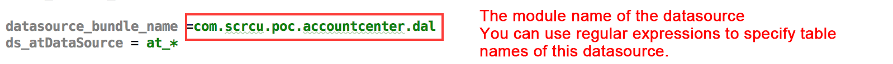
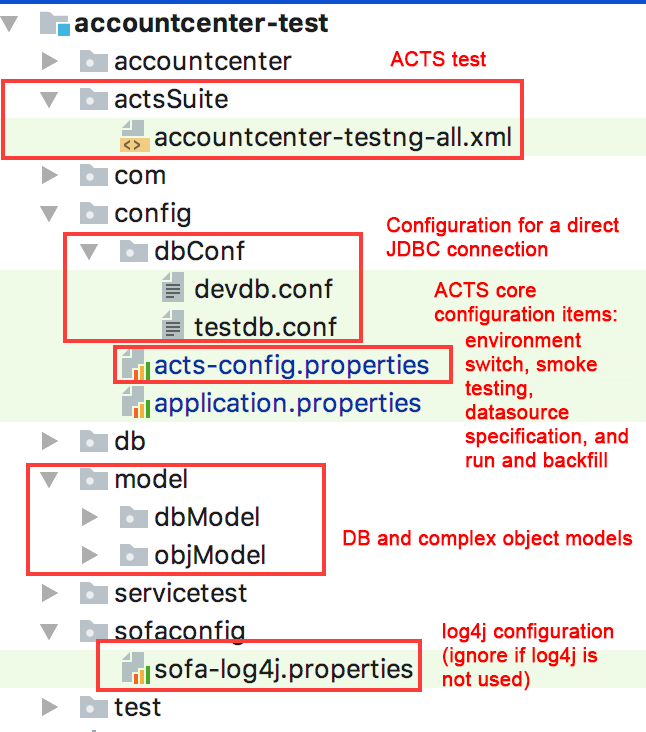

---

title: "Framework preparation"
aliases: "/sofa-acts/docs/Usage-Ready"
---

# Framework preparation

Before reading, you can download and install ACTS IDE and import the ACTS framework by refering to [Quick start](../getting-started).

This topic mainly describes the encoding, datasource configuration, and quick configuration to help you use the ACTS framework.

## Encoding

Ensure that the encoding of ACTS and that of the system code are consistent, specifically, ensure that the encoding for script generation and the encoding of the IDEA workspace are consistent with the encoding of your application code. Otherwise, the code may get corrupted.

The encoding selected for test script generation is shown as follows.



Encoding of the IDEA workspace:



## Datasource configuration

The purpose of configuring data sources in ACTS is to ensure that you can use the system's data sources to properly perform database addition, deletion, and query operations during the preparation, clearance, and check stages.

#### Datasource configuration

Configure the mapping relationship between the ModuleName, datasource, and tables at the DAL layer in `src/test/resource/config/acts-config.properties`. The name of datasources starts with ds_ as follows:

```plain
datasource_bundle_name =com.alipay.testapp.common.dal
ds_bean1=table1,table2
ds_bean2=table3,table4

#Configuration format
#ds_datasource bean=logical table 1,logical table 2
```

Bean 1 and bean 2 are the names of the datasource beans at the DAL layer of the application code. Multiple datasources are supported. The table name supports regular expressions and sharding suffixes are not required. In the case of multiple datasources, a table must belong to only one datasource. See the following figure.



#### Direct JDBC connection to the database

The direct JDBC connection to the database is used to generate the DB data model. The configuration in devdb.conf or testdb.conf under `src/test/resource/config/dbConf/` is as follows:

```plain
xxx_url = jdbc:oracle:thin:@localhost:1521:cifdb
xxx_username = myname
xxx_password = mypswd
```

## Quick configuration description

The quick test framework configuration mainly generates the basic Java classes and the necessary configuration files:

#### Java classes

+ AppNameActsBaseUtils.java

   The utility class that is commonly used in the test script writing process to get various data from the ACTS framework. The initial version provides only common methods. You can add desired methods by yourself.

+ AppNameActsTestBase.java

   The encapsulated application test base class. If you have special business system requirements, you can encapsulate additional methods based on this class. If not, ignore this file.

#### Configuration files



