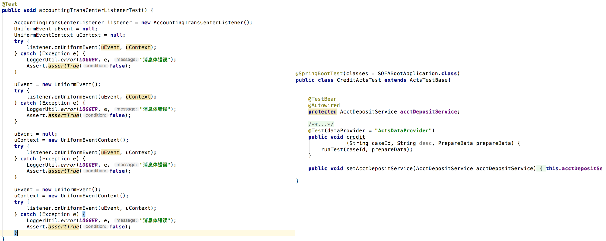
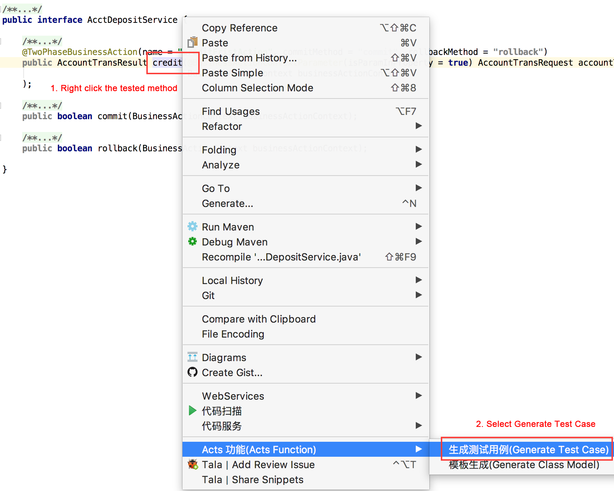
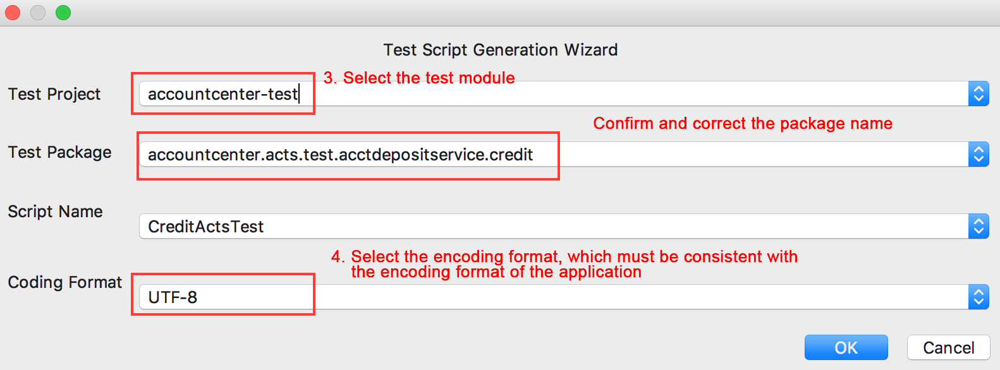
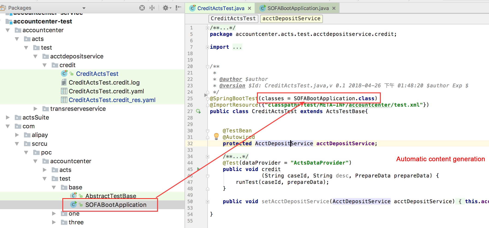
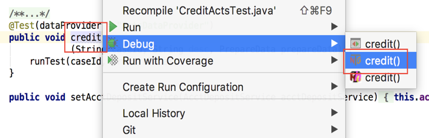
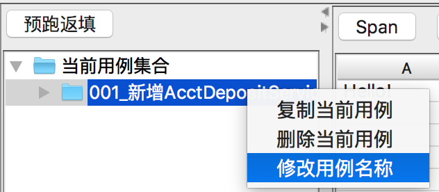
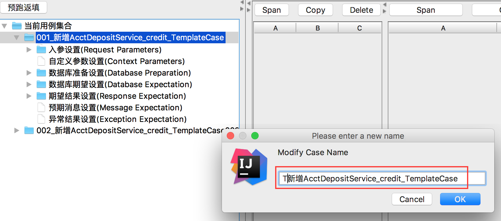
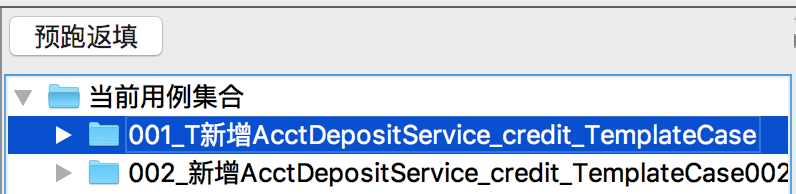

---

title: "Scripts"
aliases: "/sofa-acts/docs/Usage-Script"
---

## Quickly understand ACTS scripts

Do you have to frequently compile test cases? Are you frustrated by the following problems?

* You have to repeat assertEquals, which is definitely not creative.
* Missing an assert may lead to false success, while mistaking one may ruin your mood.
* If the scenario is complex, the test code may be longer than the service code, which is painful.
* You have to migrate utility classes every time you start writing test cases for a new application.

A TestNG test case is shown on the left side, and an ACTS test case on the right. Repeated coding is gone, and the code size is significantly reduced. Unlike ordinary test scripts, ACTS scripts inherit from the ActsTestBase class, which is encapsulated with data loading methods, driving methods, execution engines, and validation rules. Users do not have to clean or prepare data, run test cases, or validate results. ACTS implements zero coding for simple services, which greatly reduces the coding and maintenance costs.



## Generate test scripts

Prerequisites: __Be sure to use Maven to compile your project and generate the object model. Otherwise, ACTS IDE may encounter unexpected errors, such as edit failures and incorrect data.__

Right click a the method defined in the interface and select ACTS Function > Generate Test Case.







## Run test script

Method: Right click the tested method in ACTS script, and select TestNG to run the test script as shown in the following figure.



## Specify a test script to run

1. Set `test_only＝^T` in `src/test/resource/config/acts-config.properties` to run only the test case whose name starts with `T`. You can also replace `^T` with other regular expressions.

2. In this case, you can modify the name of the test case that you want to run by adding `T` in front of its name. ACTS only runs a test case whose name starts with `T`.







## Split test cases of the test script

ACTS stores all test case data of a test script in the same YAML file by default. You can determine whether to store test case data by test script or by test case by configuring the option `spilt_yaml_by_case`.
It is set to false by default, which means all test case data of the same test script is stored in one YAML file.

You can set `spilt_yaml_by_case=true` in `acts-config.properties` to store each test case of a new test script in a separate YAML file that is named after the case ID. This reduces the chances of file conflicts in the case where multiple developers work on the same interface.

In addition, ACTS provides a utility class that allows you split a legacy YAML file of a specified test script under a specified path by test case. See the following.

  __BaseDataUtil.saveYamlDataToCaseByCase__

* Note: Before the split, we recommend that you rename the original YAML file for backup, and then use the test case editor to check whether the content of the split files is correct. The original YAML file must be deleted if the split files are correct, because they cannot coexist.

## Coding for data preparation

ACTS provides context APIs in the ActsRuntimeContext class for data preparation as follows:

+ Quickly get and set custom parameters:

   Get all custom parameters: `getParamMap getParamMap()`
Get custom parameters by key: `Object getParamByName(String paraName)`
Add custom parameters: `void addOneParam(String paraName, Object paraObj)`
Replace custom parameters: `void setParamMap(Map<String, Object> paramMap)`
Get custom parameters by using a generic method: `T getParamByNameWithGeneric(String paraName)`

+ Quickly get and set test case request parameters

   Get all request parameters: `List getInputParams()`
Get request parameters by position: `Object getInputParamByPos(int i)`
Add request parameters for the test case: `void addInputParam(Object obj)`

+ Quickly get and set response expectations

   Get response expectations: `Object getExpectResult()`
Set response expectations: `Boolean setExpectResult(Object objToSet)`

## Use of the Mock function

The Mock function is currently based on the Mockito solution. For details, see the [Mockito documentation in English](https://static.javadoc.io/org.mockito/mockito-core/2.18.3/org/mockito/Mockito.html) or [Mockito documentation in Chinese.](https://github.com/hehonghui/mockito-doc-zh)

### Add the dependency

Add the following dependency to the test module (skip this step if you have already introduced the test starter of SOFABoot)

```xml
<dependency>
    <groupId>org.springframework.boot</groupId>
    <artifactId>spring-boot-starter-test</artifactId>
    <scope>test</scope>
</dependency>
```

By default, the Mockito version that Spring test depends on is 1.x. If you want to upgrade the version, exclude it first before you import the new version.

```xml
<dependency>
    <groupId>org.mockito</groupId>
    <artifactId>mockito-core</artifactId>
    <version>2.18.3</version>
</dependency>
```

__Mockito__ is used for stubbing during testing. You can use it to specify the value to be returned by a specific method of a class under a certain condition. The Mockito library enables object mocking, verification and stubbing. The sample code is as follows:

```java
@SpringBootTest(classes = SOFABootApplication.class)
@TestExecutionListeners(listeners = MockitoTestExecutionListener.class)
public class RegisterUserActsTest extends ActsTestBase {

    @TestBean
    @Autowired
    // This is the test class
    public UserService userService;

    @MockBean
    // This is the bean to be mocked
    public AccountManageFacadeClient accountManageFacadeClient;

    @Test(dataProvider = "ActsDataProvider")
    public void registerUser
                (String caseId, String desc, PrepareData prepareData) {
        runTest(caseId, prepareData);
    }

    @Override
    public void beforeActsTest(ActsRuntimeContext actsRuntimeContext) {
        super.beforeActsTest(actsRuntimeContext);
        AccountManageResult accountManageResult = new AccountManageResult();
        accountManageResult.setAccountNo("testAccount");
        accountManageResult.setOperateDt(new Date());
        accountManageResult.setSuccess(true);
        Mockito.when(accountManageFacadeClient.openAccount(Mockito.any(NormalOpenAccountRequest.class))).thenReturn(accountManageResult);
    }

    public void setUserService(UserService userService) {
        this.userService = userService;
    }
}
```

