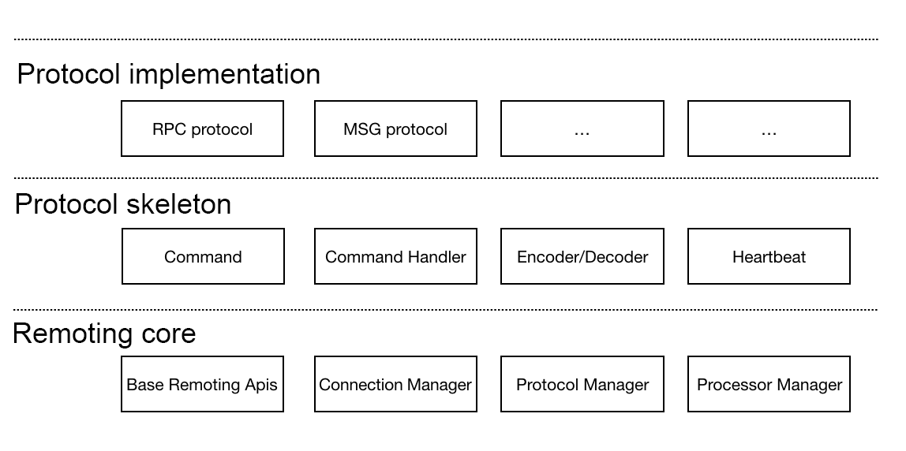
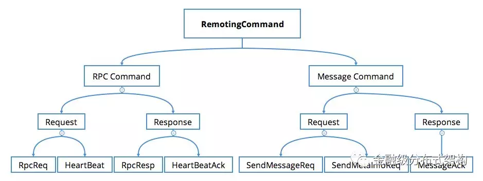

---

title: "Features"
aliases: "/sofa-bolt/docs/Functions"
---

# Feature architecture

## SOFABolt provides the following basic features:

* Basic communication functions (remoting-core)
   * Netty-based, highly-effective network I/O and thread model practice
   * Connection management (lock-free connection establishment, timed disconnection, automatic reconnection)
   * Basic communication models (oneway, sync, future, callback)
   * Timeout control
   * Batch unpacking and batch submission processor
   * Heartbeat and IDLE event processing
* Protocol framework (protocol-skeleton)
   * Commands and command processor
   * Coding and decoding processor
   * Heartbeat trigger
* Custom private protocol implementation - RPC communication protocol (protocol-implementation)
   * RPC communication protocol design
   * Flexible deserialization timing control
   * Request processing timeout FailFast mechanism
   * User request processor (UserProcessor)
   * Duplex communication

## Usage 1

Use SOFABolt as a remote communication framework. You do not need to consider the details of how to implement a private protocol, just use our built-in RPC communication protocol. You can simply enable the client side and the server side, and simultaneously register a user request processor, thereby completing the remote calling. In addition, basic features such as connection management and heartbeat are available by default.
Currently supported call types are shown in the figure below:

* For a sample demonstration, refer to our [user guide](../sofa-bolt-handbook/).

## Usage 2

Use SOFABolt as a protocol framework. You can reuse the basic functions of the basic communication model, the interface definitions included in the protocols, etc. Then, according to the private protocol you designed, you can customize the command types, command processors, decoding processors, etc. The RPC and message command definition structure is as shown in the figure below:

