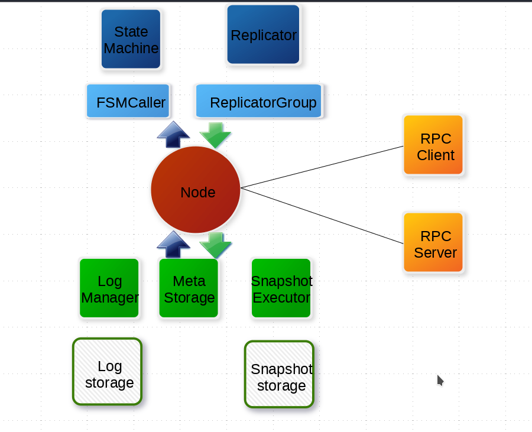

---

title: "Engine architecture"
---

The engine architecture is shown in the following diagram.

### Node

A node in a Raft cluster connects and encapsulates all underlayer service modules, and main service interfaces that are visible to users. Specifically, the leader node of a raft group calls `apply(task)` to commit new tasks to the state machine replication cluster made up by the Raft group, which will then apply the task to the business state machine.

## Storage

1. It stores Raft configuration changes and log entries converted from requests submitted by users, and replicates log entries from the leader's log to followers' logs. LogStorage stores logs, while LogManager is responsible for calling the underlayer storage, caching and batch submitting storage calls, and conducting necessary checks and optimization.
2. MetaStorage stores the metadata and records the internal states of the Raft implementation, for example, the current term of the node and the node to vote for.
3. Optional. Snapshot storage is used to store users' state-machine snapshots and meta information. SnapshotStorage stores snapshots, while SnapshotExecutor manages the actual storage, remote installation, and replication of snapshots.

## State machine

1. StateMachine is an implementation of users' core logic. It calls the `onApply(Iterator)` method to apply log entries that are submitted with `Node#apply(task)` to the business state machine.
2. FSMCaller encapsulates state transition calls that are sent to the User StateMachine, writes log entries, implements a finite-state machine (FSM), conducts necessary checks, and merges requests for batch submission and concurrent processing.

## Replication

1. Replicator is used by the leader to replicate log entries to followers. It does the same thing as an AppendEntries RPC of Raft. Without log entries, it is sent by the leader as heartbeats.
2. ReplicatorGroup is used by a Raft group to manage all replicators, and to perform necessary permission checks and dispatches.

## RPC

The RPC module is used for network communication between nodes.

1. The RPC server is built in a node to receive requests from other nodes or clients, and to redirect such requests to the corresponding service modules.
2. The RPC client is used to issue requests to other nodes, such as requests for votes, log replication requests, and heartbeats.

