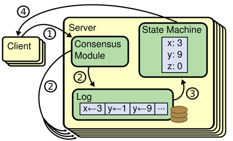
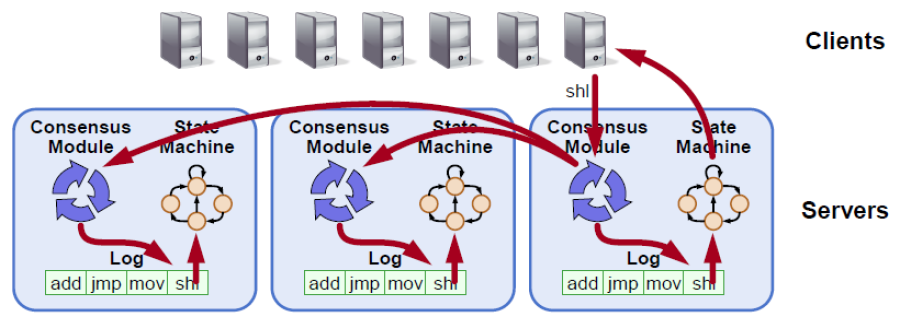

---

title: "SOFAJRaft overview"
---

This topic is a part of the [Braft](https://github.com/brpc/braft) document. To read the Braft document, click [here](https://github.com/brpc/braft/blob/master/docs/cn/overview.md). The Raft algorithm and its application are comprehensively described in the Braft document. As JRaft is designed on the basis of Braft,
we strongly recommend that you read the Braft document first to understand the basic principles and application of the Raft algorithm.

## Distributed consensus

Distributed consensus is a very fundamental problem in a distributed system. Simply put, it is about how to reach a consensus on a specific value among multiple servers, and ensure that the decision is not overthrown regardless of what failures may occur on these servers.
Assume that, all processes of a distributed system needs to determine a value V. If the system has the following properties, we consider it solves the problem of distributed consensus:

* Termination: All normal processes will determine the specific value of V, and there is no process that keeps running in a loop.
* Validity: A value V' determined by normal processes must have been proposed by one of them. For example, a random number generator does not have this property.
* Agreement: All normal processes choose the same value.

## Consensus state machine

Assume we have an infinitely incrementing sequence (system) a[1, 2, 3…]. If for any integer i, the value of a[i] meets the distributed consensus requirement, the system meets the requirement of a consensus state machine.
Basically, all systems are subject to continuous operations, and reaching consensus on a single value is definitely not enough. To make sure all replicas of a real-life system are consistent, we usually convert the operations into entries of a [write-ahead-log](https://en.wikipedia.org/wiki/Write-ahead_logging)(WAL). Then, we make sure all replicas of the system reach a consensus on the WAL entries, so that each process will perform operations corresponding to the WAL entries in order. As a result, the replicas are in consistent states.

## RAFT

RAFT is a new and easy-to-understand distributed consensus replication protocol proposed by Diego Ongaro and John Ousterhout of Stanford University as a central coordination component of the [RAMCloud](https://ramcloud.atlassian.net/wiki/display/RAM/RAMCloud)project. Raft is a leader-based multi-Paxos variant that provides a more complete and straightforward protocol description than existing protocols such as Paxos, Zab, and Viewstamped Replication. It also provides a clear description for adding and deleting nodes.
In Raft, replicated state machines are the most important and fundamental to distributed systems. Raft allows commands to be replicated and executed in order, and ensures that the states of nodes remain consistent when their initial states are the same. A system is fully functional (available) as long as a majority of nodes function properly. It allows non-Byzantine conditions, including network delays, packet loss, and reordering, but does not allow tampering with any messages.

Raft can solve the distributed consensus and partitioning problems, but cannot solve the availability problem. Raft covers some common features of distributed systems:

* Leader election
* Log replication
* Membership change
* Log compaction

# Application of Raft

We can use the Raft consensus state machine to replicate, repair, and manage nodes, which significantly streamlines the design and implementation of distributed systems, and allows developers to focus only on the service logic by implementing services as the corresponding state machines. We can build many distributed applications based on this framework:

* Distributed lock services such as ZooKeeper.
* Distributed storage systems, such as distributed message queues, distributed block systems, distributed file systems, and distributed table systems.
* It can also be used for highly reliable meta information management, for example, the high availability mechanism of various management modules.

## JRaft

JRaft is a [Raft](https://raft.github.io/) implementation that is completely based on Java, and it rewrites all features of Baidu's [Braft](https://github.com/brpc/braft) in Java, including:

1. Leader election.
2. Replication and recovery.
3. Snapshot and log compaction.
4. Membership management.
5. Fully concurrent replication.
6. Fault tolerance.
7. Asymmetric network partition tolerance.
8. Workaround when quorate peers are dead.
9. Replication pipeline optimistic
10. Linearizable read, ReadIndex/LeaseRead.

## Contact us

Welcome to join our DingTalk chat group: 23127468.

