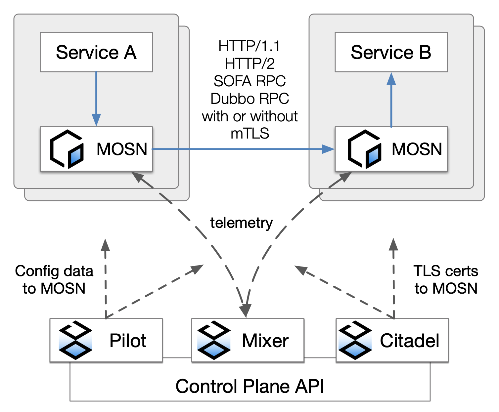
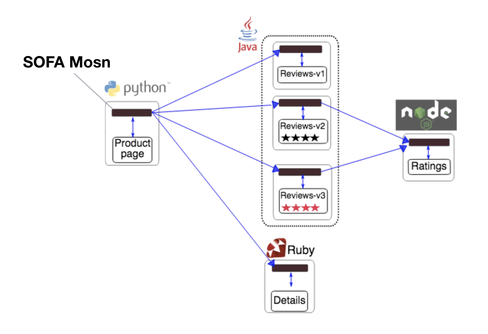

This article introduces how to use MOSN to build the Service Mesh development environment based on SOFAMesh framework, and verify some basic capabilities of MOSN, such as routing and load balancing. This article includes the following content:

+ Relationship between MOSN and SOFAMesh
+ Preparations
+ Deploy SOFAMesh with source codes
+ Bookinfo experiment

## Relationship between MOSN and SOFAMesh

As mentioned in [MOSN introduction](../overview), MOSN is a Service Mesh data plane agent developed with Golang, and SOFAMesh is a large-scale implementation solution for Service Mesh, which is improved and extended based on Istio. Serving as a critical component of SOFAMesh, MOSN is used to complete data plane forwarding.

The following figure shows the workflow chart of MOSN based on the overall SOFAMesh framework. 

Note: Currently, MOSN cannot be directly used in the native Istio.



## Preparations

This guide supposes you are using macOS. For other operating systems, you can install the corresponding software.

### 1. Install HyperKit

Install [docker-for-mac](https://store.docker.com/editions/community/docker-ce-desktop-mac), and then  [install driver](https://github.com/kubernetes/minikube/blob/master/docs/drivers.md).

#### 1.1 Install Docker 

Download the Docker software package to install it or run the following command to install it:

```bash
$ brew cask install docker
```

#### 1.2 Install driver

```bash
$ curl -LO https://storage.googleapis.com/minikube/releases/latest/docker-machine-driver-hyperkit \
&& chmod +x docker-machine-driver-hyperkit \
&& sudo mv docker-machine-driver-hyperkit /usr/local/bin/ \
&& sudo chown root:wheel /usr/local/bin/docker-machine-driver-hyperkit \
&& sudo chmod u+s /usr/local/bin/docker-machine-driver-hyperkit
```

### 2. Install Minikube (or purchase the commercial version of k8s cluster)

It is recommended to use Minikube V0.28 or later, see  [https://github.com/kubernetes/minikube](https://github.com/kubernetes/minikube).

```bash
$ brew cask install minikube
```

### 3. Start Minikube

Note that Pilot requires at least 2G memory, so you can add resources to Minikube by adding parameters at startup. If your machine has insufficient resources, it is recommended to use the commercial version of the k8s cluster.

```bash
$ minikube start --memory=8192 --cpus=4 --kubernetes-version=v1.15.0 --vm-driver=hyperkit
```

Create Istio namespace

```bash
$ kubectl create namespace istio-system
```

### 4. Install kubectl command line tool

kubectl is a command line interface used to run commands for k8s cluster. For how to install it, see [https://kubernetes.io/docs/tasks/tools/install-kubectl](https://kubernetes.io/docs/tasks/tools/install-kubectl).

```bash
$ brew install kubernetes-cli
```

### 5. Install Helm

Helm is a package management tool for k8s. For how to install it, see [https://docs.helm.sh/using\_helm/#installing-helm](https://docs.helm.sh/using_helm/#installing-helm).

```bash
$ brew install kubernetes-helm
```

## Deploy SOFAMesh with source codes

### 1. Download SOFAMesh source codes

```bash
$ git clone git@github.com:sofastack/sofa-mesh.git
```

### 2. Use Helm to install SOFAMesh


You should change directory to sofa-mesh source code, and then use helm template to install isito crd and istio

    ```
    $ cd sofa-mesh
    $ helm template install/kubernetes/helm/istio-init --name istio-init --namespace istio-system | kubectl apply -f -
    $ helm template install/kubernetes/helm/istio --name istio --namespace istio-system | kubectl apply -f -
    ```

Uninstall 

    ```
    $ helm template install/kubernetes/helm/istio --name istio --namespace istio-system | kubectl delete -f -
    $ kubectl delete namespace istio-system
    ```    

### 3. Verify installation

When the pods in the istio-system namespace are Running,  it means SOFAMesh has been successfully deployed.
If you just want to run 'bookinfo' example, you only need 'citadel', 'pilot', and 'sidecar-injector' are Running.

```bash
$ kubectl get pods -n istio-system
NAME                                       READY    STATUS   RESTARTS    AGE
istio-citadel-6579c78cd9-w57lr              1/1     Running   0          5m
istio-egressgateway-7649f76df4-zs8kw        1/1     Running   0          5m
istio-galley-c77876cb6-nhczq                1/1     Running   0          5m
istio-ingressgateway-5c9c8565d9-d972t       1/1     Running   0          5m
istio-pilot-7485f9fb4b-xsvtm                1/1     Running   0          5m
istio-policy-5766bc84b9-p2wfj               1/1     Running   0          5m
istio-sidecar-injector-7f5f586bc7-2sdx6     1/1     Running   0          5m
istio-statsd-prom-bridge-7f44bb5ddb-stcf6   1/1     Running   0          5m
istio-telemetry-55ff8c77f4-q8d8q            1/1     Running   0          5m
prometheus-84bd4b9796-nq8lg                 1/1     Running   0          5m
```

## BookInfo experiment

BookInfo is a book application like Douban. It contains four basic services.

* Product Page: Homepage, which is developed with Python, shows all book information and calls the Reviews and Details services.
* Reviews: Comment, which is developed with Java, shows book reviews and calls the Ratings service.
* Ratings: Rating service, which is developed with Nodejs.
* Details: Book details, which is developed with Ruby.



### 1. Deploy BookInfo application and inject it to MOSN

> For the specific procedure, see [https://istio.io/docs/examples/bookinfo/](https://istio.io/docs/examples/bookinfo/).

+ Inject to MOSN

```bash
$ kubectl label namespace default istio-injection=enabled
```
+ Deploy Bookinfo

```bash
$ kubectl apply -f samples/bookinfo/platform/kube/bookinfo.yaml
```

+ Verify if the deployment is successful

```bash
$ kubectl get services
NAME                       CLUSTER-IP   EXTERNAL-IP   PORT(S)              AGE
details                    10.0.0.31    <none>        9080/TCP             6m
kubernetes                 10.0.0.1     <none>        443/TCP              7d
productpage                10.0.0.120   <none>        9080/TCP             6m
ratings                    10.0.0.15    <none>        9080/TCP             6m
reviews                    10.0.0.170   <none>        9080/TCP             6m
```

+ Wait till all pods run successfully

```bash
$ kubectl get pods
NAME                                        READY     STATUS    RESTARTS   AGE
details-v1-1520924117-48z17                 2/2       Running   0          6m
productpage-v1-560495357-jk1lz              2/2       Running   0          6m
ratings-v1-734492171-rnr5l                  2/2       Running   0          6m
reviews-v1-874083890-f0qf0                  2/2       Running   0          6m
reviews-v2-1343845940-b34q5                 2/2       Running   0          6m
reviews-v3-1813607990-8ch52                 2/2       Running   0          6m
```

### 2. Access BookInfo service

* Enable gateway mode

```bash
$ kubectl apply -f samples/bookinfo/networking/bookinfo-gateway.yaml
$ kubectl get gateway        // Check if the gateway runs
NAME               AGE
bookinfo-gateway   24m
```

* Set gateway address

See the details for set gateway address in https://istio.io/docs/tasks/traffic-management/ingress/ingress-control/#determining-the-ingress-ip-and-ports

```bash
$ export INGRESS_PORT=$(kubectl -n istio-system get service istio-ingressgateway -o jsonpath='{.spec.ports[?(@.name=="http2")].nodePort}')
$ export SECURE_INGRESS_PORT=$(kubectl -n istio-system get service istio-ingressgateway -o jsonpath='{.spec.ports[?(@.name=="https")].nodePort}')
$ export INGRESS_HOST=$(minikube ip)
$ export GATEWAY_URL=$INGRESS_HOST:$INGRESS_PORT
```

* Verify if the gateway takes effect 

```bash
$ curl -o /dev/null -s -w "%{http_code}\n"  http://$GATEWAY_URL/productpage   //If 200 is output, it means a success 
200
```

* Observe the page status


Visit http://$GATEWAY_URL/productpage. Note that, you need to replace `$GATEWAY_URL` with the address you set. Normally, you can see the following BookInfo interface after refreshing the page. There are three versions of Book Reviews. After refreshing, you can see them in turn. To learn why these three versions appear, view the configuration in `samples/bookinfo/platform/kube/bookinfo.yaml`.

+ Interface of version 1


+ Interface of version 2


+ Interface of version 3


### 3. Verify MOSN's capability of routing by version

+ Firstly, create a series of destination rules for BookInfo's services.

```bash
$ kubectl apply -f samples/bookinfo/networking/destination-rule-all.yaml
```

+ Specify reviews service to access v1 only.

```bash
$ kubectl apply -f samples/bookinfo/networking/virtual-service-all-v1.yaml
```

Visit http://$GATEWAY_URL/productpage, and find that the reviews are fixed in the following version 1 page and no longer change.


### 4. Verify MOSN's capability of routing by weight

+ Allocate 50% traffic respectively to v1 and v3

```bash
$ kubectl apply -f samples/bookinfo/networking/virtual-service-reviews-50-v3.yaml
```

Access http://$GATEWAY_URL/productpage, and find that the probability for v1 and v3 to appear respectively is 1/2.

### 5. Verify MOSN's capability of routing by specific header

+ There is a login entrance in the upper right corner of the BookInfo system. After you log in, the request carries the custom parameter `end-user` of which the value is user name. Mosn supports routing by the value of this header. For example, route the user Jason to the v2 while other users to v1 (both username and password are Jason, why this user can view the corresponding yaml file).

```bash
$ kubectl apply -f samples/bookinfo/networking/virtual-service-reviews-test-v2.yaml
```

When you access http://$GATEWAY_URL/productpage:

+ Log in with the account of Jason and you will see the v2 interface.


+ Log in with the account of another user, you are always on v1 interface.

