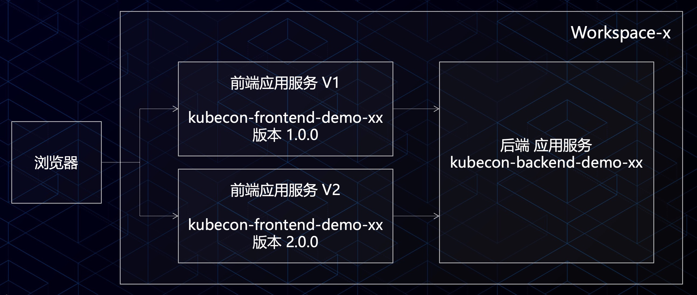

# 基于 Serverless 轻松构建云上应用

**注意：使用该指南需要开通蚂蚁金融科技账号，请访问 [蚂蚁金服科技官网](https://tech.antfin.com/)。**

作为云原生技术前进方向之一，Serverless 架构让您进一步提高资源利用率，更专注于业务研发。通过我们的 workshop，您
可以体验到快速创建 Serveless 应用、根据业务请求秒级 0-1-N 自动伸缩、通过日志查看器快速排错等产品新功能。

## Workshop 操作内容

### 流程图

### 应用架构图

### 效果预览

### Step 0: 前期准备

- 应用 clone：[https://github.com/sofastack-guides/kc-serverless-demo](https://github.com/sofastack-guides/kc-serverless-demo)

### 讲师演示：

#### 快速发布后端 Java 应用

- 选择快速创建
- 选择 Java Runtime
- 上传代码包 `balance-mng.jar`
- 入口方法可自动识别
- 端口：8080
- 创建完成后，复制保存后端服务的地址
- 查看后端服务计算实例数量：0
  
#### 快速发布前端 NodeJS 应用

- 选择创建应用服务
- 创建应用，选择技术栈为 NodeJS
- 上传代码包 `prod-stockmng-v1.zip`
- 运行时选择 `nodejs-0.0.1.1-pre`
- 入口方法可自动识别
- 端口： 3000
- 环境变量设置 `BALANCEMNG_URL` 为后端服务的地址

### Step 1: 查看 Serverless 应用服务

- 访问 Serverless 应用服务地址 [https://sas.shared.cloud.alipay.com/](https://sas.shared.cloud.alipay.com/) 
- 使用账号，密码登陆
- 选择 workspace：
    - workspace0【user00-09】
    - workspace1【user10-19】
    - ...
    - workspace9【user90-99】
- 查看前端应用服务：kubecon-frontend-demo-xx【00-99】
- 查看后端应用服务：kubecon-backend-demo-xx【00-99】
- **查看目前后端应用的计算实例数量：0**

### Step 2: 查看 0-1 冷启能力

- 使用 Chrome 浏览器访问前端服务，域名为：*.kevinwang.cc
- 查看后端服务的计算实例数量的变化

### 讲师演示：

#### 创建版本和流量控制

- 克隆前端应用，并创建新版本
- 上传代码包 `prod-stockmng-v2.zip`
- 配置权重，路由 1:1 访问 V1 和 V2 版本
- 通过浏览器查看效果

### Step 3: 查看版本和流量控制

- 打开前端应用服务
- 查看当前应用服务的 V1 和 V2 版本，和路由
- 通过浏览器访问应用查看流控效果

### Step 4: 时间触发器

- 创建时间触发器，定时 2 分钟后触发一次
- 为前端应用配置触发器
- 在指定时间，通过执行记录查看触发效果
  
### 

### Step 5: Log Shell 和计量

- 打开 Log Shell
- 选择相应的应用服务，并输入日志地址/关键词
- 搜索查看应用服务日志，可全屏
- 打开计量信息
- 通过计量监控查看实例运行情况

### 讲师演示：

#### M-N 快速伸缩

- 打开应用服务
- 查看当前版本的计算实例限额 1-5 / 计算实例数量：目前为1
- 开始压测模拟高并发，并同步查看计算示例数变化
- 快速从 1 变化为 4，演示结束

### Step 6:【可选步骤】快速开始+测试执行

- 按照前文步骤，尝试自己创建一个新的前端应用
- 测试执行应用服务

#### 快速发布前端 NodeJS 应用

- 选择创建应用服务
- 创建应用，选择技术栈为 NodeJS
- 上传代码包 `prod-stockmng-v1.zip`
- 运行时选择 `nodejs-0.0.1.1-pre`
- 入口方法可自动识别
- 端口： 3000
- 环境变量设置 `BALANCEMNG_URL` 为后端服务的地址

#### 测试执行应用服务

- 选择测试执行
- 触发查看效果

## 更多

- [下载本次 Demo 幻灯片](https://gw.alipayobjects.com/os/basement_prod/ce277119-020a-4f59-926d-2331ab7c805b.pdf)
