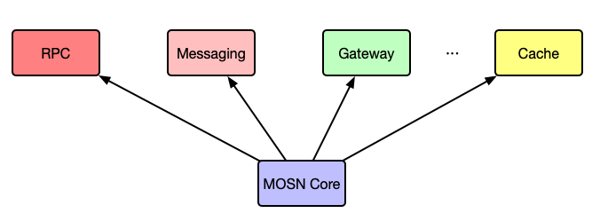
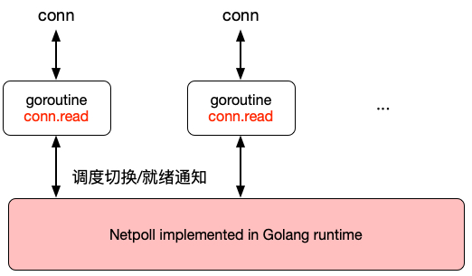
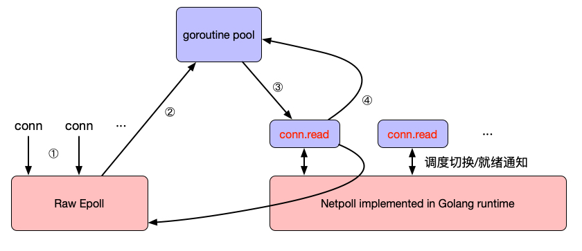
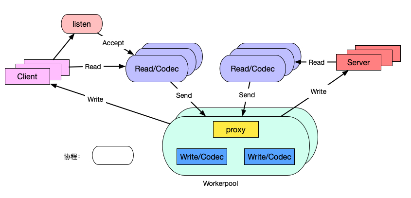
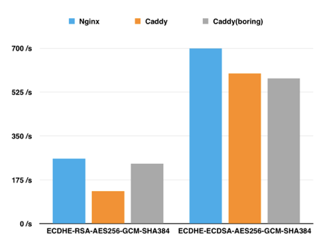

MOSN 主要划分为如下模块，包括了网络代理具备的基础能力，也包含了 [xDS](https://www.servicemesher.com/blog/envoy-xds-protocol/) 等云原生能力。

## xDS（UDPA）支持

MOSN 支持云原生[统一数据面 API（UDPA）](https://github.com/cncf/udpa)，支持全动态配置更新。

xDS 是 [Envoy](https://www.envoyproxy.io/) 创建的一个关键概念，它是一类发现服务的统称，其包括如下几类：

- CDS：Cluster Discovery Service
- EDS：Endpoint Discovery Service
- SDS：Secret Discovery Service
- RDS：Route Discovery Service
- LDS：Listener Discovery Service

正是通过对 xDS 的请求来动态更新 Envoy 配置，另外还有个 ADS（Aggregated Discovery Service）通过聚合的方式解决以上 xDS 的更新顺序问题。

## 业务支持

MOSN 作为底层的高性能安全网络代理，支撑了 RPC、消息（Messaging）、网关（Gateway）等业务场景。

## IO 模型

MOSN 支持以下两种 IO 模型：

-  **Golang 经典 netpoll 模型**：goroutine-per-connection，适用于在连接数不是瓶颈的情况。

-  **RawEpoll 模型**：也就是 Reactor 模式，I/O 多路复用（I/O multiplexing）+ 非阻塞 I/O（non-blocking I/O）的模式。对于接入层和网关有大量长链接的场景，更加适合于 RawEpoll 模型。

### netpoll 模型

 

MOSN 的 netpoll 模型如上图所示，协程数量与链接数量成正比，大量链接场景下，协程数量过多，存在以下开销：

- Stack 内存开销
- Read buffer 开销
- Runtime 调度开销

### RawEpoll 模型

 

RawEpoll 模型如上图所示，使用 epoll 感知到可读事件之后，再从协程池中为其分配协程进行处理，步骤如下：

1. 链接建立后，向 Epoll 注册 oneshot 可读事件监听；并且此时不允许有协程调用 conn.read，避免与 runtime netpoll 冲突。
1. 可读事件到达，从 goroutine pool 挑选一个协程进行读事件处理；由于使用的是 oneshot 模式，该 fd 后续可读事件不会再触发。
1. 请求处理过程中，协程调度与经典 netpoll 模式一致。
1. 请求处理完成，将协程归还给协程池；同时将 fd 重现添加到 RawEpoll 中。

## 协程模型

MOSN 的协程模型如下图所示。

 

- 一条 TCP 连接对应一个 Read 协程，执行收包、协议解析；
- 一个请求对应一个 worker 协程，执行业务处理，proxy 和 Write 逻辑；

常规模型一个 TCP 连接将有 Read/Write 两个协程，我们取消了单独的 Write 协程，让 workerpool 工作协程代替，减少了调度延迟和内存占用。

## 能力扩展

### 协议扩展

MOSN 通过使用统一的编解码引擎以及编/解码器核心接口，提供协议的 plugin 机制，包括支持：

- SOFARPC
- HTTP1.x/HTTP2.0
- Dubbo

### NetworkFilter 扩展

MOSN 通过提供 network filter 注册机制以及统一的 packet read/write filter 接口，实现了 Network filter 扩展机制，当前支持：

- TCP proxy
- Fault injection

### StreamFilter 扩展

MOSN 通过提供 stream filter 注册机制以及统一的 stream send/receive filter 接口，实现了 Stream filter 扩展机制，包括支持：

- 流量镜像
- RBAC 鉴权

## TLS 安全链路

通过测试，原生的 Go 的 TLS 经过了大量的汇编优化，在性能上是 Nginx（OpenSSL）的80%，Boring 版本的 Go（使用 cgo 调用 BoringSSL）因为 cgo 的性能问题， 并不占优势，所以我们最后选择使用原生 Go 的 TLS，相信 Go Runtime 团队后续会有更多的优化，我们也会有一些优化计划。

Go vs Nginx 测试结果如下图所示：

 

- Go 在 RSA 上没有太多优化，go-boring（CGO）的能力是 Go 的两倍。
- p256 在 Go 上有汇编优化，ECDSA 优于go-boring。
- 在 AES-GCM 对称加密上，Go 的能力是 go-boring 的 20 倍。
- 在 SHA、MD 等 HASH 算法也有对应的汇编优化。

为了满足金融场景的安全合规，我们同时也对国产密码进行了开发支持，这个是 Go Runtime 所没有的。虽然目前的性能相比国际标准 AES-GCM 还是有一些差距，大概是 50%，但是我们已经有了后续的一些优化计划，敬请期待。

支持国密的性能测试结果如下图所示：

