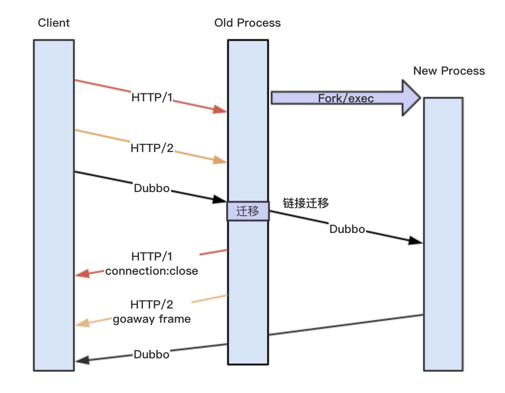
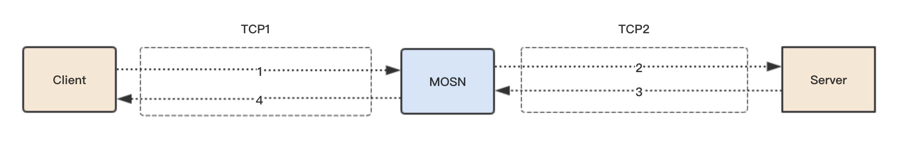
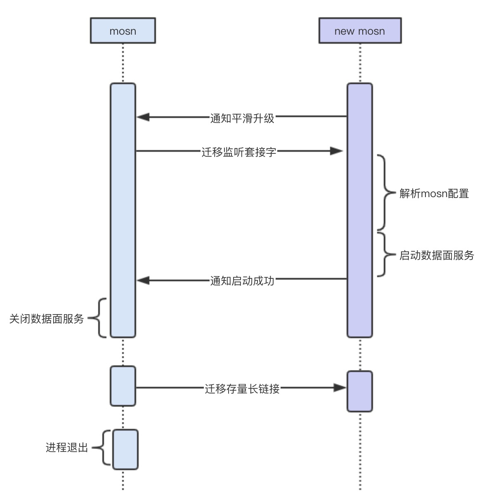
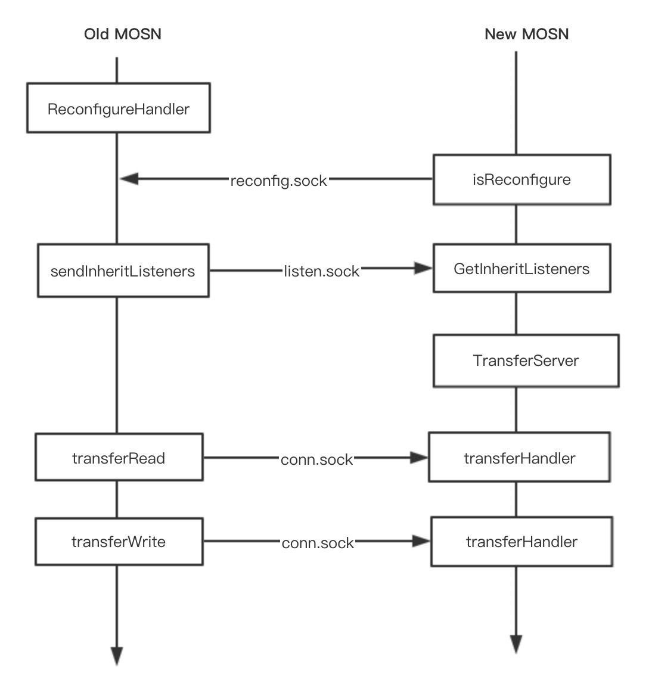
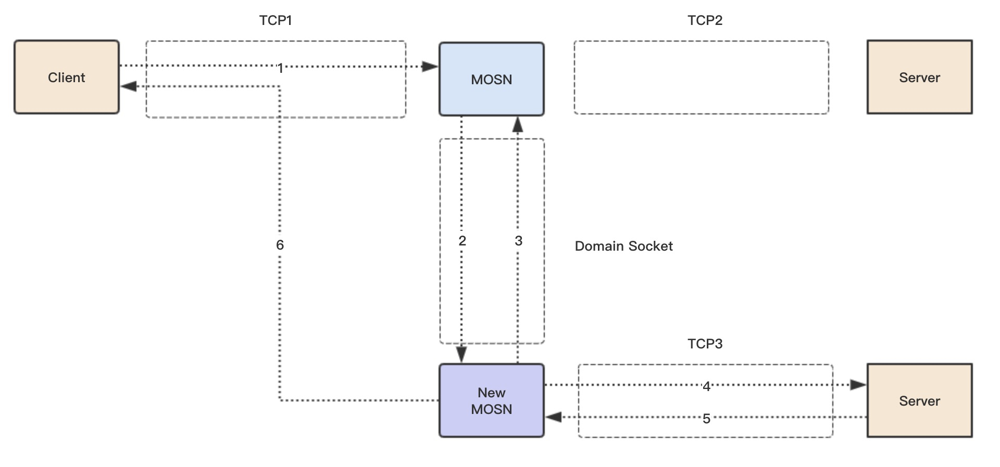
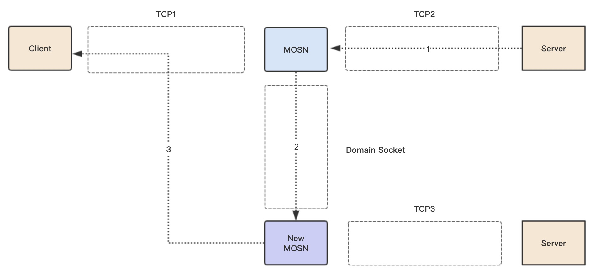

Service Mesh 中 Sidecar 运维一直是一个比较棘手的问题，数据平面的 Sidecar 升级是常有的事情，如何在升级 Sidecar（MOSN）的时候而不影响业务，对于存量的长连接如何迁移，本文将为你介绍 MOSN 的解决之道。

## 背景

本文介绍 MOSN 支持平滑升级的原因和解决方案，对于平滑升级的一些基础概念，大家可以通过 [Nginx vs Enovy vs Mosn 平滑升级原理解析](../nginx-envoy-mosn-hot-upgrade/)了解。

先简单介绍一下为什么 Nginx 和 Envoy 不需要具备 MOSN 这样的连接无损迁移方案，主要还是跟业务场景相关，Nginx 和 Envoy 主要支持的是 HTTP1 和 HTTP2 协议，HTTP1使用 connection: Close，HTTP2 使用 Goaway Frame 都可以让 Client 端主动断链接，然后新建链接到新的 New process，但是针对 Dubbo、SOFA PRC 等常见的多路复用协议，它们是没有控制帧，Old process 的链接如果断了就会影响请求的。

一般的升级做法就是切走应用的流量，比如自己UnPub掉服务，等待一段时间没有请求之后，升级MOSN，升级好之后再Pub服务，整个过程比较耗时，并且会有一段时间是不提供服务的，还要考虑应用的水位，在大规模场景下，就很难兼顾评估。MOSN 为了满足自身业务场景，开发了长连接迁移方案，把这条链接迁移到 New process 上，整个过程对 Client 透明，不需要重新建链接，达到请求无损的平滑升级。



## 正常流程



1. Client 发送请求 Request 到 MOSN
1. MOSN 转发请求 Request 到 Server
1. Server 回复响应 Response 到 MOSN
1. MOSN 回复响应 Response 到 Client

上图简单介绍了一个请求的正常流程，我们后面需要迁移的是 TCP1 链接，也就是 Client 到 MOSN 的连接，MOSN 到 Server 的链接 TCP2 不需要迁移，因为 MOSN 访问 Server 是根据 LoadBalance 选择，我们可以主动控制断链建链。

## 平滑升级流程

### 触发条件

有两个方式可以触发平滑升级流程：

1. MOSN 对 SIGHUP 做了监听，发送 SIGHUP 信号给 MOSN 进程，通过 ForkExec 生成一个新的 MOSN 进程。
1. 直接重新启动一个新 MOSN 进程。

为什么提供两种方式？最开始我们支持的是方法1，也就是 nginx 和 Envoy 使用的方式，这个在虚拟机或者容器内替换 MOSN 二级制来升级是可行的，但是我们的场景需要满足容器间的升级，所以需要新拉起一个容器，就需要重新启动一个新的 MOSN 进程来做平滑升级，所以后续又支持了方法2。容器间升级还需要 operator 的支持，本文不展开叙述。

### 交互流程





首先，老的 MOSN 在启动最后阶段会启动一个协程运行 `ReconfigureHandler()` 函数监听一个 Domain Socket（`reconfig.sock`）, 该接口的作用是让新的 MOSN 来感知是否存在老的 MOSN。

```go
func ReconfigureHandler() {
    l, err := net.Listen("unix", types.ReconfigureDomainSocket)

    for {
        uc, err := ul.AcceptUnix()
        _, err = uc.Write([]byte{0})
        reconfigure(false)
    }
}
```

触发平滑升级流程的两种方式最终都是启动一个新的 MOSN 进程，然后调用`GetInheritListeners()`，通过 `isReconfigure()` 函数来判断本机是否存在一个老的 MOSN（就是判断是否存在 `reconfig.sock` 监听），如果存在一个老的 MOSN，就进入迁移流程，反之就是正常的启动流程。

```go
// 保留了核心流程
func GetInheritListeners() ([]net.Listener, net.Conn, error) {
    if !isReconfigure() {
        return nil, nil, nil
    }

    l, err := net.Listen("unix", types.TransferListenDomainSocket)
    uc, err := ul.AcceptUnix()
    _, oobn, _, _, err := uc.ReadMsgUnix(buf, oob)
    file := os.NewFile(fd, "")
    fileListener, err := net.FileListener(file)
    return listeners, uc, nil
}
```

如果进入迁移流程，新的 MOSN 将监听一个新的 Domain Socket（`listen.sock`），用于老的 MOSN 传递 listen FD 到新的 MOSN。FD 的传递使用了sendMsg 和 recvMsg。在收到 listen FD 之后，调用 `net.FileListener()` 函数生产一个 Listener。此时，新老 MOSN 都同时拥有了相同的 Listen 套接字。

```go
// FileListener returns a copy of the network listener corresponding
// to the open file f.
// It is the caller's responsibility to close ln when finished.
// Closing ln does not affect f, and closing f does not affect ln.
func FileListener(f *os.File) (ln Listener, err error) {
    ln, err = fileListener(f)
    if err != nil {
        err = &OpError{Op: "file", Net: "file+net", Source: nil, Addr: fileAddr(f.Name()), Err: err}
    }
    return
}
```

这里的迁移和 Nginx 还是有一些区别，Nginx 是 fork 的方式，子进程自动就继承了 listen FD，MOSN 是新启动的进程，不存在父子关系，所以需要通过 sendMsg 的方式来传递。

在进入迁移流程和 Listen 的迁移过程中，一共使用了两个 Domain Socket：

- `reconfig.sock` 是 Old MOSN 监听，用于 New MOSN 来判断是否存在
- `listen.sock` 是 New MOSN 监听，用于 Old MOSN 传递 listen FD

两个 sock 其实是可以复用的，也可以用 `reconfig.sock` 进行 listen 的传递，由于一些历史原因搞了两个，后续可以优化为一个，让代码更精简易读。

这儿再看看 Old MOSN 的处理，在收到 New MOSN 的通知之后，将进入`reconfigure(false)` 流程，首先就是调用 `sendInheritListeners()` 传递 listen FD，原因上面内容已经描述，最后调用 `WaitConnectionsDone()` 进入存量长链接的迁移流程。

```go
// 保留了核心流程
func reconfigure(start bool) {
    if start {
        startNewMosn()
        return
    }
    // transfer listen fd
    if notify, err = sendInheritListeners(); err != nil {
        return
    }
    // Wait for all connections to be finished
    WaitConnectionsDone(GracefulTimeout)

    os.Exit(0)
}
```

在 Listen FD 迁移之后，New MOSN 通过配置启动，然后在最后启动一个协程运行`TransferServer()`，将监听一个新的 `DomainSocket（conn.sock）`，用于后续接收 Old MOSN 的长连接迁移。迁移的函数是 `transferHandler()`

```go
func TransferServer(handler types.ConnectionHandler) {
    l, err := net.Listen("unix", types.TransferConnDomainSocket)

    utils.GoWithRecover(func() {
        for {
            c, err := l.Accept()
            go transferHandler(c, handler, &transferMap)

        }
    }, nil)
}
```

Old MOSN 将通过 `transferRead()` 和 `transferWrite()` 进入最后的长链接迁移流程，下面主要分析这块内容。

### 长连接迁移流程



首先先粗略看一下新请求的迁移流程。

1. Client 发送请求到 MOSN
1. MOSN 通过 domain  socket(conn.sock) 把 TCP1 的 FD 和连接的状态数据发送给 New MOSN
1. New  MOSN 接受 FD 和请求数据创建新的 Conection 结构，然后把 Connection id 传给 MOSN，New MOSN 此时就拥有了 TCP1 的一个拷贝。
1. New  MOSN 通过 LB 选取一个新的 Server，建立 TCP3 连接，转发请求到 Server
1. Server 回复响应到 New MOSN
1. New MOSN 通过 MOSN 传递来的 TCP1 的拷贝，回复响应到 Client

之前的 `WaitConnectionsDone()` 函数中，`s.stopChan` 已经关闭，在链接的 ReadLoop 中，将设置一个 `[TransferTimeout, 2 * TransferTimeout]` 的随机时间进入迁移流程，随机数主要是为了打散每个 Client 的 TCP 连接迁移时机，让迁移更平滑。

```go
func (c *connection) startReadLoop() {
    var transferTime time.Time
    for {
        select {
        case <-c.stopChan:
            if transferTime.IsZero() {
                if c.transferCallbacks != nil && c.transferCallbacks() {
                    randTime := time.Duration(rand.Intn(int(TransferTimeout.Nanoseconds())))
                    transferTime = time.Now().Add(TransferTimeout).Add(randTime)
                    log.DefaultLogger.Infof("[network] [read loop] transferTime: Wait %d Second", (TransferTimeout+randTime)/1e9)
                } else {
                    // set a long time, not transfer connection, wait mosn exit.
                    transferTime = time.Now().Add(10 * TransferTimeout)
                    log.DefaultLogger.Infof("[network] [read loop] not support transfer connection, Connection = %d, Local Address = %+v, Remote Address = %+v",
                        c.id, c.rawConnection.LocalAddr(), c.RemoteAddr())
                }
            } else {
                if transferTime.Before(time.Now()) {
                    c.transfer()
                    return
                }
            }
```

在等待一个随机时间之后，`c.tranfer()` 将进入迁移流程，`c.notifyTransfer()` 的作用是暂停 write 操作，在迁移 read 操作的时候，不能有 write 操作，因为两个进程 MOSN 同时都做 write，会导致数据错乱。

```go
func (c *connection) transfer() {
    c.notifyTransfer()
    id, _ := transferRead(c)
    c.transferWrite(id)
}
```

然后进入的是 `transferRead()`，这个函数的作用就是把连接的 FD 和状态数据通过 `conn.sock`传递给 New MOSN，跟之前迁移 Listen FD 时方式一样，NEW MOSN 在成功处理之后会返回一个 ID，这个 ID 是 NEW MOSN 新建立的 Connection ID，这个 ID 后面会用到。

```go
// old mosn transfer readloop
func transferRead(c *connection) (uint64, error) {
    unixConn, err := net.Dial("unix", types.TransferConnDomainSocket)

    file, tlsConn, err := transferGetFile(c)

    uc := unixConn.(*net.UnixConn)
    
    // send type and TCP FD
    err = transferSendType(uc, file)
    
    // send header + buffer + TLS
    err = transferReadSendData(uc, tlsConn, c.readBuffer, log.DefaultLogger)
    
    // recv ID
    id := transferRecvID(uc)
    return id, nil
}
```

我们构造了一个简单的读迁移协议, 主要包括了 TCP 原始数据长度，TLS 数据长度，TCP 原始数据，TLS 数据。

```go
/**
 *  transfer read protocol
 *  header (8 bytes) + (readBuffer data) + TLS
 *
 * 0                       4                       8
 * +-----+-----+-----+-----+-----+-----+-----+-----+
 * |      data length      |     TLS length        |
 * +-----+-----+-----+-----+-----+-----+-----+-----+
 * |                     data                      |
 * +-----+-----+-----+-----+-----+-----+-----+-----+
 * |                     TLS                       |
 * +-----+-----+-----+-----+-----+-----+-----+-----+
 *
```

现在看下 New MOSN 收到迁移请求之后的处理，它会针对每个迁移请求会启动一个协程运行 `transferHandler()` 函数, 函数会根据读取的协议判断是读迁移还是写迁移，我们这儿先介绍读迁移，New MOSN 会调用 transferNewConn 把 Old MOSN 传递过来的 FD 和数据包重新生成一个新的 Connection 结构体，并把生成的新的 connection ID 传递给 Old MOSN。

此后，New MOSN 将从该 TCP 连接读取数据，开始正常的业务请求流程。

```go
func transferHandler(c net.Conn, handler types.ConnectionHandler, transferMap *sync.Map) {
    // recv type
    conn, err := transferRecvType(uc)
    if err != nil {
        log.DefaultLogger.Errorf("[network] [transfer] [handler] transferRecvType error :%v", err)
        return
    }

    if conn != nil {
        // transfer read
        // recv header + buffer
        dataBuf, tlsBuf, err := transferReadRecvData(uc)
        if err != nil {
            log.DefaultLogger.Errorf("[network] [transfer] [handler] transferRecvData error :%v", err)
            return
        }
        connection := transferNewConn(conn, dataBuf, tlsBuf, handler, transferMap)
        if connection != nil {
            transferSendID(uc, connection.id)
        } else {
            transferSendID(uc, transferErr)
        }
    } else {
        // transfer write
        // recv header + buffer
        id, buf, err := transferWriteRecvData(uc)
        if err != nil {
            log.DefaultLogger.Errorf("[network] [transfer] [handler] transferRecvData error :%v", err)
        }
        connection := transferFindConnection(transferMap, uint64(id))
        if connection == nil {
            log.DefaultLogger.Errorf("[network] [transfer] [handler] transferFindConnection failed, id = %d", id)
            return
        }
        err = transferWriteBuffer(connection, buf)
        if err != nil {
            log.DefaultLogger.Errorf("[network] [transfer] [handler] transferWriteBuffer error :%v", err)
            return
        }
    }
}
```

此后，Old MOSN 不再读取该 TCP1 连接上的数据，全部由 New MOSN 来读取 TCP1 上的数据并处理，对于新的请求，整个迁移过程就已经完成。

### 残留响应迁移流程



大家想想为什么还有残留响应的迁移流程？因为多路复用协议，在之前读连接迁移流程的时候，TCP2 上还有之前残留的响应需要回复给Client，如果同时 MOSN 和 New MOSN 都进行 Write 操作 TCP1，数据可能会乱序，所以需要让New MOSN来统一处理之前 TCP2 上残留的响应。

1. Server 回复残留的响应到 MOSN
1. MOSN 把之前从 New MOSN 获取的 Connection id 和响应数据，通过 domain socket(conn.sock) 传递给 New MOSN
1. New MOSN 通过 id 查询 TCP1 连接，回复响应到 Client

在 `transferRead()` 之后，就进入了 `transferWrite()` 阶段，该阶段会把需要 write 的数据包和之前 New MOSN 传回来的 Connection ID 一并传给 New MOSN。

```go
// old mosn transfer writeloop
func transferWrite(c *connection, id uint64) error {

    unixConn, err := net.Dial("unix", types.TransferConnDomainSocket)

    uc := unixConn.(*net.UnixConn)
    err = transferSendType(uc, nil)

    // build net.Buffers to IoBuffer
    buf := transferBuildIoBuffer(c)
    // send header + buffer
    err = transferWriteSendData(uc, int(id), buf)
    if err != nil {
        log.DefaultLogger.Errorf("[network] [transfer] [write] transferWrite failed: %v", err)
        return err
    }
    return nil
}
```

我们构造了一个简单的写迁移协议, 主要包括了TCP原始数据长度, connection ID，TCP原始数据。

```go
/*
 *  transfer write protocol
 *  header (8 bytes) + (writeBuffer data)
 *
 * 0                       4                       8
 * +-----+-----+-----+-----+-----+-----+-----+-----+
 * |      data length      |    connection  ID     |
 * +-----+-----+-----+-----+-----+-----+-----+-----+
 * |                     data                      |
 * +-----+-----+-----+-----+-----+-----+-----+-----+
 *
**/
```

在New MOSN的transferHandler()函数中，会判断出写迁移协议，然后 `transferFindConnection()` 函数通过 connection ID 找到 TCP1 连接，然后直接把数据写入即可。

这儿需要说明一点，新请求Request的转发已经使用了 TCP3，TCP2 上只会有之前请求的 Response 响应，如果在整个迁移期间 2 * TransferTimeout 都没有回复响应，那么这个请求将会超时失败。

### 连接状态数据

在连接迁移时，除了TCP FD的迁移，还有连接状态的迁移，这样New MOSN才知道怎样去初始化这个新的连接。

主要有如下几个状态：

**读缓存**

表示在迁移时，已经从 TCP 读取的数据，还没有被应用层处理的数据。

**写数据**

在迁移之后，MOSN 收到的响应数据。

**TLS状态迁移**

如果是 TLS 加密请求，需要迁移 TLS 的状态，有如下状态需要迁移：

1. 加密秘钥
1. Seq序列
1. 读缓存数据（加密和未加密）
1. cipher类型
1. TLS版本

```go
type TransferTLSInfo struct {
    Vers         uint16
    CipherSuite  uint16
    MasterSecret []byte
    ClientRandom []byte
    ServerRandom []byte
    InSeq        [8]byte
    OutSeq       [8]byte
    RawInput     []byte
    Input        []byte
}
```

## 总结

长连接的 FD 迁移是比较常规的操作，sendMsg 和 connection repair 都可以。

在整个过程中最麻烦的是应用层数据的迁移，一般想法就是把应用层的数据结构等都迁移到新的进程，比如已经读取的协议 HEAD 等结构体，但这就导致你的迁移过程会很复杂，每个协议都需要单独处理。

MOSN 的方案是把迁移放到了 IO 层，不关心应用层具体是什么协议，我们迁移最原始的 TCP 数据包，然后让 New MOSN 来 codec 这个数据包来拼装 HEAD 等结构体，这个过程是标准的处理流程了，这样就保证迁移对整个协议解析是透明的，只要这个协议是无状态的，这个迁移框架就可以自动支持。

最后的残留响应迁移流程可能不太好理解，为什么不等所有响应完成之后才开始迁移，就不需要这个流程了？是因为在多路复用协议场景下，请求一直在发送，你不能总是找到一个时间点所有响应都完成了。

## 反馈

关于该问题的讨论请见 Github Issue：[MOSN smooth upgrade problem #866](https://github.com/mosn/mosn/issues/866)。