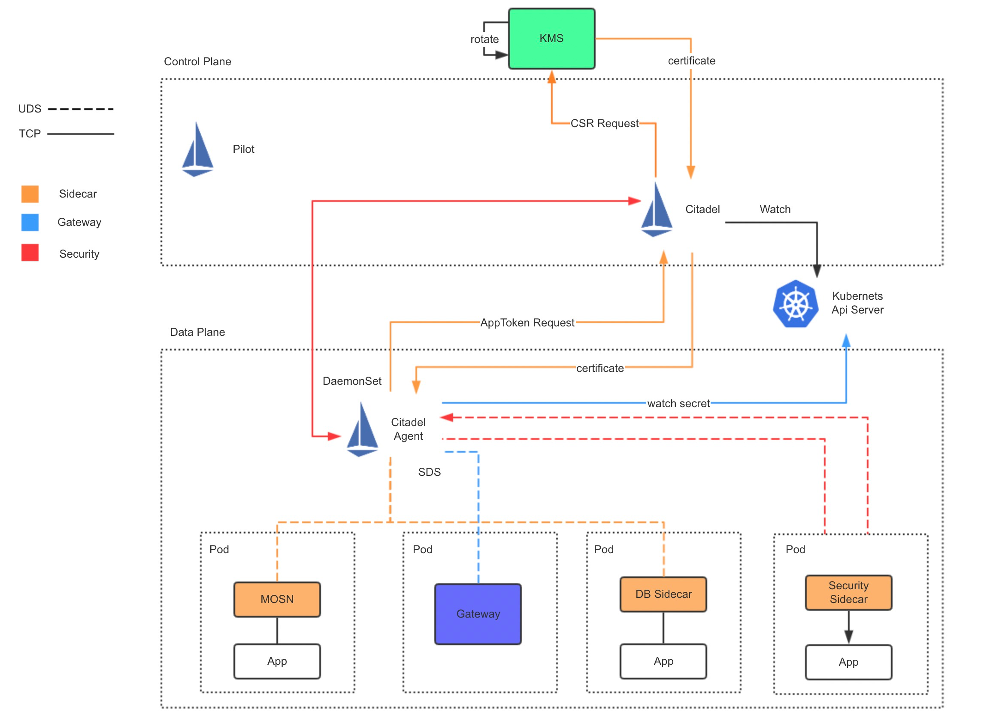
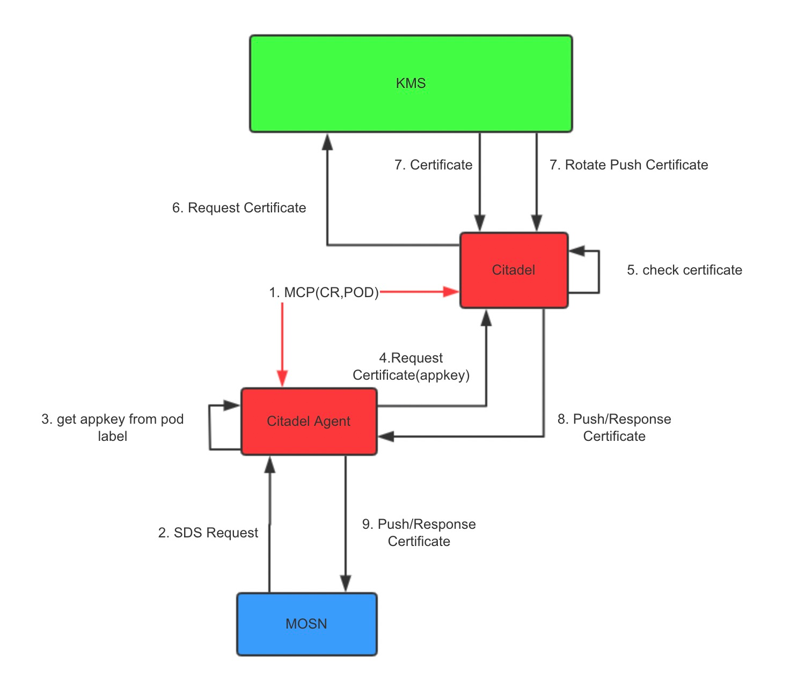

本文将向您展示 MOSN 的 TLS 安全能力。

## 证书方案

MOSN 支持通过 Istio Citadel 的证书签发方案，基于 Istio 社区的 [SDS （Secret Discovery Service）](https://www.envoyproxy.io/docs/envoy/latest/configuration/security/secret)方案为 Sidecar 配置证书，支持证书动态发现和热更新能力。为了支持更高级的安全能力，MOSN 没有使用 Citadel 的证书自签发能力，而是通过对接内部 KMS 系统获取证书。同时提供证书缓存和证书推送更新能力。

我们先来看看 MOSN 证书方案的架构图，如下图所示： 

 

各组件职能如下：

- Pilot：负责 Policy、SDS 配置下发，为简化复杂度，图中未标出
- Citadel：Citadel 作为 Certificate Provider ，同时作为 MCP Server 为 Citadel Agent 提供 Pod、CR等资源
- Citadel Agent：提供 SDS Server 服务，为MOSN、DB Sidecar、Security Sidecar 提供Certificate和CR下发能力
- KMS：密钥管理系统负责证书签发

### 证书获取流程

对整体架构有个大致理解后，我们分解下 Sidecar 获取证书的流程，如下图所示：

 

补充说明下图中的每一步环节：

1. Citadel 与 Citadel agent（nodeagent）组件通过MCP协议（Mesh Configuration Protocol）同步Pod 和 CR 信息，避免 citadel agent 直接请求 API Server 导致 API Server 负载过高
2. MOSN 通过Unix Domain Socket 方式向 Citadel Agent 发起 SDS 请求
3. Citadel Agent 会进行防篡改校验，并提取appkey
4. Citadel Agent 携带 appkey 请求 Citadel 签发证书
5. Citadel 检查证书是否已缓存，如果缓存证书未过期，Citadel 将直接响应缓存证书
6. 证书不在缓存中，Citadel 会基于 appkey 构造证书签发请求，向 KMS 申请签发证书
7. KMS 会将签发的证书响应回Citadel，另外 KMS 也支持证书过期轮换通知
8. Citadel 收到证书后，会将证书传递给到对应的 Citadel Agent
9. Citadel Agent 收到证书后，会在内存中缓存证书，并将证书下发给到 MOSN