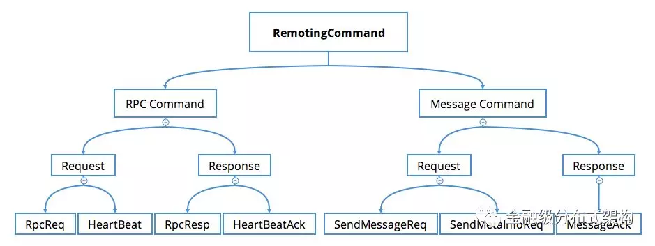

# 功能架构

## SOFABolt　的基础功能：

* 基础通信功能 ( remoting-core )
    * 基于 Netty 高效的网络 IO 与线程模型运用
    * 连接管理 (无锁建连，定时断链，自动重连)
    * 基础通信模型 ( oneway，sync，future，callback )
    * 超时控制
    * 批量解包与批量提交处理器
    * 心跳与 IDLE 事件处理
* 协议框架 ( protocol-skeleton )
    * 命令与命令处理器
    * 编解码处理器
    * 心跳触发器
* 私有协议定制实现 - RPC 通信协议 ( protocol-implementation )
    * RPC 通信协议的设计
    * 灵活的反序列化时机控制
    * 请求处理超时 FailFast 机制
    * 用户请求处理器 ( UserProcessor )
    * 双工通信

## 用法1

将 SOFABolt 用作一个远程通信框架，使用者可以不用关心如何实现一个私有协议的细节，直接使用我们内置的 RPC 通信协议。可以非常简单的启动客户端与服务端，同时注册一个用户请求处理器，即可完成远程调用。同时，像连接管理、心跳等基础功能特性都默认可以使用。
当前支持的调用类型如下图所示：

* 示例 Demo 请参考我们的 [用户手册](../sofa-bolt-handbook/)

## 用法2

将 SOFABolt 用作一个协议框架，使用者可以复用基础的通信模型、协议包含的接口定义等基础功能。然后根据自己设计的私有协议自定义 Command 类型、Command 处理器、编解码处理器等。如下图所示，RPC 和消息的 Command 定义结构：

