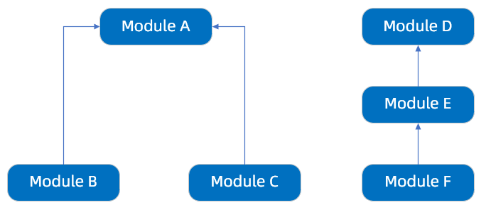

---
title: "模块并行化启动"
aliases: "/sofa-boot/docs/parallel-start"
---


SOFABoot 会根据 Require-Module 计算模块依赖树，例如以下依赖树表示模块 B 和模块 C 依赖模块 A，模块 E 依赖模块 D，模块 F 依赖模块 E：

 

该依赖树会保证模块 A 必定在模块 B 和模块 C 之前启动，模块 D 在模块 E 之前启动，模块 E 在模块 F 之前启动，但是依赖树没有定义模块 B 与模块 C，模块 B、C 与模块 D、E、F 之间的启动顺序，这几个模块之间可以串行启动，也可以并行启动。

SOFABoot 默认会并行启动模块，在使用过程中，如果希望关闭并行启动，可以在 application.properties 中增加以下参数:

```java
com.alipay.sofa.boot.module-start-up-parallel=false
```
