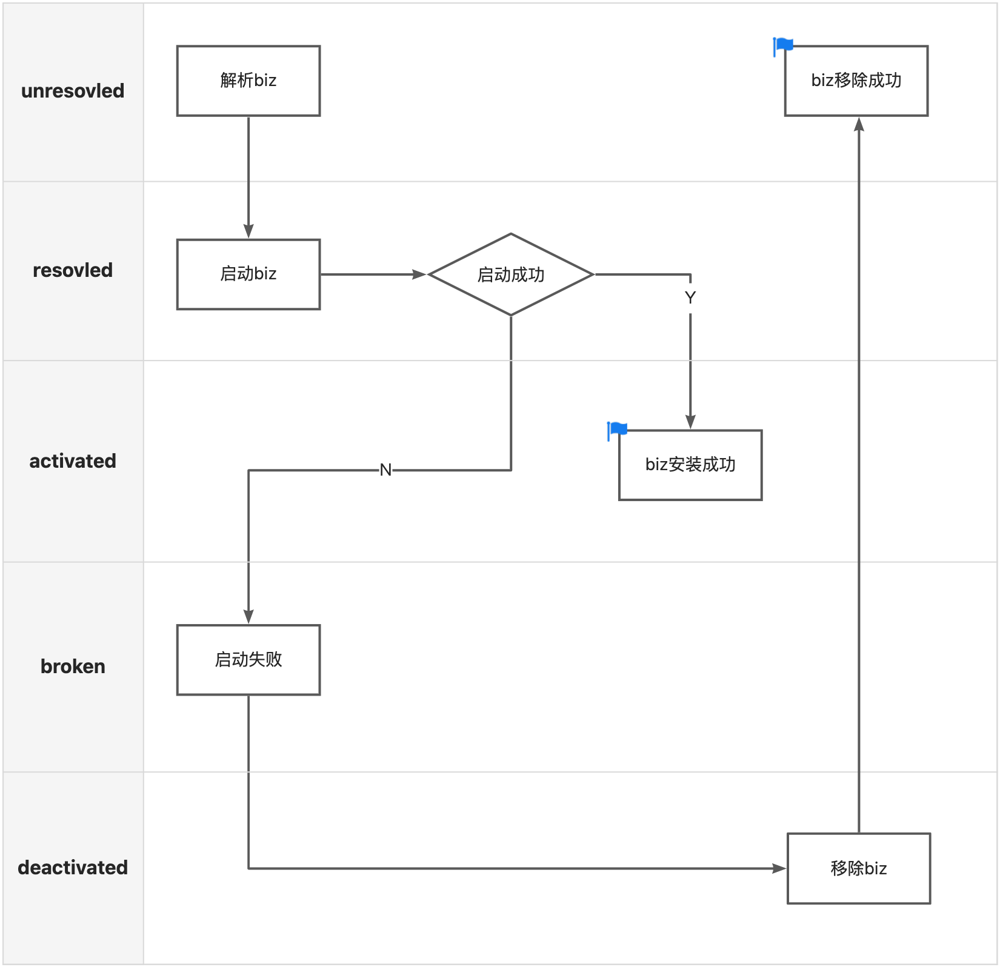

## 前言

在实践中，我们通常会使用业务功能模块化的开发模式，部署时将不同模块合并部署，由于团队间技术栈不统一，此时就有可能出现依赖冲突等问题。SOFAArk 定义了一种开发规范，将不同的应用模块打包成 Ark Biz，由一个基座 Biz 和多个 Biz 模块组成部署包，支持两种合并部署的方式，一种是静态合并部署，Ark Biz 以 Maven 依赖的方式引入项目；另一种是在运行时使用 API 或者 配置中心（Zookeeper）动态地安装或卸载 Biz，本文将重点讨论此方式。

## Ark Biz 的生命周期


Ark Biz 的生命周期主要包含三条指令：

* install: 安装 Biz
* uninstall: 卸载 Biz
* switch: 激活 Biz

在动态的安装和卸载时，Ark Biz 会流转于生命周期的五个阶段，Biz 在不同阶段时的状态如下：

* unresolved: 未注册，此时 Biz 包未被运行时解析
* resolved: Biz 包解析完成，且已注册，此时 Biz 包还没有安装或者安装中
* activated: Biz 包启动完成，且处于激活状态，可以对外提供服务
* broken: Biz 包启动失败后状态
* deactivated: Biz 包启动完成，但处于未激活状态(注意这个状态只对 JVM 服务生效，对 RPC 等其他中间件无效)

这里我们可以看一下 Ark Biz
的数据模型 BizModel 类：

```java
public class BizModel implements Biz {
    ...
    private String   bizName;
    private String   bizVersion;
    private BizState bizState;
    ...
}
```

在 Ark Biz 的数据模型中 bizState 表示的就是当前状态，可以看到数据模型中定义了 Biz 包的名称和版本号，在运行时 SOFAArk 允许部署相同名称不同版本的 Biz，但只能有一个版本处于 activated 激活状态，其他版本的 Biz 状态将自动处于 deactivated 未激活状态。

## install



在入口方法 ArkClient#installOperation 中，下载 Biz 包到本地临时文件，临时文件命名规则：${bizName}-${bizVersion}-${时间戳}。准备好 Biz 包后，调用 installBiz 方法，进入安装主流程。

```java
public static ClientResponse installOperation(BizOperation bizOperation) throws Throwable {
    return installOperation(bizOperation, arguments);
}
public static ClientResponse installOperation(BizOperation bizOperation, String[] args) throws Throwable {
    ...
    if (bizOperation.getParameters().get(Constants.CONFIG_BIZ_URL) != null) {
        URL url = new URL(bizOperation.getParameters().get(Constants.CONFIG_BIZ_URL));
        bizFile = ArkClient.createBizSaveFile(bizOperation.getBizName(), bizOperation.getBizVersion());
        FileUtils.copyInputStreamToFile(url.openStream(), bizFile);
    }
    return installBiz(bizFile, args);
}
```

安装 Ark Biz 的主流程：

1. 解析 Biz 包，创建 BizModel
2. 将 Ark Biz 注册到 Biz Manager 中（如果已经注册过，安装流程将直接结束，并返回提示信息）
3. 启动 Ark Biz
4. 如果启动失败，则关停并卸载 Ark Biz

```java
public static ClientResponse installBiz(File bizFile, String[] args) throws Throwable {
    ...
    Biz biz = bizFactoryService.createBiz(bizFile); // 1
    ClientResponse response = new ClientResponse();
    if (bizManagerService.getBizByIdentity(biz.getIdentity()) != null
        || !bizManagerService.registerBiz(biz)) { // 2
        return response.setCode(ResponseCode.REPEAT_BIZ).setMessage(
            String.format("Biz: %s has been installed or registered.", biz.getIdentity()));
    }

    try {
        biz.start(args); // 3
        ...
        response
            .setCode(ResponseCode.SUCCESS)
            .setMessage(
                String.format("Install Biz: %s success, cost: %s ms, started at: %s",
                    biz.getIdentity(), end - start, startDate))
            .setBizInfos(Collections.<BizInfo> singleton(biz));
        return response;
    } catch (Throwable throwable) {
        ...
        response.setCode(ResponseCode.FAILED).setMessage(
            String.format("Install Biz: %s fail,cost: %s ms, started at: %s",
                biz.getIdentity(), end - start, startDate));
        ...
        try {
            biz.stop(); // 4
        } catch (Throwable e) {
            ...
            throw e;
        } finally {
            bizManagerService.unRegisterBizStrictly(biz.getBizName(), biz.getBizVersion());
        }
        return response;
    }
}
```

### 解析 Ark Biz

当开启内嵌模式时，将 Biz 包解压到 ${Biz}-unpack 目录下，生成展开型的 Biz 包；当未开启内嵌模式时，直接使用原始的 Biz Jar 包，生成压缩型的 Biz 包。
这里生成 Biz 包是为了后续做类隔离做准备，在使用 ClassLoader.loadClass 方法查找类时，需要到不同的目标文件夹内查找。

```java
public Biz createBiz(File file) throws IOException {
    BizArchive bizArchive;
    if (ArkConfigs.isEmbedEnable()) {
        File unpackFile = new File(file.getAbsolutePath() + "-unpack");
        if (!unpackFile.exists()) {
            unpackFile = FileUtils.unzip(file, file.getAbsolutePath() + "-unpack");
        }
        if (file.exists()) {
            file.delete();
        }
        file = unpackFile;
        bizArchive = new ExplodedBizArchive(unpackFile);
    } else {
        JarFile bizFile = new JarFile(file);
        JarFileArchive jarFileArchive = new JarFileArchive(bizFile);
        bizArchive = new JarBizArchive(jarFileArchive);
    }
    BizModel biz = (BizModel) createBiz(bizArchive);
    biz.setBizTempWorkDir(file);
    return biz;
}
```

1. 从 Manifest 清单文件中解析基本信息（如MainClass），根据基本信息创建 BizModel，将 Ark Biz 的状态设置为 resolved
2. 创建 ClassLoader 设置到 BizModel 中

```java
public Biz createBiz(BizArchive bizArchive) throws IOException {
    ...
    // 1
    Attributes manifestMainAttributes = bizArchive.getManifest().getMainAttributes();
    bizModel
        .setBizState(BizState.RESOLVED)
        .setBizName(manifestMainAttributes.getValue(ARK_BIZ_NAME))
        .setBizVersion(manifestMainAttributes.getValue(ARK_BIZ_VERSION))
        .setMainClass(manifestMainAttributes.getValue(MAIN_CLASS_ATTRIBUTE))
        ...
        .setClassPath(bizArchive.getUrls());
    // 2
    BizClassLoader bizClassLoader = new BizClassLoader(bizModel.getIdentity(),
        getBizUcp(bizModel.getClassPath()), bizArchive instanceof ExplodedBizArchive
                                            || bizArchive instanceof DirectoryBizArchive);
    bizClassLoader.setBizModel(bizModel);
    bizModel.setClassLoader(bizClassLoader);
    bizClassLoader.setBizModel(bizModel);
    return bizModel;
}
```

### 启动 Ark Biz

1. 将当前线程上下文 ClassLoader 设置为 BizModel 的 ClassLoader，并暂存原 ClassLoader
2. 基于 BizModel ClassLoader 反射查找 MainClass，调用 main 方法
3. 发布 AfterBizStartupEvent 事件，可以看到源码中的注释表示这里会触发健康检查，我们先记下这个点稍后解答
4. 如果启动失败，就将 Ark Biz 状态设置为 broken
5. 将 ClassLoader 恢复回去
6. 当前配置的模式是默认激活新模块，将 Ark Biz 状态设置为 activated。检查当前是否有同名 Biz 处于 activated 状态，如果有就将旧的 Biz 状态设置为 deactivated
7. 当前配置的模式不是默认激活新模块，先检查当前是否有同名 Biz 处于 activated 状态，如果没有，就将本次安装的 Ark Biz 激活；如果有，则将本次安装的 Ark Biz 状态设置为 deactivated

```java
public void start(String[] args) throws Throwable {
    ...
    ClassLoader oldClassLoader = ClassLoaderUtils.pushContextClassLoader(this.classLoader); // 1
    EventAdminService eventAdminService = ArkServiceContainerHolder.getContainer().getService(EventAdminService.class);
    try {
        eventAdminService.sendEvent(new BeforeBizStartupEvent(this));
        resetProperties();
        if (!isMasterBizAndEmbedEnable()) {
            ...
            // 2
            MainMethodRunner mainMethodRunner = new MainMethodRunner(mainClass, args);
            mainMethodRunner.run();
            // this can trigger health checker handler
            eventAdminService.sendEvent(new AfterBizStartupEvent(this)); // 3
            ...
        }
    } catch (Throwable e) {
        bizState = BizState.BROKEN; // 4
        throw e;
    } finally {
        ClassLoaderUtils.popContextClassLoader(oldClassLoader); // 5
    }
    BizManagerService bizManagerService = ArkServiceContainerHolder.getContainer().getService(BizManagerService.class);
    // 6
    if (Boolean.getBoolean(Constants.ACTIVATE_NEW_MODULE)) {
        Biz currentActiveBiz = bizManagerService.getActiveBiz(bizName);
        if (currentActiveBiz == null) {
            bizState = BizState.ACTIVATED;
        } else {
            ((BizModel) currentActiveBiz).setBizState(BizState.DEACTIVATED);
            bizState = BizState.ACTIVATED;
        }
    } else {
        // 7
        if (bizManagerService.getActiveBiz(bizName) == null) {
            bizState = BizState.ACTIVATED;
        } else {
            bizState = BizState.DEACTIVATED;
        }
    }
}
```

### 关停 Ark Biz

1. 将当前线程上下文 ClassLoader 设置为 BizModel 的 ClassLoader，并暂存原 ClassLoader
2. 将 Ark Biz 状态设置为 deactivated
3. 发布 BeforeBizStopEvent 事件，可以看到源码中的注释表示这里会触发 uninstall 卸载操作，我们先记下这个点稍后解答
4. 从  Biz Manager 移除本次安装的 Ark Biz
5. 将 Ark Biz 状态恢复到初始状态 unresolved
6. 将 ClassLoader 恢复回去

```java
public void stop() {
    ...
    ClassLoader oldClassLoader = ClassLoaderUtils.pushContextClassLoader(this.classLoader); // 1
    bizState = BizState.DEACTIVATED; // 2
    EventAdminService eventAdminService = ArkServiceContainerHolder.getContainer().getService(EventAdminService.class);
    try {
        // this can trigger uninstall handler
        eventAdminService.sendEvent(new BeforeBizStopEvent(this)); // 3
    } finally {
        BizManagerService bizManagerService = ArkServiceContainerHolder.getContainer().getService(BizManagerService.class);
        bizManagerService.unRegisterBiz(bizName, bizVersion); // 4
        bizState = BizState.UNRESOLVED; // 5
        eventAdminService.sendEvent(new BeforeBizRecycleEvent(this));
        ...// 省略了一部分清理缓存的代码
        ClassLoaderUtils.popContextClassLoader(oldClassLoader); // 6
        eventAdminService.sendEvent(new AfterBizStopEvent(this));
    }
}
```

### 事件发布机制

上文中介绍了 install 的源码，在动态安装 Ark Biz 的流程中，我们遗留了两个关于事件发布的问题。

第一处是当 Ark Biz 启动成功后，发布 AfterBizStartupEvent 事件，触发健康检查：

```java
public void start(String[] args) throws Throwable {
    ...
    MainMethodRunner mainMethodRunner = new MainMethodRunner(mainClass, args);
    mainMethodRunner.run();
    // this can trigger health checker handler
    eventAdminService.sendEvent(new AfterBizStartupEvent(this));
    ...
}
```

这里需要结合 SOFABoot 理解，在 SOFABoot 源码中有一个 SofaBizHealthCheckEventHandler 类，是 AfterBizStartupEvent 事件的监听器：

```java
public class SofaBizHealthCheckEventHandler implements EventHandler<AfterBizStartupEvent> {
    @Override
    public void handleEvent(AfterBizStartupEvent event) {
        doHealthCheck(event.getSource());
    }
    private void doHealthCheck(Biz biz) {
        SofaRuntimeManager sofaRuntimeManager = getSofaRuntimeManager(biz);
        if (!sofaRuntimeManager.isReadinessHealth()) {
            throw new RuntimeException("Health check failed.");
        }
    }
    ...
}
```

SofaBizHealthCheckEventHandler 监听 AfterBizStartupEvent 事件，当事件发布时，就会调用 doHealthCheck 方法，从而实现在 Ark Biz 启动后，自动进行健康检查。当健康检查未通过时，会抛出异常，将进入 Ark Biz 启动失败的流程。

第二处是当 Ark Biz 启动失败，关停 Ark Biz 时，发布 BeforeBizStopEvent 事件，触发 uninstall 卸载操作：

```java
public void stop() {
    ...
    // this can trigger uninstall handler
    eventAdminService.sendEvent(new BeforeBizStopEvent(this)); // 3
    ...
}
```

这里同样需要结合 SOFABoot 理解，在 SOFABoot 源码中有一个 SofaBizUninstallEventHandler 类，是 BeforeBizStopEvent 事件的监听器：

```java
public class SofaBizUninstallEventHandler implements EventHandler<BeforeBizStopEvent> {
    @Override
    public void handleEvent(BeforeBizStopEvent event) {
        doUninstallBiz(event.getSource());
    }
    private void doUninstallBiz(Biz biz) {
        // Remove dynamic JVM service cache
        DynamicJvmServiceProxyFinder.getDynamicJvmServiceProxyFinder().afterBizUninstall(biz);
        SofaRuntimeProperties.unRegisterProperties(biz.getBizClassLoader());
        SofaRuntimeManager sofaRuntimeManager = getSofaRuntimeManager(biz);
        SofaFramework.unRegisterSofaRuntimeManager(sofaRuntimeManager);
        sofaRuntimeManager.shutDownExternally();
    }
    ...
}
```

SofaBizUninstallEventHandler 监听 BeforeBizStopEvent 事件，当事件发布时，调用 doUninstallBiz 方法，清理 JVM 服务、上下文参数等缓存，并在 SofaRuntimeManager#shutDownExternally 方法中关闭基座 Biz 的 Spring 上下文。

## uninstall

入口方法 ArkClient#uninstallOperation 中调用 uninstallBiz 方法，进入卸载流程。

```java
public static ClientResponse uninstallOperation(BizOperation bizOperation) throws Throwable {
    ...
    return uninstallBiz(bizOperation.getBizName(), bizOperation.getBizVersion());
}
```

卸载 Ark Biz 的主流程：

1. 判断要卸载的 Ark Biz 是否是基座，基座是主进程，不允许卸载
2. 在 Biz Manager 中查找 Ark Biz
3. 未查找到要卸载的 Ark Biz 时，返回 NOTFOUND 提示信息
4. [关停 Ark Biz](#关停-ark-biz)
5. 从 Biz Manager 中移除 Ark Biz
6. 卸载成功，返回成功提示

```java
public static ClientResponse uninstallBiz(String bizName, String bizVersion) throws Throwable {
    ...
    // 1
    if (bizName.equals(ArkConfigs.getStringValue(Constants.MASTER_BIZ))) {
        return new ClientResponse().setCode(ResponseCode.FAILED).setMessage("Master biz must not be uninstalled.");
    }
    Biz biz = bizManagerService.getBiz(bizName, bizVersion); // 2
    ClientResponse response = new ClientResponse().setCode(ResponseCode.NOT_FOUND_BIZ) // 3
        .setMessage(
            String.format("Uninstall biz: %s not found.",
                BizIdentityUtils.generateBizIdentity(bizName, bizVersion)));
    if (biz != null) {
        try {
            biz.stop(); // 4
        } catch (Throwable throwable) {
            ...
            throw throwable;
        } finally {
            bizManagerService.unRegisterBizStrictly(biz.getBizName(), biz.getBizVersion()); // 5
        }
        // 6
        response.setCode(ResponseCode.SUCCESS).setMessage(String.format("Uninstall biz: %s success.", biz.getIdentity()));
    }
    return response;
}
```

## switch

入口方法 ArkClient#switchOperation 中调用 switchBiz 方法，进入激活 Biz 流程。

```java
public static ClientResponse switchOperation(BizOperation bizOperation) {
    ...
    return switchBiz(bizOperation.getBizName(), bizOperation.getBizVersion());
}
```

激活 Ark Biz 的主流程：

1. 在 Biz Manager 中查找 Ark Biz
2. 未查找到 Ark Biz 时，返回 NOTFOUND 提示信息
3. 当要激活的 Ark Biz 状态不是 activated 或 deactivated，Ark Biz 没有成功安装过，不能直接激活，此时返回 ILLEGAL_STATE 提示信息
4. 激活 Ark Biz

```java
public static ClientResponse switchBiz(String bizName, String bizVersion) {
    ...
    Biz biz = bizManagerService.getBiz(bizName, bizVersion); // 1
    ClientResponse response = new ClientResponse().setCode(ResponseCode.NOT_FOUND_BIZ) // 2
        .setMessage(
            String.format("Switch biz: %s not found.",
                BizIdentityUtils.generateBizIdentity(bizName, bizVersion)));
    if (biz != null) {
        if (biz.getBizState() != BizState.ACTIVATED
            && biz.getBizState() != BizState.DEACTIVATED) {
            // 3
            response.setCode(ResponseCode.ILLEGAL_STATE_BIZ).setMessage(
                String.format("Switch Biz: %s's state must not be %s.", biz.getIdentity(),
                    biz.getBizState()));
        } else {
            eventAdminService.sendEvent(new BeforeBizSwitchEvent(biz));
            bizManagerService.activeBiz(bizName, bizVersion); // 4
            eventAdminService.sendEvent(new AfterBizSwitchEvent(biz));
            response.setCode(ResponseCode.SUCCESS).setMessage(
                String.format("Switch biz: %s is activated.", biz.getIdentity()));
        }
    }
    ...
    return response;
}
```

激活 Ark Biz 时，需要先查找当前是否有同名 Biz 处于激活状态，如果有需要将状态切换为 deactivated，再将本次要激活的 Ark Biz 状态设置为 activated。

```java
public void activeBiz(String bizName, String bizVersion) {
    ...
    Biz biz = getBiz(bizName, bizVersion);
    Biz activeBiz = getActiveBiz(bizName);
    if (biz != null && biz.getBizState() == BizState.DEACTIVATED) {
        if (activeBiz != null) {
            ((BizModel) activeBiz).setBizState(BizState.DEACTIVATED);
        }
        ((BizModel) biz).setBizState(BizState.ACTIVATED);
    }
}
```

## Telnet 指令

SOFAArk 提供了 telnet 小工具，用于运行时查看容器状态、执行动态部署指令等，接下来介绍下 telnet 小工具是如何实现动态部署的。

NettyTelnetHandler 作为 telnet 的入口，监听用户输入信息，委托 ArkCommandHandler 处理，并返回结果输出到控制台中。

```java
static class NettyTelnetHandler extends SimpleChannelInboundHandler<String> {
    private static ArkCommandHandler arkCommandHandler = new ArkCommandHandler();
    ...
    @Override
    protected void channelRead0(ChannelHandlerContext ctx, String msg) throws Exception {
        ...
        ctx.write(arkCommandHandler.responseMessage(msg));
        ...
    }
}
```

ArkCommandHandler 中委托 CommandProvider 解析用户输入的命令：

```java
public String responseMessage(String cmd) {
    String commandResult = handleCommand(cmd);
    ...
    return commandResult;
}
public String handleCommand(String cmdLine) {
    ...
    for (ServiceReference<CommandProvider> commandService : commandProviders) {
        CommandProvider commandProvider = commandService.getService();
        if (commandProvider.validate(cmdLine)) {
            return commandProvider.handleCommand(cmdLine);
        }
    }
    return helpMessage(commandProviders);
}
```

在 BizCommandProvider 中委托 BizCommand 处理用户输入的命令：

```java
public String handleCommand(String command) {
    return new BizCommand(command).process();
}
```

在 BizCommand 中，根据用户输入命令调用相应的编程 API，以安装 Ark Biz 为例：

1. 用户输入命令为 i 时，调用 installBiz 方法，进入安装流程
2. 将用户输入的参数部分组装成 BizOperation
3. 调用 ArkClient.installOperation 进入[安装主流程](#install)

```java
String process() {
    ...
    if (options.contains('h')) {
        return HELP_MESSAGE;
    } else if (options.contains('a')) {
        return bizList();
    } else if (options.contains('i')) {
        return installBiz();// 1
    } else if (options.contains('u')) {
        return uninstallBiz();
    } else if (options.contains('o')) {
        return switchBiz();
    } else {
        ...
    }
    return sb.toString();
}
 String installBiz() {
    ...
    BizOperation bizOperation = new BizOperation().setOperationType(BizOperation.OperationType.INSTALL);
    String param = parameters.toArray(new String[] {})[0];
    try {
        // 2
        URL url = new URL(param);
        bizOperation.putParameter(Constants.CONFIG_BIZ_URL, param);
    } catch (Throwable t) {
        String[] nameAndVersion = param.split(Constants.STRING_COLON);
        if (nameAndVersion.length != 2) {
            LOGGER.error("Invalid telnet biz install command {}", param);
            return;
        }
        bizOperation.setBizName(nameAndVersion[0]).setBizVersion(nameAndVersion[1]);
    }
    try {
        ArkClient.installOperation(bizOperation); // 3
    } catch (Throwable throwable) {
        LOGGER.error("Fail to process telnet install command: " + param, throwable);
    }
    ...
}
```

> telnet 服务端只是 SOFAArk 提供的方便运行时查看信息工具，不推荐直接通过 telnet 指令在线上执行 Biz 操作指令，推荐使用 API 或者动态配置方式。

## Zookeeper 动态配置

SOFAArk 提供的动态配置插件，通过 Zookeeper 下发动态部署指令

```xml
<dependency>
    <groupId>com.alipay.sofa</groupId>
    <artifactId>config-ark-plugin</artifactId>
    <version>${sofa.ark.version}</version>
</dependency>
```

在 ConfigProcessor 入口类中，注册定时任务，长轮询拉取配置数据：

```java
public void start() {
    commonThreadPool.getExecutor().execute(new ConfigTask());
}

class ConfigTask implements Runnable {
    @Override
    public void run() {
        while (true) {
            ...
            String config = configDeque.poll();
            if (config == null) {
                sleep(200);
                continue;
            }
            ...
            OperationProcessor.process(OperationTransformer.transformToBizOperation(config, pluginContext));
            ...
        }
    }
}
```

调用 OperationTransformer#transformToBizOperation 方法将配置数据转换为 BizOperation，此处的源码不做详细说明，感兴趣的同学可以结合[Zookeeper 配置](https://www.sofastack.tech/projects/sofa-boot/sofa-ark-zk-config/)阅读源码

在 OperationProcessor#process 方法中，根据指令类型，调用 ArkClient 的不同方法：

```java
public static List<ClientResponse> process(List<BizOperation> bizOperations) {
    List<ClientResponse> clientResponses = new ArrayList<>();
    try {
        for (BizOperation bizOperation : bizOperations) {
            ...
            switch (bizOperation.getOperationType()) {
                case INSTALL:
                    clientResponses.add(ArkClient.installOperation(bizOperation));
                    break;
                case UNINSTALL:
                    clientResponses.add(ArkClient.uninstallOperation(bizOperation));
                    break;
                case SWITCH:
                    clientResponses.add(ArkClient.switchOperation(bizOperation));
                    break;
                case CHECK:
                    clientResponses.add(ArkClient.checkOperation(bizOperation));
                    break;
                ...
            }
        }
    } catch (Throwable throwable) {
        throw new ArkRuntimeException("Failed to execute biz operations.", throwable);
    }
    return clientResponses;
}
```

### check

Zookeeper 动态下发指令支持 check指令，check 指令用于查询 Ark Biz 安装情况。

入口方法 ArkClient#checkOperation 中调用 checkBiz 方法，进入查询 Biz 流程。

```java
public static ClientResponse checkOperation(BizOperation bizOperation) {
    ...
    return checkBiz(bizOperation.getBizName(), bizOperation.getBizVersion());
}
```

查询 Ark Biz 的主流程：

1. 在 Biz Manager 中查找 Ark Biz
   1. 当 Ark Biz 名称和版本都传入的情况，在 Biz Manager 中查找指定名称和版本的 Ark Biz
   2. 当传入 Ark Biz 名称的情况，在 Biz Manager 中查找该名称所有版本的 Ark Biz
   3. 当没有传入参数的情况，将在 Biz Manager 中注册的所有 Ark Biz 都查找出来
2. 将符合条件的 Ark Biz 组装并返回

```java
public static ClientResponse checkBiz(String bizName, String bizVersion) {
    ...
    ClientResponse response = new ClientResponse();
    Set<BizInfo> bizInfoSet = new HashSet<>();
    if (bizName != null && bizVersion != null) {
        // 1.1
        Biz biz = bizManagerService.getBiz(bizName, bizVersion);
        if (biz != null) {
            bizInfoSet.add(biz);
        }
    } else if (bizName != null) {
        // 1.2
        bizInfoSet.addAll(bizManagerService.getBiz(bizName));
    } else {
        // 1.3
        bizInfoSet.addAll(bizManagerService.getBizInOrder());
    }
    // 2
    StringBuilder sb = new StringBuilder();
    sb.append(String.format("Biz count=%d", bizInfoSet.size())).append("\n");
    for (BizInfo bizInfo : bizInfoSet) {
        sb.append(
            String.format("bizName=%s, bizVersion=%s, bizState=%s", bizInfo.getBizName(),
                bizInfo.getBizVersion(), bizInfo.getBizState())).append("\n");
    }
    response.setCode(ResponseCode.SUCCESS).setBizInfos(bizInfoSet).setMessage(sb.toString());
    LOGGER.info(String.format("Check Biz: %s", response.getMessage()));
    return response;
}
```

激活 Ark Biz 时，需要先查找当前是否有同名 Biz 处于激活状态，如果有需要将状态切换为 deactivated，再将本次要激活的 Ark Biz 状态设置为 activated。

```java
public void activeBiz(String bizName, String bizVersion) {
    ...
    Biz biz = getBiz(bizName, bizVersion);
    Biz activeBiz = getActiveBiz(bizName);
    if (biz != null && biz.getBizState() == BizState.DEACTIVATED) {
        if (activeBiz != null) {
            ((BizModel) activeBiz).setBizState(BizState.DEACTIVATED);
        }
        ((BizModel) biz).setBizState(BizState.ACTIVATED);
    }
}
```

## 总结

SOFAArk 通过轻量级的类隔离+动态装载的能力实现了动态合并部署，使开着飞机换引擎成为可能，能够极大的提升开发效率及应用可扩展性。
