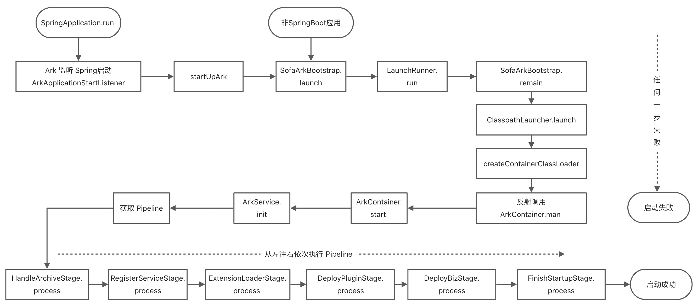
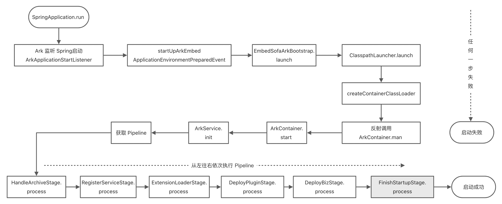
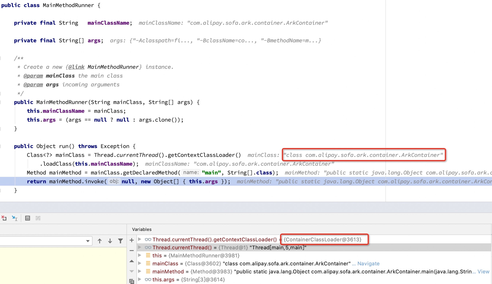

---
title: "启动过程"
aliases: "/sofa-boot/docs/sofa-ark-startup-process"
---
# 启动过程

## Ark 1.0 非内嵌模式

<h3 id="section-1-3-1">打包方式</h3>

在 SOFAArk 1.0 中使用 sofa-ark-maven-plugin 打包

```xml
<build>
     <plugins>
       <plugin>
         <groupId>com.alipay.sofa</groupId>
         <artifactId>sofa-ark-maven-plugin</artifactId>
         <version>${sofa.ark.version}</version>
         <executions>
           <execution>
             <id>default-cli</id>
             
             <!--goal executed to generate executable-ark-jar -->
             <goals>
               <goal>repackage</goal>
             </goals>
             
             <configuration>
               <outputDirectory>./target</outputDirectory>
               
               <!--default none-->
               <arkClassifier>executable-ark</arkClassifier>
             </configuration>
           </execution>
         </executions>
       </plugin>
     </plugins>
   </build>
```

<h3 id="section-1-3-2">启动流程图</h3>

Ark 1.0 应用的整体启动流程如下图所述：


<h3 id="section-1-3-3">启动方式</h3>

<h4 id="section-1-3-3-1">方式一、IDEA 启动</h4>

使用 idea 启动 SpringBoot Application 即可

<h4 id="section-1-3-3-2">方式二、命令行启动</h4>

Ark 包是可执行 Jar，可直接使用 java -jar 的方式启动，先使用 mvn clean package 进行打包，打包得到 ${bizName}-${bizVersion}-executable-ark.jar，命令行启动

```bash
java -jar ${bizName}-${bizVersion}-executable-ark.jar
``` 

<h3 id="section-1-3-4">启动原理分析</h3>

Springboot 应用，ArkApplicationStartListener 实现了 ApplicationListener 接口，监听 Spring 的启动事件，调用`SofaArkBootstrap.launch(args)`启动 Ark。

```java
public class ArkApplicationStartListener implements ApplicationListener<SpringApplicationEvent> {

    @Override
    public void onApplicationEvent(SpringApplicationEvent event) {
        try {
            if (isSpringBoot2()
                && APPLICATION_STARTING_EVENT.equals(event.getClass().getCanonicalName())) {
                startUpArk(event);
            }

            if (isSpringBoot1()
                && APPLICATION_STARTED_EVENT.equals(event.getClass().getCanonicalName())) {
                startUpArk(event);
            }
        } catch (Throwable e) {
            throw new RuntimeException("Meet exception when determine whether to start SOFAArk!", e);
        }
    }

    public void startUpArk(SpringApplicationEvent event) {
        if (LAUNCH_CLASSLOADER_NAME.equals(this.getClass().getClassLoader().getClass().getName())) {
            // Ark 启动入口，非 Springboot 应用需要手动调用该方法
            SofaArkBootstrap.launch(event.getArgs());
        }
    }

    public boolean isSpringBoot1() {
        return SpringBootVersion.getVersion().startsWith("1");
    }

    public boolean isSpringBoot2() {
        return SpringBootVersion.getVersion().startsWith("2");
    }
}
```

SofaArkBootstrap launch 方法里面启了一个线程执行`SofaArkBootstrap.remain`方法，remain 里面调`ClasspathLauncher.launch`方法。

```java
public class SofaArkBootstrap {

    private static final String BIZ_CLASSLOADER = "com.alipay.sofa.ark.container.service.classloader.BizClassLoader";
    private static final String MAIN_ENTRY_NAME = "remain";
    private static EntryMethod  entryMethod;

    public static void launch(String[] args) {
        try {
            if (!isSofaArkStarted()) {
                entryMethod = new EntryMethod(Thread.currentThread());
                IsolatedThreadGroup threadGroup = new IsolatedThreadGroup(
                    entryMethod.getDeclaringClassName());
                // 参数中指定当前类的remain方法，LaunchRunner.run 里面会用反射调用remain方法
                LaunchRunner launchRunner = new LaunchRunner(SofaArkBootstrap.class.getName(),
                    MAIN_ENTRY_NAME, args);
                Thread launchThread = new Thread(threadGroup, launchRunner,
                    entryMethod.getMethodName());
                launchThread.start();
                // 等待前面的线程执行完成
                LaunchRunner.join(threadGroup);
                threadGroup.rethrowUncaughtException();
                System.exit(0);
            }
        } catch (Throwable e) {
            throw new RuntimeException(e);
        }
    }

    private static void remain(String[] args) throws Exception {// NOPMD
        // 在一个新的线程里面执行该方法
        AssertUtils.assertNotNull(entryMethod, "No Entry Method Found.");
        URL[] urls = getURLClassPath();
        new ClasspathLauncher(new ClassPathArchive(entryMethod.getDeclaringClassName(),
            entryMethod.getMethodName(), urls)).launch(args, getClasspath(urls),
            entryMethod.getMethod());
    }

}
```

ClasspathLauncher launch 方法在基类 AbstractLauncher 里面，会先创建 ContainerClassLoader，然后修改当前线程的 classLoader，通过 ContainerClassLoader 加载 com.alipay.sofa.ark.container.ArkContainer，然后使用反射执行 com.alipay.sofa.ark.container.ArkContainer.main 方法。

```java
public abstract class AbstractLauncher {

    /**
     * Launch the ark container. This method is the initial entry point when execute an fat jar.
     * @throws Exception if the ark container fails to launch.
     */
    public Object launch(String[] args) throws Exception {
        JarFile.registerUrlProtocolHandler();
        // 创建 ContainerClassLoader
        ClassLoader classLoader = createContainerClassLoader(getContainerArchive());
        List<String> attachArgs = new ArrayList<>();
        attachArgs
            .add(String.format("%s%s=%s", CommandArgument.ARK_CONTAINER_ARGUMENTS_MARK,
                CommandArgument.FAT_JAR_ARGUMENT_KEY, getExecutableArchive().getUrl()
                    .toExternalForm()));
        attachArgs.addAll(Arrays.asList(args));
        return launch(attachArgs.toArray(new String[attachArgs.size()]), getMainClass(),
            classLoader);
    }

    protected Object launch(String[] args, String mainClass, ClassLoader classLoader)
                                                                                     throws Exception {
        ClassLoader old = Thread.currentThread().getContextClassLoader();
        try {
            // 修改线程的classLoader
            Thread.currentThread().setContextClassLoader(classLoader);
            // 通过反射执行 com.alipay.sofa.ark.container.ArkContainer.main 
            return createMainMethodRunner(mainClass, args).run();
        } finally {
            Thread.currentThread().setContextClassLoader(old);
        }
    }

    // ......
}
```

ArkContainer main 方法里面，会创建一个 ArkContainer 实例，然后执行 start 方法，start 方法中会获取 Pipeline，然后执行 StandardPipeline。

```java
public class ArkContainer {
    // ......

    public Object start() throws ArkRuntimeException {
        AssertUtils.assertNotNull(arkServiceContainer, "arkServiceContainer is null !");
        if (started.compareAndSet(false, true)) {
            Runtime.getRuntime().addShutdownHook(new Thread(new Runnable() {
                @Override
                public void run() {
                    stop();
                }
            }));
            prepareArkConfig();
            reInitializeArkLogger();
            arkServiceContainer.start();
            // 获取 Pipeline
            Pipeline pipeline = arkServiceContainer.getService(Pipeline.class);
            // 执行 Pipeline
            pipeline.process(pipelineContext);

            // Pipeline 执行完成之后 Ark 启动成功
            System.out.println("Ark container started in " + (System.currentTimeMillis() - start) //NOPMD
                               + " ms.");
        }
        return this;
    }
    // ......
}
```

StandardPipeline 里面内置了 6 个 Stage，会按顺序执行。

```java
public class StandardPipeline implements Pipeline {

    private static final ArkLogger LOGGER = ArkLoggerFactory.getDefaultLogger();
    private List<PipelineStage>    stages = new ArrayList<>();

    public StandardPipeline() {
        initializePipeline();
    }

    private void initializePipeline() {
        // 初始化 Stage
        addPipelineStage(
            ArkServiceContainerHolder.getContainer().getService(HandleArchiveStage.class))
            .addPipelineStage(
                ArkServiceContainerHolder.getContainer().getService(RegisterServiceStage.class))
            .addPipelineStage(
                ArkServiceContainerHolder.getContainer().getService(ExtensionLoaderStage.class))
            .addPipelineStage(
                ArkServiceContainerHolder.getContainer().getService(DeployPluginStage.class))
            .addPipelineStage(
                ArkServiceContainerHolder.getContainer().getService(DeployBizStage.class))
            .addPipelineStage(
                ArkServiceContainerHolder.getContainer().getService(FinishStartupStage.class));
    }

    @Override
    public Pipeline addPipelineStage(PipelineStage pipelineStage) {
        stages.add(pipelineStage);
        return this;
    }

    @Override
    public void process(PipelineContext pipelineContext) throws ArkRuntimeException {
        for (PipelineStage pipelineStage : stages) {
            try {
                LOGGER.info(String.format("Start to process pipeline stage: %s", pipelineStage
                    .getClass().getName()));
               // 按顺序执行 Stage，有一个 Stage 执行报错都会终止 ark 启动
                pipelineStage.process(pipelineContext);
                LOGGER.info(String.format("Finish to process pipeline stage: %s", pipelineStage
                    .getClass().getName()));
            } catch (Throwable e) {
                LOGGER.error(String.format("Process pipeline stage fail: %s", pipelineStage
                    .getClass().getName()), e);
                throw new ArkRuntimeException(e);
            }
        }
    }
}
```

## Ark 2.0 内嵌模式

<h3 id="section-2-3-1">打包方式</h3>

在 SOFAArk 2.0 中基座是采用 spring-boot 原生打包插件 spring-boot-maven-plugin 打包

```xml
<build>
  <plugins>
    <plugin>
      <groupId>org.springframework.boot</groupId>
      <artifactId>spring-boot-maven-plugin</artifactId>
      <version>2.6.6</version>
      
      <configuration>
        <outputDirectory>target</outputDirectory>
        <classifier>ark-biz</classifier>
      </configuration>
      <executions>
        <execution>
          <id>package</id>
          <goals>
            <goal>repackage</goal>
          </goals>
        </execution>
      </executions>
    </plugin>
  </plugins>
</build>
```

<h3 id="section-2-3-2">启动流程图</h3>



<h3 id="section-2-3-3">启动方式</h3>

<h4 id="section-2-3-3-1">方式一、IDEA 启动</h4>

本地启动需要加上启动参数

```bash
-Dsofa.ark.embed.enable=true -Dcom.alipay.sofa.ark.master.biz=${bizName}
```

<h4 id="section-2-2-3-2">方式二、命令行启动</h4>

Ark包是可执行Jar，可直接使用Java -jar的方式启动，先使用 mvn clean package 进行打包，打包得到 ${bizName}-${bizVersion}-ark-biz.jar，命令行启动

```bash
java -jar -Dsofa.ark.embed.enable=true -Dcom.alipay.sofa.ark.master.biz=${bizName} ${bizName}-${bizVersion}-ark-biz.jar
```

<h3 id="section-2-3-4">启动原理分析</h3>

<h4 id="section-2-3-4-1">启动入口</h4>

入口和 1.0 一样，使用 ArkApplicationStartListener 监听 Spring 的启动事件，调用`EmbedSofaArkBootstrap.launch`启动 Ark。

```java
public class ArkApplicationStartListener implements ApplicationListener<SpringApplicationEvent> {

    @Override
    public void onApplicationEvent(SpringApplicationEvent event) {
        try {
            if (ArkConfigs.isEmbedEnable()
                || LaunchedURLClassLoader.class.isAssignableFrom(this.getClass().getClassLoader()
                    .getClass())) {
                ArkConfigs.setEmbedEnable(true);
                // Ark 2.0 内嵌模式
                startUpArkEmbed(event);
                return;
            }
            if (isSpringBoot2()
                && APPLICATION_STARTING_EVENT.equals(event.getClass().getCanonicalName())) {
                startUpArk(event);
            }

            if (isSpringBoot1()
                && APPLICATION_STARTED_EVENT.equals(event.getClass().getCanonicalName())) {
                startUpArk(event);
            }
        } catch (Throwable e) {
            throw new RuntimeException("Meet exception when determine whether to start SOFAArk!", e);
        }
    }
    // ......
    protected void startUpArkEmbed(SpringApplicationEvent event) {
        if (this.getClass().getClassLoader() != Thread.currentThread().getContextClassLoader()) {
            return;
        }
        if (event instanceof ApplicationEnvironmentPreparedEvent) {
            ApplicationEnvironmentPreparedEvent preparedEvent = (ApplicationEnvironmentPreparedEvent) event;
            // Ark 启动入口
            EmbedSofaArkBootstrap.launch(preparedEvent.getEnvironment());
        }
        if (event instanceof ApplicationReadyEvent) {
            if (ArkClient.getEventAdminService() != null && ArkClient.getMasterBiz() != null) {
                ArkClient.getEventAdminService().sendEvent(
                    new AfterBizStartupEvent(ArkClient.getMasterBiz()));
                ArkClient.getEventAdminService().sendEvent(new AfterFinishDeployEvent());
                ArkClient.getEventAdminService().sendEvent(new AfterFinishStartupEvent());
            }
        }
    }
}
```

EmbedSofaArkBootstrap launch 方法里面直接调`ClasspathLauncher.launch`，此处和 1.0 的处理有些差异。

```java
public class EmbedSofaArkBootstrap {
    private static AtomicBoolean started = new AtomicBoolean(false);

    public static void launch(Environment environment) {
        if (started.compareAndSet(false, true)) {
            EntryMethod entryMethod = new EntryMethod(Thread.currentThread());

            getOrSetDefault(
                Constants.MASTER_BIZ,
                environment.getProperty(Constants.MASTER_BIZ,
                    environment.getProperty("spring.application.name")));
            getOrSetDefault(Constants.BIZ_CLASS_LOADER_HOOK_DIR,
                environment.getProperty(Constants.BIZ_CLASS_LOADER_HOOK_DIR));
            getOrSetDefault(Constants.PLUGIN_EXPORT_CLASS_ENABLE,
                environment.getProperty(Constants.PLUGIN_EXPORT_CLASS_ENABLE, "false"));
            getOrSetDefault(Constants.BIZ_CLASS_LOADER_HOOK_DIR,
                DelegateToMasterBizClassLoaderHook.class.getName());
            try {
                URL[] urls = getURLClassPath();
                ClasspathLauncher launcher = new ClasspathLauncher(new EmbedClassPathArchive(
                    entryMethod.getDeclaringClassName(), entryMethod.getMethod().getName(), urls));
                // 调 ClasspathLauncher.launch
                launcher.launch(new String[] {}, getClasspath(urls), entryMethod.getMethod());
            } catch (Throwable e) {
                throw new RuntimeException(e);
            }
        }
    }

    // ......
}
```

ClasspathLauncher launch 方法内容和 Ark 1.0 类似，会先创建 ContainerClassLoader，然后修改当前线程的 classLoader，通过 ContainerClassLoader 加载 com.alipay.sofa.ark.container.ArkContainer，然后使用反射执行 com.alipay.sofa.ark.container.ArkContainer.main 方法。



ArkContainer main 方法里面，会创建一个 ArkContainer 实例，然后执行 start 方法，开始启动容器服务。

```java
public class ArkContainer {

    // .....

    public static Object main(String[] args) throws ArkRuntimeException {
        if (args.length < MINIMUM_ARGS_SIZE) {
            throw new ArkRuntimeException("Please provide suitable arguments to continue !");
        }

        try {
            LaunchCommand launchCommand = LaunchCommand.parse(args);
            if (launchCommand.isExecutedByCommandLine()) {
                ExecutableArkBizJar executableArchive;
                File rootFile = new File(URLDecoder.decode(launchCommand.getExecutableArkBizJar()
                    .getFile()));
                if (rootFile.isDirectory()) {
                    executableArchive = new ExecutableArkBizJar(new ExplodedArchive(rootFile));
                } else {
                    executableArchive = new ExecutableArkBizJar(new JarFileArchive(rootFile,
                        launchCommand.getExecutableArkBizJar()));
                }
                return new ArkContainer(executableArchive, launchCommand).start();
            } else {
                ClassPathArchive classPathArchive;
                if (ArkConfigs.isEmbedEnable()) {
                    // Ark 2.0 内嵌模式
                    classPathArchive = new EmbedClassPathArchive(launchCommand.getEntryClassName(),
                        launchCommand.getEntryMethodName(), launchCommand.getClasspath());
                } else {
                    classPathArchive = new ClassPathArchive(launchCommand.getEntryClassName(),
                        launchCommand.getEntryMethodName(), launchCommand.getClasspath());
                }
                return new ArkContainer(classPathArchive, launchCommand).start();
            }
        } catch (IOException e) {
            throw new ArkRuntimeException(String.format("SOFAArk startup failed, commandline=%s",
                LaunchCommand.toString(args)), e);
        }
    }
    // ......
    public Object start() throws ArkRuntimeException {
        AssertUtils.assertNotNull(arkServiceContainer, "arkServiceContainer is null !");
        if (started.compareAndSet(false, true)) {
            Runtime.getRuntime().addShutdownHook(new Thread(new Runnable() {
                @Override
                public void run() {
                    stop();
                }
            }));
            prepareArkConfig();
            reInitializeArkLogger();
            // 启动容器服务
            arkServiceContainer.start();
            // 从容器服务中获取 Pipeline 实例，底层是从 Guice 中获取实例
            Pipeline pipeline = arkServiceContainer.getService(Pipeline.class);
           //  执行流水线
            pipeline.process(pipelineContext);

            // Ark 启动完成
            System.out.println("Ark container started in " + (System.currentTimeMillis() - start) //NOPMD
                               + " ms.");
        }
        return this;
    }
}
```

<h4 id="section-2-3-4-2">启动容器服务</h4>

ArkServiceContainer 是基于 Guice 实现的容器服务，[Guice](https://github.com/google/guice) 是 Google开发的, 一个轻量级的依赖注入框架。类似Spring 的依赖注入。通过 Guice 管理 Ark 容器服务相关的 bean。

```java
public class ArkServiceContainer {

    private Injector               injector;

    private List<ArkService>       arkServiceList = new ArrayList<>();

    private AtomicBoolean          started        = new AtomicBoolean(false);
    private AtomicBoolean          stopped        = new AtomicBoolean(false);

    private final String[]         arguments;

    private static final ArkLogger LOGGER         = ArkLoggerFactory.getDefaultLogger();

    public ArkServiceContainer(String[] arguments) {
        this.arguments = arguments;
    }

    /**
     * Start Ark Service Container
     * @throws ArkRuntimeException
     * @since 0.1.0
     */
    public void start() throws ArkRuntimeException {
        if (started.compareAndSet(false, true)) {
            ClassLoader oldClassLoader = ClassLoaderUtils.pushContextClassLoader(getClass()
                .getClassLoader());
            try {
                LOGGER.info("Begin to start ArkServiceContainer");

                // Guice 是 Google开发的, 一个轻量级的依赖注入框架
                injector = Guice.createInjector(findServiceModules());
                // 从 guice 中查询所有 ArkService 实例
                for (Binding<ArkService> binding : injector
                    .findBindingsByType(new TypeLiteral<ArkService>() {
                    })) {
                    arkServiceList.add(binding.getProvider().get());
                }
                Collections.sort(arkServiceList, new OrderComparator());

                for (ArkService arkService : arkServiceList) {
                    LOGGER.info(String.format("Init Service: %s", arkService.getClass().getName()));
                    // 初始化 arkService，一共有 4 个 ArkService，分别是：
                    // PluginDeployService：部署 plugin 的服务
                    // BizDeployService:  部署 biz 包的服务
                    // ClassLoaderService:  ClassLoader 服务
                    // StandardTelnetServer: Telnet 工具服务
                    arkService.init();
                }

                ArkServiceContainerHolder.setContainer(this);
                ArkClient.setBizFactoryService(getService(BizFactoryService.class));
                ArkClient.setBizManagerService(getService(BizManagerService.class));
                ArkClient.setInjectionService(getService(InjectionService.class));
                ArkClient.setEventAdminService(getService(EventAdminService.class));
                ArkClient.setArguments(arguments);
                LOGGER.info("Finish to start ArkServiceContainer");
            } finally {
                ClassLoaderUtils.popContextClassLoader(oldClassLoader);
            }
        }
    }
  
    private List<AbstractArkGuiceModule> findServiceModules() throws ArkRuntimeException {
        try {
            List<AbstractArkGuiceModule> modules = new ArrayList<>();
            // 通过 java spi 加载 Module
            for (AbstractArkGuiceModule module : ServiceLoader.load(AbstractArkGuiceModule.class)) {
                modules.add(module);
            }
            return modules;
        } catch (Throwable e) {
            throw new ArkRuntimeException(e);
        }
    }
   // ......

}
````

com.alipay.sofa.ark.common.guice.AbstractArkGuiceModule 文件中配置了 spi 实现 com.alipay.sofa.ark.container.guice.ContainerModule, ContainerModule 里配置了所有 ark 用到的实例，这些实例通过 @Inject 即可自动注入：

```java
public class ContainerModule extends AbstractArkGuiceModule {

    @Override
    protected void configure() {
        // 当需要 Pipeline 的实例时，我们注入 StandardPipeline 的实例作为依赖
        binder().bind(Pipeline.class).to(StandardPipeline.class);

        Multibinder<ArkService> arkServiceMultibinder = Multibinder.newSetBinder(binder(),
            ArkService.class);
        // ArkService 有4个类型的实例
        arkServiceMultibinder.addBinding().to(PluginDeployServiceImpl.class);
        arkServiceMultibinder.addBinding().to(BizDeployServiceImpl.class);
        arkServiceMultibinder.addBinding().to(ClassLoaderServiceImpl.class);
        arkServiceMultibinder.addBinding().to(StandardTelnetServerImpl.class);

        // 当需要 PluginManagerService 的实例时，我们注入 PluginManagerServiceImpl 的实例作为依赖
        binder().bind(PluginManagerService.class).to(PluginManagerServiceImpl.class);
        // 下面是一样的道理
        binder().bind(BizManagerService.class).to(BizManagerServiceImpl.class);
        binder().bind(ClassLoaderService.class).to(ClassLoaderServiceImpl.class);
        binder().bind(PluginDeployService.class).to(PluginDeployServiceImpl.class);
        binder().bind(BizDeployService.class).to(BizDeployServiceImpl.class);
        binder().bind(RegistryService.class).to(RegistryServiceImpl.class);
        binder().bind(InjectionService.class).to(InjectionServiceImpl.class);
        binder().bind(TelnetServerService.class).to(StandardTelnetServerImpl.class);
        binder().bind(BizFactoryService.class).to(BizFactoryServiceImpl.class);
        binder().bind(PluginFactoryService.class).to(PluginFactoryServiceImpl.class);
        binder().bind(ExtensionLoaderService.class).to(ExtensionLoaderServiceImpl.class);
        binder().bind(EventAdminService.class).to(EventAdminServiceImpl.class);
    }
}
```

<h4 id="section-2-3-4-3">执行流水线</h4>

容器服务 arkServiceContainer 启动完成之后，就容器服务中获取 Pipeline 实例，执行流水线，下面看一下 StandardPipeline 的源码：

```java
// 在容器中是单例对象
@Singleton
public class StandardPipeline implements Pipeline {

    private static final ArkLogger LOGGER = ArkLoggerFactory.getDefaultLogger();
    private List<PipelineStage>    stages = new ArrayList<>();

    public StandardPipeline() {
        initializePipeline();
    }

    private void initializePipeline() {
        // 一共有 6 个步骤
        addPipelineStage(
            ArkServiceContainerHolder.getContainer().getService(HandleArchiveStage.class))
            .addPipelineStage(
                ArkServiceContainerHolder.getContainer().getService(RegisterServiceStage.class))
            .addPipelineStage(
                ArkServiceContainerHolder.getContainer().getService(ExtensionLoaderStage.class))
            .addPipelineStage(
                ArkServiceContainerHolder.getContainer().getService(DeployPluginStage.class))
            .addPipelineStage(
                ArkServiceContainerHolder.getContainer().getService(DeployBizStage.class))
            .addPipelineStage(
                ArkServiceContainerHolder.getContainer().getService(FinishStartupStage.class));
    }

    @Override
    public Pipeline addPipelineStage(PipelineStage pipelineStage) {
        stages.add(pipelineStage);
        return this;
    }

    @Override
    public void process(PipelineContext pipelineContext) throws ArkRuntimeException {
        for (PipelineStage pipelineStage : stages) {
            try {
                LOGGER.info(String.format("Start to process pipeline stage: %s", pipelineStage
                    .getClass().getName()));
                // 执行每个步骤
                pipelineStage.process(pipelineContext);
                LOGGER.info(String.format("Finish to process pipeline stage: %s", pipelineStage
                    .getClass().getName()));
            } catch (Throwable e) {
                LOGGER.error(String.format("Process pipeline stage fail: %s", pipelineStage
                    .getClass().getName()), e);
                throw new ArkRuntimeException(e);
            }
        }
    }
}
```

<h5 id="section-2-3-4-3-1">Archive 解析</h5>

Ark 2.0 模式下，在这个步骤里会创建 master biz，创建 master biz 的过程见 processEmbed 方法和 BizFactoryServiceImpl 里面的 createEmbedMasterBiz，并且 master biz 是使用 LaunchedURLClassLoader 加载的（本地启动是用 AppClassLoader） 。创建完 master biz 之后进行安装 plugin。

```java
    // HandleArchiveStage 类
    protected void processEmbed(PipelineContext pipelineContext) throws Exception {
        // 获取到 Launcher$AppClassLoader
        ClassLoader masterBizClassLoader = pipelineContext.getClass().getClassLoader();
        // 创建 master biz
        Biz masterBiz = bizFactoryService.createEmbedMasterBiz(masterBizClassLoader);
        bizManagerService.registerBiz(masterBiz);
        ArkClient.setMasterBiz(masterBiz);
        ArkConfigs.putStringValue(Constants.MASTER_BIZ, masterBiz.getBizName());
        ExecutableArchive executableArchive = pipelineContext.getExecutableArchive();
        // 获取 plugin 包
        List<PluginArchive> pluginArchives = executableArchive.getPluginArchives();
        for (PluginArchive pluginArchive : pluginArchives) {
            // jar 包里面带有 com/alipay/sofa/ark/plugin/mark 文件的都是 plugin 
            Plugin plugin = pluginFactoryService.createEmbedPlugin(pluginArchive,
                masterBizClassLoader);
            if (!isPluginExcluded(plugin)) {
                pluginManagerService.registerPlugin(plugin);
            } else {
                LOGGER.warn(String.format("The plugin of %s is excluded.", plugin.getPluginName()));
            }
        }
        return;
    }
    
    // BizFactoryServiceImpl 类
    public Biz createEmbedMasterBiz(ClassLoader masterClassLoader) {
        BizModel bizModel = new BizModel();
        bizModel.setBizState(BizState.RESOLVED).setBizName(ArkConfigs.getStringValue(MASTER_BIZ))
            .setBizVersion("1.0.0").setMainClass("embed main").setPriority("100")
            .setWebContextPath("/").setDenyImportPackages(null).setDenyImportClasses(null)
            .setDenyImportResources(null).setInjectPluginDependencies(new HashSet<>())
            .setInjectExportPackages(null)
            .setClassPath(((URLClassLoader) masterClassLoader).getURLs())
            .setClassLoader(masterClassLoader);
        return bizModel;
    }

    // EmbedClassPathArchive 类
    @Override
    public List<PluginArchive> getPluginArchives() throws Exception {
        // 扫描 plugin 包，ARK_PLUGIN_MARK_ENTRY="com/alipay/sofa/ark/container/mark"
        List<URL> urlList = filterUrls(Constants.ARK_PLUGIN_MARK_ENTRY);

        List<PluginArchive> pluginArchives = new ArrayList<>();
        for (URL url : urlList) {
            pluginArchives.add(new JarPluginArchive(getUrlJarFileArchive(url)));
        }
        return pluginArchives;
    }
```

<h5 id="section-2-3-4-3-2">注册容器服务</h5>

`RegisterServiceStage`这一步是将所有 Ark 相关的服务注册到 com.alipay.sofa.ark.container.service.registry.RegistryServiceImpl#services 里去，并扫描服务中的 @ArkInject 注解，进行自动注入 Ark 服务。为什么要引入 @ArkInject？主要是为了方便开发高级特性，使用注解 @ArkInject 引用服务。SOFAArk 容器默认将内部功能组件发布成了服务，包括 Biz 管理，Plugin 管理，事件管理，服务注册管理。

```java
    // RegisterServiceStage 类
    private void registryDefaultService() {
        /**
         * some basic container service is not allowed to be override,  they are only published
         * to be referenced by plugin and biz, even depended by other container service.
         */
        registryService.publishService(BizManagerService.class, ArkServiceContainerHolder
            .getContainer().getService(BizManagerService.class), new ContainerServiceProvider(
            PriorityOrdered.HIGHEST_PRECEDENCE));
        registryService.publishService(BizFactoryService.class, ArkServiceContainerHolder
            .getContainer().getService(BizFactoryService.class), new ContainerServiceProvider(
            PriorityOrdered.HIGHEST_PRECEDENCE));
        registryService.publishService(PluginManagerService.class, ArkServiceContainerHolder
            .getContainer().getService(PluginManagerService.class), new ContainerServiceProvider(
            PriorityOrdered.HIGHEST_PRECEDENCE));
        registryService.publishService(PluginFactoryService.class, ArkServiceContainerHolder
            .getContainer().getService(PluginFactoryService.class), new ContainerServiceProvider(
            PriorityOrdered.HIGHEST_PRECEDENCE));
        registryService.publishService(EventAdminService.class, ArkServiceContainerHolder
            .getContainer().getService(EventAdminService.class), new ContainerServiceProvider(
            PriorityOrdered.HIGHEST_PRECEDENCE));
        registryService.publishService(RegistryService.class, ArkServiceContainerHolder
            .getContainer().getService(RegistryService.class), new ContainerServiceProvider(
            PriorityOrdered.HIGHEST_PRECEDENCE));

        /**
         * some container service which may depends on other basic container service.
         */
        registryService.publishService(BizDeployer.class, new DefaultBizDeployer(),
            new ContainerServiceProvider());
        registryService.publishService(CommandProvider.class, new PluginCommandProvider(),
            PLUGIN_COMMAND_UNIQUE_ID, new ContainerServiceProvider());
        registryService.publishService(CommandProvider.class, new BizCommandProvider(),
            BIZ_COMMAND_UNIQUE_ID, new ContainerServiceProvider());
    }

    // RegistryServiceImpl 类
    public <T> ServiceReference<T> publishService(Class<T> ifClass, T implObject, String uniqueId,
                                                  ServiceProvider serviceProvider) {
        AssertUtils.assertNotNull(ifClass, "Service interface should not be null.");
        AssertUtils.assertNotNull(implObject, "Service implementation should not be null.");
        AssertUtils.assertNotNull(uniqueId, "Service uniqueId should not be null.");
        AssertUtils.assertNotNull(serviceProvider, "ServiceProvider should not be null.");

        ServiceMetadata serviceMetadata = new ServiceMetadataImpl(ifClass, uniqueId,
            serviceProvider);
        for (ServiceReference<?> serviceReference : services) {
            // services 中已经存在这个服务，不重复注册
            if (serviceMetadata.equals(serviceReference.getServiceMetadata())) {
                LOGGER.warn(String.format("Service: %s publish by: %s already exist",
                    serviceMetadata.getServiceName(), serviceProvider));
                return (ServiceReference<T>) serviceReference;
            }
        }

        ServiceReference<T> serviceReference = new ServiceReferenceImpl<>(serviceMetadata,
            implObject);
        // 处理服务中的 @ArkInject ，自动注入依赖
        injectionService.inject(serviceReference);

        LOGGER.info(String.format("Service: %s publish by: %s succeed",
            serviceMetadata.getServiceName(), serviceProvider));

        services.add(serviceReference);

        return serviceReference;
    }

    // InjectionServiceImpl 类
    private void inject(final Object instance, final String type) {
        ReflectionUtils.doWithFields(instance.getClass(), new FieldCallback() {
            @Override
            public void doWith(Field field) throws ArkRuntimeException {
                // 查找 @ArkInject 注解
                ArkInject arkInject = field.getAnnotation(ArkInject.class);
                if (arkInject == null) {
                    return;
                }

                Class<?> serviceType = arkInject.interfaceType() == void.class ? field.getType()
                    : arkInject.interfaceType();
                Object value = getService(serviceType, arkInject.uniqueId());

                if (value == null) {
                    LOGGER.warn(String.format("Inject {field= %s} of {service= %s} fail!",
                        field.getName(), type));
                    return;
                }
                ReflectionUtils.makeAccessible(field);
                try {
                    // 自动注入
                    field.set(instance, value);
                    LOGGER.info(String.format("Inject {field= %s} of {service= %s} success!",
                        field.getName(), type));
                } catch (Throwable throwable) {
                    throw new ArkRuntimeException(throwable);
                }
            }
        });
    }
    private Object getService(Class serviceType, String uniqueId) {
        ServiceReference serviceReference = registryService.referenceService(serviceType, uniqueId);
        return serviceReference == null ? null : serviceReference.getService();
    }
```

<h5 id="section-2-3-4-3-3">初始化环境</h5>

`ExtensionLoaderStage` 这一步做的事情比较简单，将 ExtensionLoaderService 实例设置到 ArkServiceLoader 的静态属性上，方便使用静态方法就能获取到 ExtensionLoaderService 实例。

```java
    // ExtensionLoaderStage 类
    public void process(PipelineContext pipelineContext) throws ArkRuntimeException {
        ArkServiceLoader.setExtensionLoaderService(extensionLoaderService);
    }
```

<h5 id="section-2-3-4-3-4">部署 Ark 插件</h5>

`DeployPluginStage` 这一步主要是部署 plugin。从 PluginManagerService 中获取到所有的 Ark 插件，并按照插件优先级顺序：
* ClassloaderService 准备插件 export 类的 map 映射
* PluginDeployService 启动插件的 com.alipay.sofa.ark.spi.service.PluginActivator。

```java
    // PluginDeployServiceImpl 类
    public void deploy() throws ArkRuntimeException {
        for (Plugin plugin : pluginManagerService.getPluginsInOrder()) {
            try {
                deployPlugin(plugin);
            } catch (ArkRuntimeException e) {
                LOGGER.error(String.format("Deploy plugin: %s meet error", plugin.getPluginName()),
                    e);
                throw e;
            }
        }
    }

    // PluginModel 类
    public void start() throws ArkRuntimeException {
        if (activator == null || activator.isEmpty()) {
            return;
        }

        EventAdminService eventAdminService = ArkServiceContainerHolder.getContainer().getService(
            EventAdminService.class);

        ClassLoader oldClassLoader = ClassLoaderUtils
            .pushContextClassLoader(this.pluginClassLoader);
        try {
            eventAdminService.sendEvent(new BeforePluginStartupEvent(this));
            pluginActivator = (PluginActivator) pluginClassLoader.loadClass(activator)
                .newInstance();
            pluginActivator.start(pluginContext);
        } catch (Throwable ex) {
            throw new ArkRuntimeException(ex.getMessage(), ex);
        } finally {
            eventAdminService.sendEvent(new AfterPluginStartupEvent(this));
            ClassLoaderUtils.popContextClassLoader(oldClassLoader);

        }
    }
```

<h5 id="section-2-3-4-3-5">启动 Ark 业务</h5>

`DeployBizStage`这一步主要是部署 biz。从 BizManagerService 中获取到所有的 Ark 业务，并执行业务配置在 MANIFEST.MF 属性 Main-Class 中提供的入口 main 函数

```java
    // BizDeployServiceImpl 类
    public void deploy(String[] args) throws ArkRuntimeException {
        ServiceReference<BizDeployer> serviceReference = registryService
            .referenceService(BizDeployer.class);
        bizDeployer = serviceReference.getService();

        LOGGER.info(String.format("BizDeployer=\'%s\' is starting.", bizDeployer.getDesc()));

        bizDeployer.init(args);
        bizDeployer.deploy();
    }

    // DefaultBizDeployer 类
    public void deploy() {
        for (Biz biz : bizManagerService.getBizInOrder()) {
            try {
                LOGGER.info(String.format("Begin to start biz: %s", biz.getBizName()));
                biz.start(arguments);
                LOGGER.info(String.format("Finish to start biz: %s", biz.getBizName()));
            } catch (Throwable e) {
                LOGGER.error(String.format("Start biz: %s meet error", biz.getBizName()), e);
                throw new ArkRuntimeException(e);
            }
        }
    }
```

<h5 id="section-2-3-4-3-6">完成启动</h5>

`FinishStartupStage`Ark 2.0 这一步什么事情都不会做，1.0 会发送一个 AfterFinishStartupEvent 事件。

```java
@Singleton
public class FinishStartupStage implements PipelineStage {
    @Inject
    private EventAdminService eventAdminService;

    @Override
    public void process(PipelineContext pipelineContext) throws ArkRuntimeException {
        if (ArkConfigs.isEmbedEnable()) {
            // 2.0 直接返回
            return;
        }
        eventAdminService.sendEvent(new AfterFinishStartupEvent());
    }
}
```