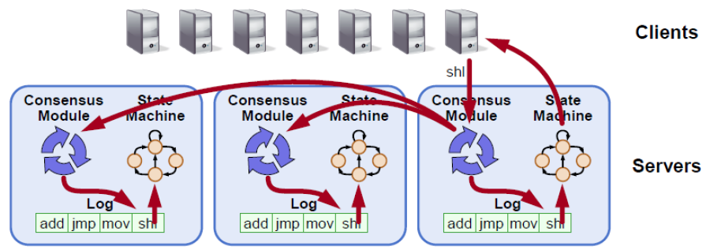

本介绍内容来自 [braft](https://github.com/brpc/braft) 文档，原文链接请参见[这里](https://github.com/brpc/braft/blob/master/docs/cn/overview.md)。braft 的关于算法和应用本身的文档非常优秀，由于 jraft 脱胎自 
 braft，我们强烈推荐阅读上述文档以了解 raft 算法的基本原理和应用。

## 分布式一致性

分布式一致性 (distributed consensus) 是分布式系统中最基本的问题，用来保证一个分布式系统的可靠性以及容灾能力。简单的来讲，就是如何在多个机器间对某一个值达成一致, 并且当达成一致之后，无论之后这些机器间发生怎样的故障，这个值能保持不变。
抽象定义上， 一个分布式系统里的所有进程要确定一个值 v，如果这个系统满足如下几个性质， 就可以认为它解决了分布式一致性问题, 分别是:

- Termination: 所有正常的进程都会决定 v 具体的值，不会出现一直在循环的进程。
- Validity: 任何正常的进程确定的值 v', 那么 v' 肯定是某个进程提交的。比如随机数生成器就不满足这个性质。
- Agreement: 所有正常的进程选择的值都是一样的。

## 一致性状态机

对于一个无限增长的序列 a[1, 2, 3…], 如果对于任意整数 i, a[i] 的值满足分布式一致性，这个系统就满足一致性状态机的要求。
基本上所有的系统都会有源源不断的操作, 这时候单独对某个特定的值达成一致是不够的。为了真实系统保证所有的副本的一致性，通常会把操作转化为 [write-ahead-log](https://en.wikipedia.org/wiki/Write-ahead_logging)(简称WAL)。然后让系统的所有副本对WAL保持一致，这样每个进程按照顺序执行WAL里的操作，就能保证最终的状态是一致的。

## RAFT

RAFT 是一种新型易于理解的分布式一致性复制协议，由斯坦福大学的 Diego Ongaro 和 John Ousterhout 提出，作为 [RAMCloud](https://ramcloud.atlassian.net/wiki/display/RAM/RAMCloud) 项目中的中心协调组件。Raft 是一种 Leader-Based 的 Multi-Paxos 变种，相比 Paxos、Zab、View Stamped Replication 等协议提供了更完整更清晰的协议描述，并提供了清晰的节点增删描述。
Raft 作为复制状态机，是分布式系统中最核心最基础的组件，提供命令在多个节点之间有序复制和执行，当多个节点初始状态一致的时候，保证节点之间状态一致。系统只要多数节点存活就可以正常处理，它允许消息的延迟、丢弃和乱序，但是不允许消息的篡改（非拜占庭场景）。

Raft 可以解决分布式理论中的 CP，即一致性和分区容忍性，并不能解决 Available 的问题。其中包含分布式系统中一些通常的功能：

- Leader Election
- Log Replication
- Membership Change
- Log Compaction

## RAFT 可以做什么

通过 RAFT 提供的一致性状态机，可以解决复制、修复、节点管理等问题，极大的简化当前分布式系统的设计与实现，让开发者只关注于业务逻辑，将其抽象实现成对应的状态机即可。基于这套框架，可以构建很多分布式应用：

- 分布式锁服务，比如 Zookeeper
- 分布式存储系统，比如分布式消息队列、分布式块系统、分布式文件系统、分布式表格系统等
- 高可靠元信息管理，比如各类 Master 模块的 HA

## JRAFT

一个纯 Java 的 [Raft](https://raft.github.io/) 算法实现库, 基于百度 [braft](https://github.com/brpc/braft) 实现而来, 使用 Java 重写了所有功能, 支持:

1. Leader election and priority-based semi-deterministic leader election.
2. Replication and recovery.
3. Snapshot and log compaction.
4. Read-only member (learner).
5. Membership management.
6. Fully concurrent replication.
7. Fault tolerance.
8. Asymmetric network partition tolerance.
9. Workaround when quorate peers are dead.
10. Replication pipeline optimistic
11. Linearizable read,  ReadIndex/LeaseRead.

## 联系我们

更多讨论欢迎加入钉钉讨论群：23127468
