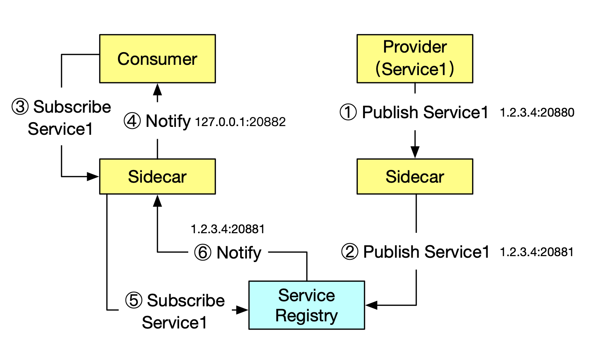
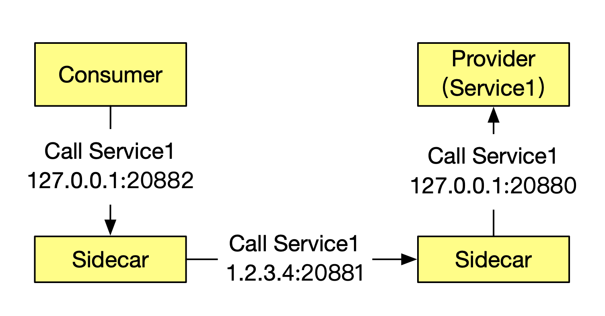
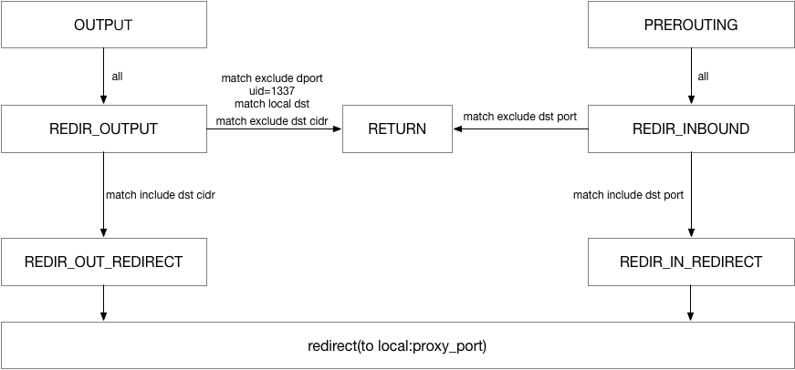
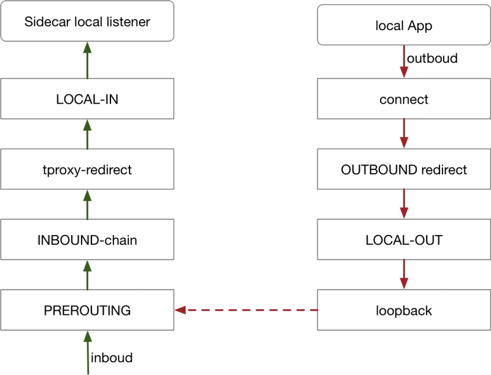

本文描述的是 MOSN 作为 Sidecar 使用时的流量劫持方案。

MOSN 作为 Sidecar 和业务容器部署在同一个 Pod 中时，需要使得业务应用的 Inbound 和 Outbound 服务请求都能够经过 Sidecar 处理。区别于 Istio 社区使用 iptables 做流量透明劫持，MOSN 目前使用的是流量接管方案，并在积极探索适用于大规模流量下的透明劫持方案。

## 流量接管

区别于 Istio 社区的 [iptables 流量劫持方案](https://jimmysong.io/istio-handbook/concepts/sidecar-injection-deep-dive.html)，MOSN 使用的流量接管的方案如下：

1. 假设服务端运行在 1.2.3.4 这台机器上，监听 20880 端口，首先服务端会向自己的 Sidecar 发起服务注册请求，告知 Sidecar 需要注册的服务以及 IP + 端口（1.2.3.4:20880）
1. 服务端的 Sidecar 会向服务注册中心（如 SOFA Registry）发起服务注册请求，告知需要注册的服务以及 IP + 端口，不过这里需要注意的是注册上去的并不是业务应用的端口（20880），而是 Sidecar 自己监听的一个端口（例如：20881）
1. 调用端向自己的 Sidecar 发起服务订阅请求，告知需要订阅的服务信息
1. 调用端的 Sidecar 向调用端推送服务地址，这里需要注意的是推送的 IP 是本机，端口是调用端的 Sidecar 监听的端口（例如 20882）
1. 调用端的 Sidecar 会向服务注册中心（如 SOFA Registry）发起服务订阅请求，告知需要订阅的服务信息；
1. 服务注册中心（如 SOFA Registry）向调用端的 Sidecar 推送服务地址（1.2.3.4:20881）

 

### 服务调用过程

经过上述的服务发现过程，流量转发过程就显得非常自然了：

1. 调用端拿到的服务端地址是 `127.0.0.1:20882`，所以就会向这个地址发起服务调用
1. 调用端的 Sidecar 接收到请求后，通过解析请求头，可以得知具体要调用的服务信息，然后获取之前从服务注册中心返回的地址后就可以发起真实的调用（`1.2.3.4:20881`）
1. 服务端的 Sidecar 接收到请求后，经过一系列处理，最终会把请求发送给服务端（`127.0.0.1:20880`）

 

## 透明劫持

上文通过在服务注册过程中把服务端地址替换成本机监听端口实现了轻量级的“流量劫持”，在存在注册中心，且调用端和服务端同时使用特定SDK的场景中可以很好的工作，如果不满足这两个条件，则无法流量劫持。为了降低对于应用程序的要求，需要引入透明劫持。

### 使用 iptables 做流量劫持

iptables 通过 NAT 表的 redirect 动作执行流量重定向，通过 syn 包触发新建 nefilter 层的连接，后续报文到来时查找连接转换目的地址与端口。新建连接时同时会记录下原始目的地址，应用程序可以通过(`SOL_IP`、`SO_ORIGINAL_DST`)获取到真实的目的地址。

iptables 劫持原理如下图所示：

 

### 使用 iptables 做流量劫持时存在的问题

目前 Istio 使用 iptables 实现透明劫持，主要存在以下三个问题：
1. 需要借助于 conntrack 模块实现连接跟踪，在连接数较多的情况下，会造成较大的消耗，同时可能会造成 track 表满的情况，为了避免这个问题，业内有关闭 conntrack 的做法，比如阿里巴巴就关闭了这个模块。
1. iptables 属于常用模块，全局生效，不能显式的禁止相关联的修改，可管控性比较差。
1. iptables 重定向流量本质上是通过 loopback 交换数据，outbond 流量将两次穿越协议栈，在大并发场景下会损失转发性能。

上述几个问题并非在所有场景中都存在，比方说某些场景下，连接数并不多，且 NAT 表未被使用到的情况下，iptables 是一个满足要求的简单方案。为了适配更加广泛的场景，透明劫持需要解决上述三个问题。

### 透明劫持方案优化

**使用 tproxy 处理 inbound 流量**

tproxy 可以用于 inbound 流量的重定向，且无需改变报文中的目的 IP/端口，不需要执行连接跟踪，不会出现 conntrack 模块创建大量连接的问题。受限于内核版本，tproxy 应用于 outbound 存在一定缺陷。目前 Istio 支持通过 tproxy 处理 inbound 流量。

**使用 hook connect 处理 outbound 流量**

为了适配更多应用场景，outbound 方向通过 hook connect 来实现，实现原理如下：

 

无论采用哪种透明劫持方案，均需要解决获取真实目的 IP/端口的问题，使用 iptables 方案通过 getsockopt 方式获取，tproxy 可以直接读取目的地址，通过修改调用接口，hook connect 方案读取方式类似于tproxy。

实现透明劫持后，在内核版本满足要求（4.16以上）的前提下，通过 sockmap 可以缩短报文穿越路径，进而改善 outbound 方向的转发性能。

## 总结
总结来看，如果应用程序通过注册中心发布/订阅服务时，可以结合注册中心劫持流量；在需要用到透明劫持的场景，如果性能压力不大，使用 iptables redirect 即可，大并发压力下使用 tproxy 与hook connect 结合的方案。