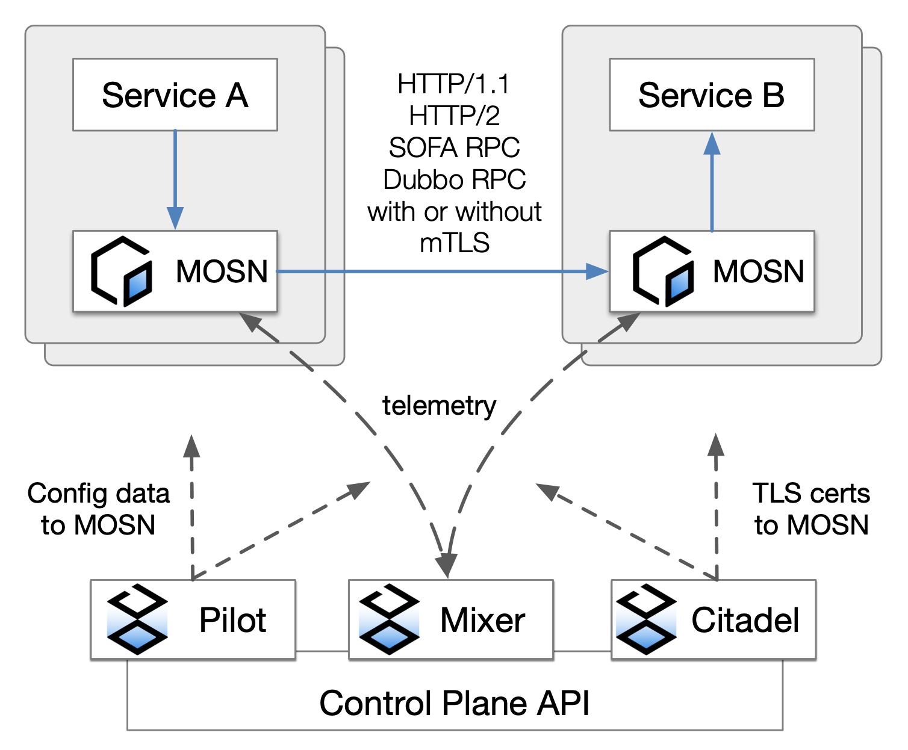

本文将介绍如何使用 MOSN 在 SOFAMesh 框架下搭建 Service Mesh 的开发环境，并验证 MOSN 的一些基础路由能力、负载均衡能力等。本文介绍的内容将包括 : 

- MOSN 与 SOFAMesh 的关系
- 准备工作
- 源码方式部署 SOFAMesh
- Bookinfo 实验

## MOSN 与 SOFAMesh 的关系

我们曾在 [MOSN 介绍](../overview)中介绍过，MOSN 是一款采用 Go 语言开发的 Service Mesh 数据平面代理。而 SOFAMesh 则是基于 Istio 改进和扩展而来的 Service Mesh 大规模落地实践方案，MOSN 作为 SOFAMesh 的关键组件用来完成数据面的转发。

下图是 SOFAMesh 整体框架下，MOSN 的工作示意图。

注意：当前 MOSN 不支持在原生的 Istio 中直接使用。

<div align=center></div>

## 准备工作

本文以 macOS 为例 ，其他环境可以安装对应版本的软件。

### 1. 安装 hyperkit

先安装 [docker-for-mac](https://store.docker.com/editions/community/docker-ce-desktop-mac)，之后[安装驱动](https://github.com/kubernetes/minikube/blob/master/docs/drivers.md)

#### 1.1 安装 docker

下载软件包安装，或者使用如下的命令安装。

```bash
$ brew cask install docker
```

#### 1.2 安装驱动

```bash
$ curl -LO https://storage.googleapis.com/minikube/releases/latest/docker-machine-driver-hyperkit \
&& chmod +x docker-machine-driver-hyperkit \
&& sudo mv docker-machine-driver-hyperkit /usr/local/bin/ \
&& sudo chown root:wheel /usr/local/bin/docker-machine-driver-hyperkit \
&& sudo chmod u+s /usr/local/bin/docker-machine-driver-hyperkit
```

### 2. 安装 Minikube(也可以购买商业 k8s 集群)

推荐使用 Minikube v0.28 以上来体验，请参考 [https://github.com/kubernetes/minikube](https://github.com/kubernetes/minikube)

```bash
$ brew cask install minikube
```

### 3. 启动 Minikube

注意，pilot 至少需要 2G 内存，所以在启动的时候，可以通过加参数的方法给 minikube 添加分配的资源，如果你机器的资源不够，推荐使用商业版本的 k8s 集群。

```bash
$ minikube start --memory=8192 --cpus=4 --kubernetes-version=v1.15.0 --vm-driver=hyperkit
```

创建istio 命名空间

```
$ kubectl create namespace istio-system
```

### 4. 安装 kubectl 命令行工具

kubectl 是用于针对 k8s 集群运行命令的命令行接口，安装参考 [https://kubernetes.io/docs/tasks/tools/install-kubectl](https://kubernetes.io/docs/tasks/tools/install-kubectl)。

```bash
$ brew install kubernetes-cli
```

### 5. 安装 Helm

Helm 是一个 k8s 的包管理工具，安装参考 [https://docs.helm.sh/using\_helm/#installing-helm](https://docs.helm.sh/using_helm/#installing-helm)

```bash
$ brew install kubernetes-helm
```

## 源码方式部署 SOFAMesh

### 1. 下载 SOFAMesh 源码

```bash
$ git clone https://github.com/sofastack/sofa-mesh.git
```

### 2. 通过 Helm 安装 SOFAMesh


**使用 `helm template` 安装**

首先需要切换到SOFAMesh源码所在目录，然后使用Helm安装istio CRD以及各个组件 

```bash
$ cd sofa-mesh 
$ helm template install/kubernetes/helm/istio-init --name istio-init --namespace istio-system | kubectl apply -f -
$ helm template install/kubernetes/helm/istio --name istio --namespace istio-system | kubectl apply -f -
```

### 3. 验证安装

`istio-system` 命名空间下的 pod 状态都是 Running 时，说明已经部署成功。
如果仅仅是为了运行bookinfo，只需要pilot,injector,citadel这三个pods运行成功就可以满足最低要求

```bash
$ kubectl get pods -n istio-system
NAME                                       READY    STATUS   RESTARTS    AGE
istio-citadel-6579c78cd9-w57lr              1/1     Running   0          5m
istio-egressgateway-7649f76df4-zs8kw        1/1     Running   0          5m
istio-galley-c77876cb6-nhczq                1/1     Running   0          5m
istio-ingressgateway-5c9c8565d9-d972t       1/1     Running   0          5m
istio-pilot-7485f9fb4b-xsvtm                1/1     Running   0          5m
istio-policy-5766bc84b9-p2wfj               1/1     Running   0          5m
istio-sidecar-injector-7f5f586bc7-2sdx6     1/1     Running   0          5m
istio-statsd-prom-bridge-7f44bb5ddb-stcf6   1/1     Running   0          5m
istio-telemetry-55ff8c77f4-q8d8q            1/1     Running   0          5m
prometheus-84bd4b9796-nq8lg                 1/1     Running   0          5m
```

### 4. 卸载安装

卸载SOFAMesh

```bash
$ helm template install/kubernetes/helm/istio --name istio --namespace istio-system | kubectl delete -f -
$ kubectl delete namespace istio-system
```

## BookInfo 实验

BookInfo 是一个类似豆瓣的图书应用，它包含四个基础服务：

-  Product Page：主页，由 python 开发，展示所有图书信息，它会调用 Reviews 和 Details 服务
-  Reviews：评论，由 java 开发，展示图书评论，会调用 Ratings 服务
-  Ratings：评分服务，由 nodejs 开发
-  Details：图书详情，由 ruby 开发

<div align=center></div>
### 1. 部署 BookInfo 应用并注入 SOFA-Mosn

> 详细过程可以参考 [https://istio.io/docs/examples/bookinfo/](https://istio.io/docs/examples/bookinfo/)

注入 MOSN。

```bash
$ kubectl label namespace default istio-injection=enabled
```

部署 Bookinfo。

```bash
$ kubectl apply -f samples/bookinfo/platform/kube/bookinfo.yaml
```

验证部署是否成功。

```bash
$ kubectl get services
NAME                       CLUSTER-IP   EXTERNAL-IP   PORT(S)              AGE
details                    10.0.0.31    <none>        9080/TCP             6m
kubernetes                 10.0.0.1     <none>        443/TCP              7d
productpage                10.0.0.120   <none>        9080/TCP             6m
ratings                    10.0.0.15    <none>        9080/TCP             6m
reviews                    10.0.0.170   <none>        9080/TCP             6m
```

等待所有的 pods 等成功运行起来。

```bash
$ kubectl get pods
NAME                                        READY     STATUS    RESTARTS   AGE
details-v1-1520924117-48z17                 2/2       Running   0          6m
productpage-v1-560495357-jk1lz              2/2       Running   0          6m
ratings-v1-734492171-rnr5l                  2/2       Running   0          6m
reviews-v1-874083890-f0qf0                  2/2       Running   0          6m
reviews-v2-1343845940-b34q5                 2/2       Running   0          6m
reviews-v3-1813607990-8ch52                 2/2       Running   0          6m
```

### 2. 访问 BookInfo 服务

开启 gateway 模式。

```bash
$ kubectl apply -f samples/bookinfo/networking/bookinfo-gateway.yaml
$ kubectl get gateway        // 查看 gateway 是否运行起来
NAME               AGE
bookinfo-gateway   24m
```

设置GATEWAY_URL,参考文档 https://istio.io/docs/tasks/traffic-management/ingress/ingress-control/#determining-the-ingress-ip-and-ports

```bash
$ export INGRESS_PORT=$(kubectl -n istio-system get service istio-ingressgateway -o jsonpath='{.spec.ports[?(@.name=="http2")].nodePort}')
$ export SECURE_INGRESS_PORT=$(kubectl -n istio-system get service istio-ingressgateway -o jsonpath='{.spec.ports[?(@.name=="https")].nodePort}')
$ export INGRESS_HOST=$(minikube ip)
$ export GATEWAY_URL=$INGRESS_HOST:$INGRESS_PORT
```

验证 gateway 是否生效。

```bash
$ curl -o /dev/null -s -w "%{http_code}\n"  http://$GATEWAY_URL/productpage   //输出 200 表示成功 
200
```

**观察页面情况**

访问 `http://$GATEWAY_URL/productpage` (注意： $GATEWAY_URL 需要替换成你设置的地址)，正常的话通过刷新会看到如下所示 BookInfo 的界面，其中 Book Reviews 有三个版本，
刷新后依次会看到(可以查看 samples/bookinfo/platform/kube/bookinfo.yaml 中的配置发现为什么是这三个版本)

版本一的界面。


版本二的界面。


版本三的界面。


### 3. 验证 MOSN 按 version 路由能力

首先为 BookInfo 的 service 创建一系列的 destination rules。

```bash
$ kubectl apply -f samples/bookinfo/networking/destination-rule-all.yaml
```

指定 reviews 服务只访问 v1 版本。

```bash
$ kubectl apply -f samples/bookinfo/networking/virtual-service-all-v1.yaml
```

访问 `http://$GATEWAY_URL/productpage` 发现 reviews 固定在如下版本一的页面不再变化


### 4. 验证 MOSN 按 weight 路由能力

我们通过下面操作将 v1 和 v3 版本各分配 50% 的流量。

```bash
$ kubectl apply -f samples/bookinfo/networking/virtual-service-reviews-50-v3.yaml
```

访问 `http://$GATEWAY_URL/productpage` 这次 v1 和 v3 各有 1/2 几率出现

### 5. 验证 MOSN 按照特定 header 路由能力

BookInfo 系统右上角有一个登陆的入口，登陆以后请求会带上 end-user 这个自定义，值是 user name，Mosn 支持根据这个 header 的值来做路由。比如，我们尝试将 jason 这个用户路由到 v2 版本，其他的路由到 v1 版本（用户名和密码均是：jason，为什么是这个用户可以查看对应的 yaml 文件）。

```bash
$ kubectl apply -f samples/bookinfo/networking/virtual-service-reviews-test-v2.yaml
```

访问 `http://$GATEWAY_URL/productpage` 时：

以 jason 身份登陆，会看到 v2 版本。


以其他身份登录，始终在 v1 版本。


